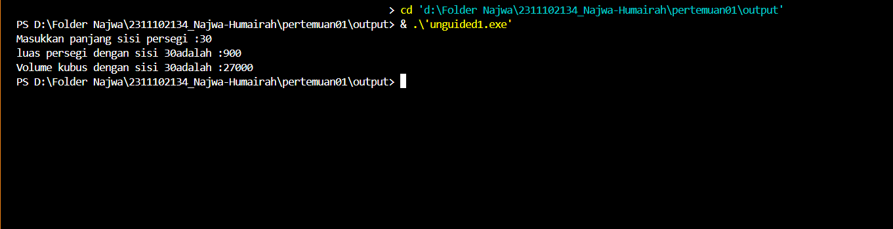
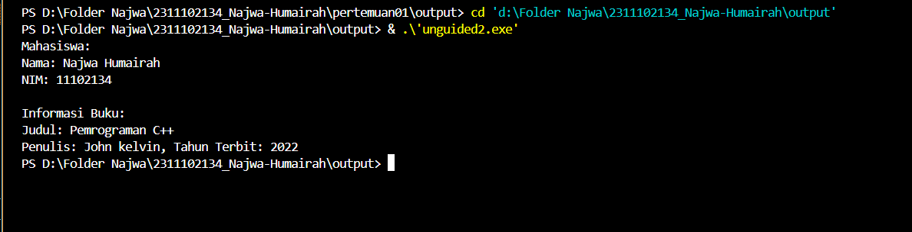
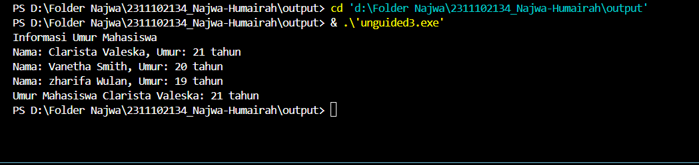

# <h1 align="center">Laporan Praktikum Modul Tipe Data</h1>
<p align="center"> Najwa Humairah_2311102134 </p>

## Dasar Teori

### 1. [Tipe Data primitif]
Tipe data primitif adalah tipe data yang telah ditentukan oleh sistem. Banyak bahasa pemrograman dapat menyediakan tipe data primitif, tetapi mereka berbeda karena jumlah bit yang dialokasikan untuk setiap bit bergantung pada kompiler, bahasa pemrograman, dan sistem operasinya.
Contoh tipe data primitif:

1. integer (Bilangan Bulat)
Tipe data ini digunakan untuk menyimpan bilangan bulat seperti 2,4,dll. Bagian ini menerima byte, short, int, dan long sebagai tipe data yang disignifikasi, yang memungkinkan nilai positif dan negatif. Namun, Java tidak mendukung tipe data yang tidak disignifikasi, yang hanya dapat menampilkan nilai positif. 
2. Float (Bilangan Desimal)
Tipe data float digunakan untuk mempresentasikan nilai yang memiliki pecahan atau angka decimal di belakang koma,seperti 2.4, 3.14, dan sebagainya. Bilangan semacam ini disebut bilangan riil.
3. Char (Karakter)
Merupakan tipe data yang menggunakan sebuah karakter misalnya sebuah huruf. Biasanya digunakan untuk simbol A, B, C, D dan seterusnya.
4. Boolean (Nilai Logika)
Tipe data Boolean yaitu nilai yang terdiri dari dua kemungkinan (benar atau salah), dapat disimpan dalam tipe data boolean. Kata kunci Boolean menunjukkan tipe data ini. Kata kunci "benar" digunakan untuk menunjukkan nilai benar, sedangkan kata kunci "salah" digunakan untuk menunjukkan nilai salah.

### 2. [Tipe Data Abstrak]
Programer menciptakan tipe data abstrak, juga dikenal sebagai tipe data abstrak (ADT). Tipe data abstrak dapat berisi lebih dari satu tipe data, sehingga nilainya dapat beragam. Pada bahasa C++, fitur Class adalah fitur program berorientasi objek (OOP), yang mirip dengan fitur data struktur pada bahasa C. Kedua berfungsi untuk membungkus tipe data sebagai anggota di dalamnya. Menurut learn.microsoft.com, perbedaan antara Struct dan Class terletak pada cara mereka diakses secara default: Struct bersifat publik sedangkan Class bersifat privat.

### 3. [Tipe Data Koleksi]
Adalah Tipe data koleksi adalah jenis data yang digunakan untuk mengelompokkan dan menyimpan sejumlah nilai atau objek secara bersamaan. Mereka memungkinkan penyimpanan, pengelolaan, dan akses ke sejumlah besar data yang terstruktur. Dalam pemrograman, ada beberapa jenis data koleksi yang umum digunakan, dan di antaranya adalah:
a. Array
Koleksi statis yang hanya dapat mengelompokkan tipe data yang sama dan memiliki ukuran yang tetap.Indeks memungkinkan akses ke elemen-elemen tersebut. Array memiliki ukuran tetap yang ditetapkan saat deklarasi.
b. Vector
Vector seperti array, memiliki kemampuan untuk menyimpan data dalam bentuk elemen yang alokasi memorinya dilakukan secara otomatis dan bersebelahan. Pada C/C++, vector juga memiliki fitur pelengkap seperti akses elemen, iterator, kapasitas, dan modifikasi.
c. Map
koleksi dinamis yang dapat disesuaikan ukurannya dan memiliki kemampuan untuk mengelompokkan berbagai tipe data dengan menggunakan pasangan <key, value>. Pada std::map digunakan Self-Balancing Tree khususnya Red-Black Tree.

## Guided

### 1. [Tipe Data primitif]

```C++
#include <iostream>
#include <iomanip>

using namespace std;

int main(){
    char op;
    float num1, num2;

    cout << "Enter operator (+, -, *, /): ";
    cin >> op;

    cout << "Enter two operands: ";

    cin >> num1 >> num2;
    // Switch statement begins
    switch (op) {
    // If user enters +
        case '+':
            cout << "Result: " << num1 + num2;
            break;
    // If user enters -
        case '-':   
            cout << "Result: " << num1 - num2;
            break;
    // If user enters *
        case '*':
            cout << "Result: " << num1 * num2;
            break;
    // If user enters /
        case '/':
            if (num2 != 0) {
                cout << "Result: " << fixed << setprecision(2) << num1 / num2;
        } else {
            cout << "Error! Division by zero is not allowed.";
        }
    break;

    // If the operator is other than +, -, * or /,
    // error message will display
    default:
        cout << "Error! Operator is not correct";
    } // switch statement ends

    return 0;
}
```
Kode di atas digunakan untuk menerima operator dan dua operand pengguna, melakukan operasi matematika yang sesuai, dan menampilkan hasilnya. Pada codingan diatas variabel char op; digunakan untuk menyimpan operator yang dimasukkan pengguna sedangkan variabel float num1, num2; digunakan untuk menyimpan dua angka yang dimasukkan pengguna. Kemudia dalam kasus case akan dilakukan pengecekan apakah num2 tidak sama dengan 0, pengecekan itu dilakukan untuk menghindari pembagian oleh nol. Jika tidak hasil pembagian akan ditampilkan dengan menggunakan 'fixed' dan 'setprecision(2)' yang membatasi angka desimal.

## Guided 

### 2. [Tipe Data abstrak]

```C++
#include <stdio.h>
#include <string.h>

//Struct
struct Mahasiswa{

    char name[50];
    char address[100];
    int age;
};

int main(){
    // menggunakan struct
    struct Mahasiswa mhs1, mhs2;
    // mengisi nilai ke struct
    strcpy(mhs1.name, "Dian");
    strcpy(mhs1.address, "Mataram");
    mhs1.age = 22;
    strcpy(mhs2.name, "Bambang");
    strcpy(mhs2.address, "Surabaya");
    mhs2.age = 23;

    // mencetak isi struct
    printf("## Mahasiswa 1 ##\n");
    printf("Nama: %s\n", mhs1.name);
    printf("Alamat: %s\n", mhs1.address);
    printf("Umur: %d\n", mhs1.age);
    printf ("\n");
    printf("## Mahasiswa 2 ##\n");
    printf("Nama: %s\n", mhs2.name);
    printf("Alamat: %s\n", mhs2.address);
    printf("Umur: %d\n", mhs2.age);
    return 0;
}
```
Pada codingan diatas menggunakan struct untuk mencetak isinya. Struct adalah salah satu tipe data abstrak. Pada kode diatas mendefinisikan struct mahasiswa yang memiliki tiga anggota yaitu : 'name' array karakter dengan panjang maksimum 50,'addres' array dengan panjang maksimum karakter 100, dan 'age' variabel yang bertipe integer. Kemudian program akan mencetak informasi dari dua mahasiswa sesuai dengan nilai yang telah diinisialisasi.

## Guided 

### 3. [Tipe Data koleksi]

```C++
#include <iostream>
#include <array>

using namespace std;
int main() {
    // Deklarasi dan inisialisasi array
    int nilai[5];
    nilai[0] = 23;
    nilai[1] = 50;
    nilai[2] = 34;
    nilai[3] = 78;
    nilai[4] = 90;
    
    // Mencetak array dengan tab
    cout << "Isi array pertama : " << nilai[0] << endl;
    cout << "Isi array kedua : " << nilai[1] << endl;
    cout << "Isi array ketiga : " << nilai[2] << endl;
    cout << "Isi array keempat : " << nilai[3] << endl;
    cout << "Isi array kelima : " << nilai[4] << endl;
return 0;
}
```
Pada kode diatas digunakan untuk mencetak isi dari sebuah array. Array digunakan untuk menyimpan sekumpulan nilai yang memiliki tipe yang sama. Pada program diatas, sebuah array dengan ukuran 5 elemen dideklarasikan dan diinisialisasi dengan nilai 23, 50, 34, 78, dan 90. Kemudia setiap elemen array dicetak, makan akan menampilkan indeks array serta nilainya.

## Unguided 

### 1. [Buatlah program menggunakan tipe data primitif minimal dua fungsi dan bebas. Menampilkan program, jelaskan program tersebut dan ambil kesimpulan dari materi tipe data primitif!]

```C++
#include <iostream>
#include <cmath>

using namespace std;

float hitungLuasPersegi_134(int sisi_134){
    return sisi_134*sisi_134;
}

float hitungVolumeKubus_134(int sisi_134){
    return sisi_134*sisi_134*sisi_134;
}

int main(){
    //Mendefenisikan variabel dengan menggunakan tipe data int
    int panjangSisi;

    cout << "Masukkan panjang sisi persegi :";
    cin >> panjangSisi;

    float luasPersegi = hitungLuasPersegi_134(panjangSisi);
    cout << "luas persegi dengan sisi " << panjangSisi << "adalah :" << luasPersegi << endl;
    float volumeKubus = hitungVolumeKubus_134(panjangSisi);
    cout << "Volume kubus dengan sisi " << panjangSisi << "adalah :" << volumeKubus << endl;

    return 0;
}
```
#### Output:


Pada codingan diatas, merupakan program sederhana untuk menghitung luas persegi dan volume kubus berdasarkan panjang sisi yang dimasukkan oleh pengguna. Variabel 'int' digunakan untuk menyimpang panjang sisi persegi atau kubus. Kemudian nilai yang dimasukkan pengguna akan disimpan. Program akan menampilkan atau mencetak hasil luas persegi dan volume kubus di layar. Lalu program akan mengembalikan nilai 0.

## Unguided 

### 2. [Jelaskan fungsi dari class dan struct secara detail dan berikan contoh programnya]

```C++
// 
#include <iostream>
#include <string>

using namespace std;

// Struct untuk menyimpan informasi mahasiswa
struct Mahasiswa {
    string nama_134;
    int nim_134;

    // Member function untuk menampilkan informasi mahasiswa
    void display() {
        cout << "Mahasiswa:" << endl;
        cout << "Nama: " << nama_134 << endl;
        cout << "NIM: " << nim_134 << endl;
    }
};

// Class untuk merepresentasikan sebuah buku
class Buku {
private:
    string judul_134;
    string penulis_134;
    int tahunTerbit_134;

public:
    // Constructor untuk menginisialisasi objek Buku
    Buku(string jdl, string pen, int tahun) : judul_134(jdl), penulis_134(pen), tahunTerbit_134(tahun) {}

    // Metode untuk menampilkan informasi buku
    void display() {
        cout << "\nInformasi Buku:" << endl;
        cout << "Judul: " << judul_134 << endl;
        cout << "Penulis: " << penulis_134 << ", Tahun Terbit: " << tahunTerbit_134 << endl;
    }
};

int main(){
    // Membuat objek Mahasiswa
    Mahasiswa mahasiswa;
    mahasiswa.nama_134 = "Najwa Humairah";
    mahasiswa.nim_134 = 11102134;

    // Memanggil member function untuk menampilkan informasi mahasiswa
    mahasiswa.display();

    // Membuat objek Buku
    Buku buku("Pemrograman C++", "John kelvin", 2022);

    // Memanggil member function untuk menampilkan informasi buku
    buku.display();

    return 0;
}
```
#### Output:


Program diatas menggunakan strutur(struct) dan kelas(class) untuk merepresentasikan informasi mahasiswa dan buku. Struct digunakan untuk menyimpan informasi tentang seorang mahasiswa seperti nama dan NIM. Dalam struktur mahasiswa, ada juga metode (fungsi anggota) display() yang menampilkan informasi siswa di layar. Metode ini menampilkan nama dan NIM siswa di layar. Class memiliki tiga data yaitu judul_134, penulis_134, dan tahunTerbit_134, semuanya bertipe string atau integer. Class Buku juga memiliki metode display() yang memungkinkan informasi buku ditampilkan di layar. Program kemudian mengembalikan nilai 0, menandakan bahwa program berakhir dengan sukses.

Penjelasan Class dan Struct:<br/>
A. Class<br/>
Dalam pemrograman berorientasi objek (OOP) pada bahasa pemrograman C++, class adalah kumpulan objek dengan karakter yang sama. Dengan menggunakan class, Anda dapat membuat tipe data baru yang dapat digunakan untuk membuat objek. Sifat (atribut), kelakuan (operasi/metode), hubungan (hubungan), dan arti adalah ciri-ciri kelas [3]. Class digunakan untuk memasukkan tipe data sebagai anggota, seperti yang dilakukan oleh struct.

B. Struct<br/>
Struktur, juga dikenal sebagai struktur, adalah tipe data yang memungkinkan program untuk mengelompokkan berbagai jenis data yang berbeda menjadi satu kesatuan yang lebih besar. Struktur terdiri dari lebih dari satu variabel, masing-masing dapat mengandung jenis data yang sama atau berbeda. Struktur dalam C++ adalah tipe data yang didefinisikan oleh pengguna(tipe data yang didefinisikan oleh pengguna). Struktur ini bermanfaat untuk mengelompokkan data dengan berbagai tipe data menjadi satu unit. untuk menyimpan dan mengakses data dengan cara yang terstruktur. Dengan mengakses atribut atau anggota struct secara individual, data dapat dikelola dan diubah dengan mudah dengan struct.

## Unguided 

### 3. [Buat dan jelaskan program menggunakan fungsi map dan jelaskan perbedaan dari array dengan map.]

```C++
#include <iostream>
#include <map>
#include <string>

using namespace std;

int main() {
    // Map digunakan untuk menyimpan informasi umur mahasiswa berdasarkan nama
    map<string, int> umurMahasiswa_134;

    // Menambahkan data umur mahasiswa ke dalam map
    umurMahasiswa_134["Vanetha Smith"] = 20;
    umurMahasiswa_134["Clarista Valeska"] = 21;
    umurMahasiswa_134["zharifa Wulan"] = 19;

    // Menampilkan informasi umur mahasiswa
    cout << "Informasi Umur Mahasiswa" << endl;
    for (const auto& pair : umurMahasiswa_134) {
        cout << "Nama: " << pair.first << ", Umur: " << pair.second << " tahun" << endl;
    }

    // Mengakses umur mahasiswa dengan nama tertentu
    string namaMahasiswa_134 = "Clarista Valeska";
    cout << "Umur Mahasiswa " << namaMahasiswa_134 << ": " << umurMahasiswa_134[namaMahasiswa_134] << " tahun" << endl;

    return 0;
}
```
#### Output:


Pada codingan diatas menggunakan struktur data map dalam bahasa pemograman c++. Map digunakan untuk memetakan (mapping) kunci (key) ke nilai (value) yang terkait. Pada kasus diatas, program menyimpan informasi umur mahasiswa berdasarkan nama menggunakan map<string,int>. Deklarasi dan inisialisasi map, map akan menyimpan informasi umur mahasiswa berdasarkan nama. kemudian data ditambahkan kedalam map. Program mengakses umur mahasiswa berdasarkan nama yang diberikan. Kemudian program akan mengembalikan nilai 0. Jadi program ini memiliki fungsi untuk menyimpan,menampilkan, dan mengakses informasi dan menggunakan struktur data map dalam bahasa c++.

Perbedaan array dengan map:<br/>
1.Array<br/>
-Struktur data linear yang terdiri dari kumpulan elemen yang memiliki tipe data yang sama yang diindeks oleh bilangan bulat disebut array.
-Element array disimpan dalam lokasi memori yang dekat satu sama lain.
-Array dimulai dari indeks o.
-Selama kompilasi, ukuran array tidak boleh diubah.
-Array merupakan struktur data linear yang menyimpan elemen dalam urutan yang terdefenisi dengan indeks integer.
2.Map<br/>
-Maps adalah struktur data yang memetakan kunci ke nilai(key-value pairs).
-Map biasanya menggunakan struktur data seperti pohon pencarian biner atau tabel hash, yang memungkinkan pencarian, penyisipan, dan penghapusan dalam waktu konstan atau logaritmik.
-Saat program berjalan ukuran map bisa berubah.
-Map merupakan struktur data yang memetakan kunci ke nilai dan mengakses cepat ke nilai berdasarkan kunci.

## Kesimpulan
Programen harus memahami dan menguasai tipe data c++ dengan baik.Ketika Anda membuat variabel, tipe data harus ada agar variabel memiliki nilai yang jelas dan spesifik ketika digunakan. Terdapat tiga kategori tipe data: tipe data primitif atau tipe data dasar, yang mencakup integer, char, float, dan boolen; tipe data abstrak atau tipe data yang dapat dibentuk sendiri, yang mencakup struct dan class; dan tipe data koleksi atau tipe data yang digunakan untuk pengelompokan, yang mencakup array, map, dan vector. Agar program yang dibuat dapat berjalan dengan benar, efisien, dan terhindar dari kesalahan (error).

## Referensi
[1] Fajri, D. (n.d.). LAPORAN PRAKTIKUM 1 ALGORITMA STRUKTUR DATA-TIPE DATA PRIMITIF, TIPE DATA ABSTRAK, DAN TIPE DATA KOLEKSI. Www.academia.edu. Retrieved March 12, 2024, from https://www.academia.edu/31473936/LAPORAN_PRAKTIKUM_1_ALGORITMA_STRUKTUR_DATA_TIPE_DATA_PRIMITIF_TIPE_DATA_ABSTRAK_DAN_TIPE_DATA_KOLEKSI
[2] Hermawan T. “Buku Ajar Panduan Praktikum STRUKTUR DATA.” Text-Id.123dok.com, 2014, text-id.123dok.com/document/zkxv02ey-buku-ajar-panduan-praktikum-struktur-data.html. Accessed 12 Mar. 2024.