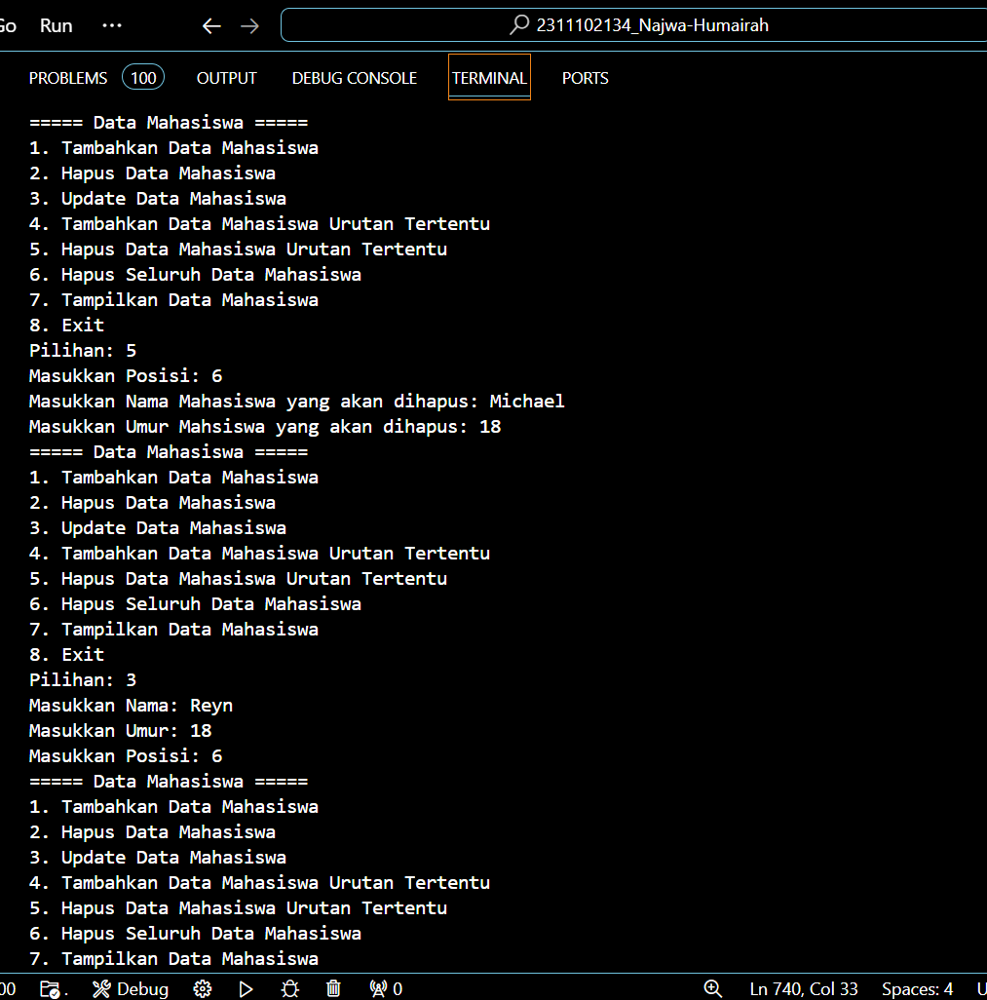

# <h1 align="center">Laporan Praktikum Modul SINGLE AND DOUBLE LINKED LIST </h1>
<p align="center"> Najwa Humairah_2311102134 </p>

## Dasar Teori
Senarai berkait (linked list) adalah jenis struktur data di mana simpul (node) terhubung satu sama lain dalam urutan tertentu. Simpul dapat berbentuk struktur atau class, dan simpul harus memiliki satu atau lebih elemen struktur atau class yang mengandung data. Senarai berkait adalah jenis struktur data di mana kumpulan data disusun secara dinamis, sekuensial, dan saling berhubungan. Secara teori, daftar yang dihubungkan didefinisikan sebagai sejumlah node yang dihubungkan secara linier dengan bantuan pointer. Daftar yang dihubungkan satu kali didefinisikan sebagai daftar yang dihubungkan satu kali apabila hanya ada satu pointer yang menghubungkan setiap node single.

Linked list adalah struktur data yang paling dasar, terdiri dari sejumlah unsur yang dikelompokkan, atau terhubung, bersama-sama di suatu deret tertentu. Linked list membantu menyimpan koleksi data, yang sebanding dengan array atau larik yang sering digunakan; namun, linked list menawarkan banyak keuntungan yang lebih besar daripada array atau larik. Secara khusus, linked list lebih efektif dalam melaksanakan penyusunan daftar. 

### 1. [Single linked list]
Single Linked list adalah Daftar terhubung yang setiap simpul pembentuknya mempunyai satu rantai(link) ke simpul lainnya. Pembentukan linked list tunggal memerlukan :
1. deklarasi tipe simpul
2. deklarasi variabel pointer penunjuk awal Linked list
3. pembentukan simpul baru
4. pengaitan simpul baru ke Linked list yang telah terbentuk

Alamat elemen adalah pointer. Setiap simpul terdiri dari dua bagian: yang pertama disebut bagian isi, informasi, atau data, dan yang kedua disebut bagian pointer, yang berisi alamat dari node berikutnya atau sebelumnya. Elemen awal daftar disebut head dan elemen terakhir disebut tail. Dengan struktur seperti ini, linked list dibentuk dengan menunjuk pointer next elemen ke elemen yang mengikutinya. Pointer next pada elemen terakhir merupakan NULL, yang menunjukkan akhir daftar. Operasi Single Linked List biasanya mencakup penambahan dan penghapusan simpul pada awal atau akhir daftar serta pencarian dan pengambilan nilai pada simpul tertentu. Single Linked List umumnya lebih efisien dalam penggunaan memori karena struktur datanya hanya memerlukan satu pointer untuk setiap simpul. Ini dibandingkan dengan jenis Linked List lainnya, seperti Double Linked List dan Circular Linked List. Ciri circular linked list berbeda dari single linked list karena penunjuk berikutnya pada node terakhir circular linked list selalu merujuk ke node pertama.

### 2. [Double linked list]
Penggunaan Double Linked List hampir sama dengan penggunaan Single Linked List yang telah kita pelajari sebelumnya. Yang berbeda adalah bahwa Double Linked List menggunakan pointer baru, prev, yang dapat digunakan untuk menggeser mundur sementara tetap mempertahankan pointer next. Double Linked List memiliki tiga elemen penting untuk setiap simpul: elemen data (biasanya nilai), pointer next yang menunjuk ke simpul berikutnya, dan pointer prev yang menunjuk ke simpul sebelumnya. Dengan adanya pointer prev, Double Linked List memungkinkan operasi penghapusan dan penambahan pada simpul mana saja secara efisien.
a. Double Linked List lebih fleksibel daripada Single Linked List karena memiliki dua pointer penunjuk (next dan prev), tetapi memerlukan memori tambahan.
b. Ada 2 jenis Double Linked List, yaitu: Double Linked List Non Circular dan Double Linked List Circular. DLLNC adalah sebuah Linked List yang terdiri dari dua arah pointer, dengan node yang saling terhubung, namun kedua pointernya menunjuk ke NULL.

Keuntungan dari Double Linked List adalah memungkinkan operasi penambahan dan penghapusan pada simpul mana pun dengan efisien, yang membuatnya sangat berguna untuk menjalankan beberapa algoritma yang membutuhkan operasi ini. Selain itu, melakukan traversal list dari depan ke belakang dengan mudah dengan Double Linked List. Karena setiap simpul membutuhkan satu pointer tambahan, Double Linked List membutuhkan lebih banyak memori daripada Single Linked List. Selain itu, operasi penambahan dan penghapusan pada Double Linked List membutuhkan waktu yang lebih lama daripada pada Single Linked List.

## Guided

### 1. [Single linked list]

```C++
#include <iostream>
using namespace std;

///PROGRAM SINGLE LINKED LIST NON-CIRCULAR
//Deklarasi Struct Node
struct Node{
    int data;
    Node *next;
};
    Node *head;
    Node *tail;
//Inisialisasi Node
void init(){
    head = NULL;
    tail = NULL;
}
// Pengecekan
bool isEmpty(){
    if (head == NULL)
    return true;
    else
    return false;
}
//Tambah Depan
void insertDepan(int nilai){
    //Buat Node baru
    Node *baru = new Node;
    baru->data = nilai;
    baru->next = NULL;
    if (isEmpty() == true){
        head = tail = baru;
        tail->next = NULL;
    }
    else{
        baru->next = head;
        head = baru;
    }
}
//Tambah Belakang
void insertBelakang(int nilai){
//Buat Node baru
    Node *baru = new Node;
    baru->data = nilai;
    baru->next = NULL;
    if (isEmpty() == true){
        head = tail = baru;
        tail->next = NULL;
    }
else{
    tail->next = baru;
    tail = baru;
    }
}
//Hitung Jumlah List
int hitungList(){
    Node *hitung;
    hitung = head;
    int jumlah = 0;
    while( hitung != NULL ){
        jumlah++;
        hitung = hitung->next;
    }
    return jumlah;
}
//Tambah Tengah
void insertTengah(int data, int posisi){
    if( posisi < 1 || posisi > hitungList() ){
        cout << "Posisi diluar jangkauan" << endl;
    }
    else if( posisi == 1){
        cout << "Posisi bukan posisi tengah" << endl;
    }
    else{
        Node *baru, *bantu;
        baru = new Node();
        baru->data = data;
        // tranversing
            bantu = head;
            int nomor = 1;
        while( nomor < posisi - 1 ){
            bantu = bantu->next;
            nomor++;
        }
        baru->next = bantu->next;
        bantu->next = baru;
    }
}
//Hapus Depan
void hapusDepan() {
    Node *hapus;
    if (isEmpty() == false){
        if (head->next != NULL){
            hapus = head;
            head = head->next;
            delete hapus;
        }
        else{
            head = tail = NULL;
        }
    }
    else{
            cout << "List kosong!" << endl;
        }
    }
//Hapus Belakang
void hapusBelakang() {
    Node *hapus;
    Node *bantu;
    if (isEmpty() == false){
        if (head != tail){
            hapus = tail;
            bantu = head;
            while (bantu->next != tail){
                bantu = bantu->next;
            }
            tail = bantu;
            tail->next = NULL;
        delete hapus;
        }
        else{
            head = tail = NULL;
        }
    }
    else{
        cout << "List kosong!" << endl;
    }
}
//Hapus Tengah
void hapusTengah(int posisi){
    Node *hapus, *bantu, *bantu2;
    if( posisi < 1 || posisi > hitungList() ){
        cout << "Posisi di luar jangkauan" << endl;
    }
    else if( posisi == 1){
        cout << "Posisi bukan posisi tengah" << endl;
    }
    else{
        int nomor = 1;
        bantu = head;
        while( nomor <= posisi ){
            if( nomor == posisi-1 ){
                bantu2 = bantu;
            }
            if( nomor == posisi ){
                hapus = bantu;
            }
            bantu = bantu->next;
            nomor++;
        }
        bantu2->next = bantu;
    delete hapus;
    }
}
//Ubah Depan
void ubahDepan(int data){
    if (isEmpty() == false){
        head->data = data;
    }
    else{
        cout << "List masih kosong!" << endl;
    }
}
//Ubah Tengah
void ubahTengah(int data, int posisi){
    Node *bantu;
    if (isEmpty() == false){
        if( posisi < 1 || posisi > hitungList() ){
            cout << "Posisi di luar jangkauan" << endl;
        }
        else if( posisi == 1){
            cout << "Posisi bukan posisi tengah" << endl;
        }
        else{
            bantu = head;
            int nomor = 1;
            while (nomor < posisi){
                bantu = bantu->next;nomor++;
            }
            bantu->data = data;
        }
    }
    else{
        cout << "List masih kosong!" << endl;
    }
}
//Ubah Belakang
void ubahBelakang(int data){
    if (isEmpty() == false){
        tail->data = data;
    }
    else{
        cout << "List masih kosong!" << endl;
    }
}
//Hapus List
void clearList(){
    Node *bantu, *hapus;
    bantu = head;
    while (bantu != NULL){
        hapus = bantu;bantu = bantu->next;
        delete hapus;
    }
    head = tail = NULL;
    cout << "List berhasil terhapus!" << endl;
}
//Tampilkan List
void tampil(){
    Node *bantu;
    bantu = head;
    if (isEmpty() == false){
        while (bantu != NULL){
            cout << bantu->data << ends;
            bantu = bantu->next;
        }
        cout << endl;
    }
    else{
        cout << "List masih kosong!" << endl;
    }
}
int main(){
    init();
    insertDepan(3);tampil();
    insertBelakang(5);
    tampil();
    insertDepan(2);
    tampil();
    insertDepan(1);
    tampil();
    hapusDepan();
    tampil();
    hapusBelakang();
    tampil();
    insertTengah(7,2);
    tampil();
    hapusTengah(2);
    tampil();
    ubahDepan(1);
    tampil();
    ubahBelakang(8);
    tampil();
    ubahTengah(11, 2);
    tampil();
    return 0;
}
```
Pada program diatas yaitu mengimplementasikan dari single linked list non-circular. Struktur node mewakili setiap elemen dalam linked list, yang terdiri dari sebuah variabel untuk menyimpan data bertipe integer dan sebuah pointer untuk menunjuk ke node berikutnya dalam linked list. Program dapat melakukan operasi dasar seperti menambah dan menghapus node di berbagai posisi, mengubah data pada node, dan menghitung jumlah node dalam daftar yang terhubung. Dengan menggunakan fungsi main(), program menguji setiap operasi yang didefinisikan, memungkinkan pengguna untuk mengubah data dalam daftar yang terhubung sesuai kebutuhan.

## Guided 

### 2. [Double linked list]

```C++
#include <iostream>
using namespace std;

class Node {
    public:int data;
    Node* prev;
    Node* next;
};
class DoublyLinkedList {
        public:
        Node* head;
        Node* tail;
        DoublyLinkedList() {
            head = nullptr;
            tail = nullptr;
    }
    void push(int data) {
        Node* newNode = new Node;
        newNode->data = data;
        newNode->prev = nullptr;
        newNode->next = head;
        if (head != nullptr) {
            head->prev = newNode;
        }
        else {
            tail = newNode;
        }
        head = newNode;
    }
    void pop() {
        if (head == nullptr) {
            return;
        }
        Node* temp = head;
        head = head->next;
        if (head != nullptr) {
            head->prev = nullptr;
        }
        else {
            tail = nullptr;
        }
        delete temp;
    }
    bool update(int oldData, int newData) {
        Node* current = head;while (current != nullptr) {
            if (current->data == oldData) {
                current->data = newData;
                return true;
            }
            current = current->next;
        }
        return false;
    }
    void deleteAll() {
        Node* current = head;
        while (current != nullptr) {
            Node* temp = current;
            current = current->next;
            delete temp;
        }
        head = nullptr;
        tail = nullptr;
    }
    void display() {
        Node* current = head;
        while (current != nullptr) {
            cout << current->data << " ";
            current = current->next;
        }
        cout << endl;
    }
};

int main() {
    DoublyLinkedList list;
    while (true) {
        cout << "1. Add data" << endl;
        cout << "2. Delete data" << endl;
        cout << "3. Update data" << endl;
        cout << "4. Clear data" << endl;
        cout << "5. Display data" << endl;
        cout << "6. Exit" << endl;int choice;
        cout << "Enter your choice: ";
        cin >> choice;
        switch (choice) {
            case 1: {
                int data;
                cout << "Enter data to add: ";
                cin >> data;
                list.push(data);
                break;
            }
            case 2: {
                list.pop();
                break;
            }
            case 3: {
                int oldData, newData;
                cout << "Enter old data: ";
                cin >> oldData;
                cout << "Enter new data: ";
                cin >> newData;
                bool updated = list.update(oldData, newData);
                if (!updated) {
                    cout << "Data not found" << endl;
                }
                break;
            }
            case 4: {
                list.deleteAll();
                break;
            }
            case 5: {
                list.display();
                break;
            }
            case 6: {
                return 0;
            }
            default: {
                cout << "Invalid choice" << endl;
                break;
            }
        }
    }
    return 0;
}
```
Pada codingan diatas yaitu mengimplementasikan struktur data linked list double/ double linked list dalam bahasa pemograman c++. Ada dua kelas utama dalam program ini: kelas Node menampilkan setiap elemen dalam daftar terkait dengan data integer dan pointer ke node sebelumnya dan node berikutnya, dan kelas DoublyLinkedList mengatur operasi seperti menambah, menghapus, memperbarui, dan menampilkan data. Fungsi main() memiliki loop tak terbatas yang memungkinkan pengguna memilih operasi yang ingin mereka lakukan, seperti menambah, menghapus, memperbarui, dan menampilkan data. 

## Unguided 

### 1. [Buatlah program menu Single Linked List Non-Circular untuk menyimpan Nama dan usia mahasiswa, dengan menggunakan inputan dari user.]


```C++
#include <iostream>
#include <string>
#include <iomanip>

using namespace std;

//Mendeklarasikan struct Node
struct Node {
    string nama_134;
    int umur_134;
    Node *next;
};
    Node *head; // deklarasi node sebagai head
    Node *tail; // deklarasi node sebagai tail

// Menginisialisasi Node
void inisialisasi_134(){
    head = NULL;
    tail = NULL;
}

// Pengecekan NULL
bool isEmpty_134(){
    if (head == NULL){
        return true;
    }else {
        return false;
    }
}

// Prosedure untuk memasukkan data 
// Prosedure untuk memasukkan insert depan
void insertDepan_134(string nama_134, int umur_134)
{
    Node *baru = new Node; // tambah node baru
    baru->nama_134 = nama_134; // isi node baru
    baru->umur_134 = umur_134; // isi node baru
    baru->next = NULL; // next node nya NULL
    if (isEmpty_134() == true){
        head = tail = baru;    
    }else {
        baru->next = head;
        head = baru;
    }
}

// Prosedure untuk insert belakang
void insertBelakang_134(string nama_134, int umur_134)
{
    Node *baru = new Node; // tambah node baru
    baru->nama_134 = nama_134; // isi node baru
    baru->umur_134 = umur_134; // isi node baru
    baru->next = NULL;
    if (isEmpty_134() == true){
        head = tail = baru;
    }else {
        tail->next = baru;
        tail = baru;
    }
}

// Prosedure untuk insert tengah
void insertTengah_134(string nama_134, int umur_134, int posisi_134)
{
    Node *baru = new Node;
    baru->nama_134 = nama_134;
    baru->umur_134 = umur_134;
    baru->next = NULL;
    if (isEmpty_134() == true){
        head = tail = baru;
    }else {
        Node *bantu = head;
        int nomor = 1; // deklarasi variabel nomor
        while (nomor < posisi_134 - 1){
            bantu = bantu->next;
            nomor++;
        }
        baru->next = bantu->next;
        bantu->next = baru;
    }
}

// Fungsi Hitung Node
int hitungNode_134(){
    Node *hitung = head;
    int jumlah = 0;
    while (hitung != NULL){ // perulangan while
        jumlah++; // deklarasi variabel jumlah
        hitung = hitung->next;
    }
    return jumlah;
}

// Untuk menghapus data
// Prosedure untuk hapus depan
void hapusDepan_134(){
    if (isEmpty_134() == false){
        if (head->next != NULL){
            Node *hapus = head;
            head = head->next;
            delete hapus;
        }else {
            head = tail = NULL;
        }
    }else {
        cout << "List masih kosong!" << endl;
    }
}

// Prosedure untuk hapus belakang
void hapusBelakang_134(){
    if (isEmpty_134() == false){
        if (head->next != NULL){
            Node *hapus = tail;
            Node *bantu = head;
            while (bantu->next != tail){
                bantu = bantu->next; // node bantu berlanjut ke next dari bantu
            }
            tail = bantu;
            tail->next = NULL;
            delete hapus; // delete node hapus
        }else {
            head = tail = NULL;
        }
    }else {
        cout << "List masih kosong!" << endl;
    }
}
// Prosedure untuk hapus tengah
void hapusTengah_134(int posisi_134){
    if (posisi_134 < 1 || posisi_134 > hitungNode_134()){
        cout << "Posisi node yang akan dihapus diluar jangkauan" << endl;
    }else if (posisi_134 == 1){
        cout << "Posisi nodeyang ingin dihapus bukan posisi tengah" << endl;
    }else {
        Node *hapus = head;
        Node *bantu = head;
        int nomor = 1;
        while (nomor < posisi_134 - 1){
            bantu = bantu->next;
            nomor++;
        }
        hapus = bantu->next;
        bantu->next = hapus->next;
        delete hapus;
    } 
}

// Untuk ubah data
// Prosedure untuk mengubah depan
void ubahDepan_134(string nama_134, int umur_134){
    if (isEmpty_134() == false){
        head->nama_134 = nama_134;
        head->umur_134 = umur_134;
    }else {
        cout << "List masih kosong!" << endl;
    }
}

// Prosedure untuk mengubah belakang
void ubahBelakang_134(string nama_134, int umur_134){
    if (isEmpty_134() == false){
        tail->nama_134 = nama_134;
        tail->umur_134 = umur_134;
    }else {
        cout << "List masih kosong!" << endl;
    }
}

// Prosedure untuk mengubah tengah
void ubahTengah_134(string nama_134, int umur_134, int posisi_134){
    if (posisi_134 < 1 || posisi_134 > hitungNode_134()){
        cout << "Posisi diluar jangkauan" << endl;
    }else if (posisi_134 == 1){
        cout << "Posisi bukan posisi tengah" << endl;
    }else {
        Node *bantu = head;
        int nomor = 1;
        while (nomor < posisi_134){
            bantu = bantu->next;
            nomor++;
        }
        bantu->nama_134 = nama_134;
        bantu->umur_134 = umur_134;    
    } 
}

// Prosedure untuk menghapus semua data
void hapusSemua_134(){
    if (isEmpty_134() == false){
        Node *bantu = head;
        while (bantu != NULL){
            Node *hapus = bantu;
            bantu = bantu->next;
            delete hapus;
        }
        head = tail = NULL;
    }else {
        cout << "List masih kosong!" << endl;
    }
}

// Prosedure untuk menampilkan display
void display_134(){
    Node *bantu = head;
    if (!isEmpty_134()){
        cout << "|=========================|" << endl;
        cout << "|    Nama    |    Umur    |" << endl;
        cout << "|=========================|" << endl;
        while (bantu != NULL){
            cout << "| " << setw(10) << left << bantu->nama_134<< " | " << setw(10) << left << bantu->umur_134 << " |" << endl;
            bantu = bantu->next;
        }
        cout << "|-------------------------|" << endl;
    }else {
        cout << "List masih kosong!" << endl;
    }
}

int main(){
    
    //Untuk inisialisasi
    inisialisasi_134();
    //Untuk menambahkan data diawali
    insertDepan_134("Karin", 18);
    insertDepan_134("Hoshino", 18);
    insertDepan_134("Akechi", 20);
    insertDepan_134("Yusuke", 19);
    insertDepan_134("Michael", 18);
    insertDepan_134("Jane", 20);
    insertDepan_134("John", 19);

    //Untuk menampilkan data diawali
    cout << "Data Mahasiswa : " << endl;
    display_134();
    cout << endl;

    //Pilihan Menu
    int pilihan_134;
    string nama_134;
    int umur_134;
    int posisi_134;
    do{
        cout << "===== Data Mahasiswa =====" << endl;
        cout << "1. Tambahkan Data Mahasiswa" << endl;
        cout << "2. Hapus Data Mahasiswa" << endl;
        cout << "3. Update Data Mahasiswa" << endl;
        cout << "4. Tambahkan Data Mahasiswa Urutan Tertentu" << endl;
        cout << "5. Hapus Data Mahasiswa Urutan Tertentu" << endl;
        cout << "6. Hapus Seluruh Data Mahasiswa" << endl;
        cout << "7. Tampilkan Data Mahasiswa" << endl;
        cout << "8. Exit" << endl;
        cout << "Pilihan: ";
        cin >> pilihan_134;

        switch(pilihan_134){
            //Menambahkan data
            case 1:
                cout << "Masukkan Nama: ";
                cin >> nama_134;
                cout << "Masukkan Umur: ";
                cin >> umur_134;
                insertDepan_134(nama_134, umur_134);
                break;
            //Menghapus data    
            case 2:
                hapusDepan_134();
                break;
            //Mengubah data    
            case 3:
                cout << "Masukkan Nama: "; cin >> nama_134;
                cout << "Masukkan Umur: "; cin >> umur_134;
                cout << "Masukkan Posisi: "; cin >> posisi_134;
                ubahTengah_134(nama_134, umur_134, posisi_134);
                break;
            //Menambahkan data di posisi antara   
            case 4:
                cout << "Masukkan Nama: "; cin >> nama_134;
                cout << "Masukkan Umur: "; cin >> umur_134;
                cout << "Masukkan Posisi: "; cin >> posisi_134;
                insertTengah_134(nama_134, umur_134, posisi_134);
                break;
            //Menghapus data di posisi antara    
            case 5:
                cout << "Masukkan Posisi: ";
                cin >> posisi_134;
                cout << "Masukkan Nama Mahasiswa yang akan dihapus: ";
                cin >> nama_134;
                cout << "Masukkan Umur Mahsiswa yang akan dihapus: ";
                cin >> umur_134;
                hapusTengah_134(posisi_134);
                break;
            //Menghapus semua data    
            case 6:
                hapusSemua_134();
                break;
            //Menampilkan semua data    
            case 7:
                cout << "Tampilan Seluruh Data Mahasiswa" << endl;
                display_134();
                break;
            //Program selesai    
            case 8:
                cout << "Anda keluar dari program. Program selesai!" << endl;
                break;
            default:
                cout << "Pilihan yang anda masukkan tidak tersedia" << endl;
                break;
        }
    }
    while(pilihan_134 != 8);
    return 0;   
}
```
#### Output:
Masukkan nama dan NIM:

Menghapus data Akechi:

Menambahkan data Futaba diantara John dan Jane:

Menambahkan data Igor diawal:

Mengubah data Michael menjadi Reyn:

Tampilkan seluruh data mahasiswa:


Program diatas adalah sebuah implementasi dari linked list dalam bahasa c++. Program ini memanfaatkan struktur data linked list untuk menyimpan data mahasiswa berupa nama dan umur. Program mendeklarasikan sebuah struct node dengan dua atribut, yaitu nama dan umur, dan sebuah pointer next yang menunjukkan ke node berikutnya. Selain itu, program mendeklarasikan dua variabel pointer head dan tail sebagai penanda awal dan akhir dari daftar yang terhubung. Program kemudian menetapkan berbagai cara untuk melakukan operasi pada daftar terhubung, seperti memulai, memeriksa apakah daftar terhubung kosong, menambah, menghapus, dan mengubah data di depan, belakang, dan tengah, menghitung jumlah node, dan menampilkan data.

Pada fungsi main program mengaktifkan daftar terhubung dan menambahkan beberapa data siswa ke dalam daftar terhubung. Setelah itu, program memberikan menu interaktif kepada pengguna yang memungkinkan mereka melakukan berbagai hal dengan data siswa, seperti menambahkan, menghapus, mengubah, menambahkan data ke posisi tertentu, menghapus data ke posisi tertentu, menghapus semua data, dan menampilkan semua data. Switch case akan menjalankan setiap operasi yang dipilih oleh pengguna dan memanggil prosedur yang sesuai yang telah didefinisikan sebelumnya. Hal ini memungkinkan pengguna untuk dengan mudah mengelola data siswa sesuai kebutuhan mereka melalui menu yang tersedia. Sampai pengguna memilih untuk keluar dari program, program akan terus berjalan.
## Unguided 

### 2. [Modifikasi Guided Double Linked List dilakukan dengan penambahan operasi untuk menambah data, menghapus, dan update di tengah / di urutan tertentu yang diminta. Selain itu, buatlah agar tampilannya menampilkan Nama produk dan harga.]


```C++
#include <iostream>
#include <iomanip> 
#include <string>

using namespace std;

class Node {
public:
    string namaProduk_134;
    double harga_134;
    Node* prev;
    Node* next;

    Node(string nama, double harga_134) : namaProduk_134(nama), harga_134(harga_134), prev(nullptr), next(nullptr) {}
};

class DoublyLinkedList {
private:
    Node* head;

public:
    DoublyLinkedList() : head(nullptr) {}

    void add_data_134(string namaProduk_134, double harga_134) {
        Node* newNode = new Node(namaProduk_134, harga_134);
        if (head == nullptr) {
            head = newNode;
        } else {
            Node* current = head;
            while (current->next != nullptr) {
                current = current->next;
            }
            current->next = newNode;
            newNode->prev = current;
        }
    }

    void tambahDataUrutanTertentu(string namaProduk_134, double harga_134, int posisi) {
        if (posisi < 1) {
            cout << "Posisi tidak valid" << endl;
            return;
        }

        Node* newNode = new Node(namaProduk_134, harga_134);
        if (posisi == 1 || head == nullptr) {
            newNode->next = head;
            if (head != nullptr) {
                head->prev = newNode;
            }
            head = newNode;
        } else {
            Node* current = head;
            int pos = 1;
            while (current != nullptr && pos < posisi - 1) {
                current = current->next;
                pos++;
            }
            if (current == nullptr) {
                cout << "Posisi tidak valid" << endl;
                return;
            }
            newNode->next = current->next;
            newNode->prev = current;
            if (current->next != nullptr) {
                current->next->prev = newNode;
            }
            current->next = newNode;
        }
    }

    void hapusData(string namaProduk_134) {
        Node* current = head;
        while (current != nullptr) {
            if (current->namaProduk_134 == namaProduk_134) {
                if (current->prev) {
                    current->prev->next = current->next;
                }
                if (current->next) {
                    current->next->prev = current->prev;
                }
                if (current == head) {
                    head = current->next;
                }
                delete current;
                return;
            }
            current = current->next;
        }
        cout << "Produk tidak ditemukan" << endl;
    }

    void updateData(string namaProduk_134, string new_namaProduk_134, double newHarga_134) {
        Node* current = head;
        while (current != nullptr) {
            if (current->namaProduk_134 == namaProduk_134) {
                current->namaProduk_134 = new_namaProduk_134;
                current->harga_134 = newHarga_134;
                return;
            }
            current = current->next;
        }
        cout << "Produk tidak ditemukan" << endl;
    }

    void hapusSeluruhData() {
        Node* current = head;
        while (current != nullptr) {
            Node* temp = current;
            current = current->next;
            delete temp;
        }
        head = nullptr;
    }

    void hapusDataUrutanTertentu(int posisi) {
        if (posisi < 1) {
            cout << "Posisi tidak valid" << endl;
            return;
        }
        Node* current = head;
        int pos = 1;
        while (current != nullptr && pos < posisi) {
            current = current->next;
            pos++;
        }
        if (current == nullptr) {
            cout << "Posisi tidak valid" << endl;
            return;
        }
        if (current->prev) {
            current->prev->next = current->next;
        }
        if (current->next) {
            current->next->prev = current->prev;
        }
        if (current == head) {
            head = current->next;
        }
        delete current;
    }

    void tampilkanData() {
        if (head == nullptr) {
            cout << "Tidak ada data yang tersedia" << endl;
            return;
        }
        cout << left << setw(20) << "Nama Produk" << "Harga" << endl;
        Node* current = head;
        while (current != nullptr) {
            cout << left << setw(20) << current->namaProduk_134 << current->harga_134 << endl;
            current = current->next;
        }
    }
};

int main() {
    DoublyLinkedList list;

    // add data awal penjualan skincare purwokerto
    cout << "=============Daftar Produk=============" << endl;
    list.add_data_134("Originote", 60000);
    list.add_data_134("Somethinc", 150000);
    list.add_data_134("Skintific", 100000);
    list.add_data_134("Wardah", 50000);
    list.add_data_134("Hanasui", 30000);

    int pilihan;
    do {
        cout << "=====Toko Skincare======" << endl;
        cout << "1. Tambah Produk" << endl;
        cout << "2. Hapus Produk" << endl;
        cout << "3. Update Produk" << endl;
        cout << "4. Tambah produk berdasarkan urutan" << endl;
        cout << "5. Hapus produk berdasarkan urutan" << endl;
        cout << "6. Hapus Seluruh produk" << endl;
        cout << "7. Tampilkan Produk" << endl;
        cout << "8. Exit" << endl;

        cout << "Masukkan pilihan: ";
        cin >> pilihan;

        string namaProduk_134, new_namaProduk_134;
        double harga_134, newHarga_134;
        int posisi;

        switch (pilihan) {
            case 1:
                cout << "Masukkan Nama Produk: ";
                cin >> namaProduk_134;
                cout << "Masukkan Harga: ";
                cin >> harga_134;
                list.add_data_134(namaProduk_134, harga_134);
                break;
            case 2:
                cout << "Masukkan Nama Produk yang akan dihapus: ";
                cin >> namaProduk_134;
                list.hapusData(namaProduk_134);
                break;
            case 3:
                cout << "Masukkan Nama Produk yang akan diupdate: ";
                cin >> namaProduk_134;
                cout << "Masukkan Nama Produk baru: ";
                cin >> new_namaProduk_134;
                cout << "Masukkan Harga baru: ";
                cin >> newHarga_134;
                list.updateData(namaProduk_134, new_namaProduk_134, newHarga_134);
                break;
            case 4:
                cout << "Masukkan Nama Produk baru: ";
                cin >> namaProduk_134;
                cout << "Masukkan Harga: ";
                cin >> harga_134;
                cout << "Masukkan Urutan: ";
                cin >> posisi;
                list.tambahDataUrutanTertentu(namaProduk_134, harga_134, posisi);
                break;
            case 5:
                cout << "Masukkan Urutan produk yang akan dihapus: ";
                cin >> posisi;
                list.hapusDataUrutanTertentu(posisi);
                break;
            case 6:
                list.hapusSeluruhData();
                cout << "Produk pada posisi" << posisi << "berhasil dihapus" << endl;
                break;
            case 7:
                list.tampilkanData();
                break;
            case 8:
                cout << "Terima kasih!" << endl;
                break;
            default:
                cout << "Pilihan tidak valid. Silakan pilih kembali!." << endl;
        }
    } while (pilihan != 8);

    return 0;
}
```
#### Output:
_unguided2.png)
_unguided2.png)

Pada codingan diatas menggunakan struktur data yaitu double linked list dalam bahasa pemograman c++. Terdapat dua kelas utama dalam program ini, dua kelas utama program ini adalah Node dan DoublyLinkedList. Kelas Node menampilkan setiap elemen dalam daftar terkait, termasuk atribut yang menyimpan nama produk dan harga, serta pointer yang menunjuk ke node sebelumnya dan node berikutnya. Kelas DoublyLinkedList mengatur operasi pada daftar terkait berganda. Program memberikan menu interaktif kepada pengguna untuk melakukan berbagai hal pada daftar produk skincare dalam fungsi main(). Pengguna memiliki kemampuan untuk menambahkan produk baru, menghapus produk, memperbarui informasi tentang produk, menambahkan produk ke lokasi tertentu, menghapus produk dari lokasi tertentu, menghapus semua produk, dan menampilkan semua produk yang sudah ada. Setiap operasi ini dilakukan dengan menggunakan switch case dan menggunakan fungsi-fungsi yang telah didefinisikan dalam kelas DoublyLinkedList. Hal ini memungkinkan pengguna untuk mengelola daftar produk skincare dengan berbagai operasi yang tersedia.

## Kesimpulan
Programen harus memahami dan menguasai single dan double linked list. Linked list adalah struktur data yang terdiri dari sejumlah node atau simpul yang dihubungkan secara linier dengan bantuan pointer. List yang terhubung satu kali terdiri dari dua bagian, yaitu nilai yang ditampung dan pointer berikutnya, sedangkan list yang terhubung dua kali terdiri dari tiga bagian, yaitu nilai yang ditampung, pointer sebelumnya, dan pointer berikutnya. Masing-masing tipe Linked List ini memiliki kelebihan dalam hal penyisipan dan penghapusan elemen yang lebih efisien dibandingkan array. Namun, karena setiap node menggunakan lebih dari satu blok memori dan biasanya memiliki akses data yang lebih lambat, Linked List juga membutuhkan lebih banyak memori.
    
## Referensi
[1] ST,M.KOm, Triase. STRUKTUR DATA. 2020.
[2] M.TI, Anita Sindar RMS, ST. STRUKTUR DATA DAN ALGORITMA DENGAN C++. Google Books, CV. AA. RIZKY, 28 Nov. 2019, books.google.com/books?hl=id&lr=&id=GP_ADwAAQBAJ&oi=fnd&pg=PR7&dq=modul+SINGLE+AND+DOUBLE+LINKED+LIST+c%2B%2B&ots=86f0Qs-P8U&sig=5KnO8VZm-t7sNtgREo8oEZSmDEU. Accessed 24 Mar. 2024.