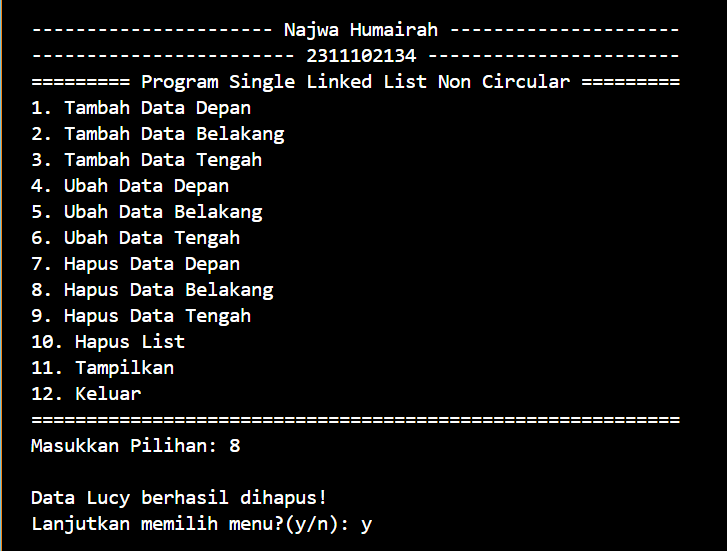

# <h1 align="center">Laporan Praktikum Modul LINKED LIST CIRCULAR DAN NON CIRCULAR</h1>
<p align="center"> Najwa Humairah_2311102134 </p>

## Dasar Teori

### 1. [Linked List Non Circular]
Linked List Non Circular memiliki node pertama (head) dan terakhir (tail) yang tidak terhubung satu sama lain. Pointer terakhir (tail) dari daftar terkait ini selalu bernilai "NULL" sebagai pertanda data terakhir dalam list-nya. Berikut adalah contoh gambar terkait linked list non-circular :


1.pembentukan node</p>-
Keyword "new" digunakan untuk membuat sebuah node baru dengan alokasi memori, kemudian diisi data, dan pointer berikutnya ditunjuk ke NULL. Pembentukan node tidak dapat dilakukan sekaligus, tetapi harus satu per satu, ini berkaitan dengan cara menyambungkan antar node. Contohnya:
```C++
baru = new node;
baru->data = databaru;
baru->next = NULL;
```

    - tambah depan
Gerbong paling depan akan terhubung ke node baru, tetapi jika data masih kosong, penambahan data dilakukan dengan menunjuk head gerbong tersebut. 


    - tambah belakang
Penambahan data dibelakang akan selalu dikaitkan dengan tail karena tail selalu berada di paling belakang gerbong. setelah dikaitkan dengan node, maka node tersebut menjadi tail yang baru.

2.penghapusan node</p>
Jika ada list lain selain list "head" dalam barisan linked list non-circular, list yang digunakan sebagai "head" tidak boleh dihapus; sebaliknya, "head" harus dipindahkan terlebih dahulu. Keyword "delete" digunakan.

    - hapus depan
Fungsi ini menghapus data terdepan yang ditunjuk oleh head. Jika keadaan ditunjuk oleh pointer, penghapusan tidak dapat dilakukan. Oleh karena itu, penunjukan dilakukan dengan pointer hapus yang menujuk pada head, pergeseran node dilakukan sehingga node setelah head menjadi head yang baru, dan perintah delete digunakan untuk menghapus pointer hapus. Data tidak ada jika tail tetap NULL.


    - hapus belakang
Dengan tail, penghapusan data di belakang menjadi lebih mudah. Jika keadaan node ditunjukkan oleh pointer, penghapusan node tidak boleh dilakukan. Oleh karena itu, variable hapus terlebih dahulu ditujukan ke tail. Kemudian dibutuhkan pointer bantu untuk membantu pergeseran dari head ke node berikutnya sampai sebelum tail, sehingga tail dapat ditunjukkan ke bantu dan bantu tersebut menjadi tail yang baru. Setelah itu, perintah delete digunakan untuk menghapus pointer bantu. Jika ujungnya masih NULL, berarti list masih kosong!

3.pencetakan node</p>

### 2. [Linked List Circular]
Linked list circular memerlukan dummy node atau node pengecoh, yang biasanya disebut sebagai node current, saat menggunakannya supaya program dapat berhenti menghitung data ketika node current mencapai node pertama (head). Dengan demikian, linked list circular tidak memiliki akhir karena node terakhir (tail) tidak bernilai "NULL". Daftar lingkaran terkait dapat digunakan untuk menyimpan data yang perlu diakses secara berulang, seperti daftar pesan dalam antrian, daftar putar lagu, atau penggunaan memori berulang dalam aplikasi. Gambar berikut menunjukkan daftar lingkaran.


1. Deklarasi Simpul(Node)
```C++
struct Node
{
    string data;
    Node *next;
};
```

2. Membuat dan Menginisialisasi Pointer Head dan Tail
```C++
Node *head, *tail, *baru, *bantu, *hapus;
void init()
{
    head = NULL;
    tail = head;
}
```

3. Pengecekan Kondisi Linked List
```C++
int isEmpty()
{
    if (head == NULL)
        return 1; // true
    else
        return 0; // false
}
```

4. Pembuatan Simpul (Node)
```C++
void buatNode(string data)
{
    baru = new Node;
    baru->data = data;
    baru->next = NULL;
}
```

5. Penambahan Simpul (Node)
```C++
// Tambah Depan
void insertDepan(string data)
{
    // Buat Node baru
    buatNode(data);
    if (isEmpty() == 1)
    {
        head = baru;
        tail = head;
        baru->next = head;
    }
    else
    {
        while (tail->next != head)
        {
            tail = tail->next;
        }
        baru->next = head;
        head = baru;
        tail->next = head;
    }
}
```

6. Penghapusan Simpul (Node)
```C++
void hapusBelakang()
{
    if (isEmpty() == 0)
    {
        hapus = head;
        tail = head;
        if (hapus->next == head)
        {
            head = NULL;
            tail = NULL;
            delete hapus;
        }
        else
        {
            while (hapus->next != head)
            {
                hapus = hapus->next;
            }
            while (tail->next != hapus)
            {
                tail = tail->next;
            }
            tail->next = head;
            hapus->next = NULL;
        delete hapus;
        }
    }
}
```

7. Menampilkan Data Linked List
```C++
void tampil()
{
    if (isEmpty() == 0)
    {
        tail = head;
        do
        {
            cout << tail->data << ends;
            tail = tail->next;
        } while (tail != head);
        cout << endl;
    }
}
```

## Guided

### 1. [Linked List Non Circular]

```C++
#include <iostream>
using namespace std;

/// PROGRAM SINGLE LINKED LIST NON-CIRCULAR
// Deklarasi Struct Node
struct Node{
    int data;
    Node *next;
    };
    Node *head;
    Node *tail;

// Inisialisasi Node
void init(){
    head = NULL;
    tail = NULL;
    }

// Pengecekan
bool isEmpty(){
    if (head == NULL)
        return true;
    else
        return false;
    }

// Tambah Depan
void insertDepan(int nilai){
    // Buat Node baru
    Node *baru = new Node;
    baru->data = nilai;
    baru->next = NULL;
    if (isEmpty() == true)
    {
        head = tail = baru;
        tail->next = NULL;
    }else {
        baru->next = head;
        head = baru;
    }
}

// Tambah Belakang
void insertBelakang(int nilai){
    // Buat Node baru
    Node *baru = new Node;
    baru->data = nilai;
    baru->next = NULL;
    if (isEmpty() == true){
        head = tail = baru;
        tail->next = NULL;
    }else {
        tail->next = baru;
        tail = baru;
    }
}
        
// Hitung Jumlah List
int hitungList(){
    Node *hitung;
    hitung = head;
    int jumlah = 0;
    while (hitung != NULL){
        jumlah++;
        hitung = hitung->next;
    }
    return jumlah;
}

// Tambah Tengah
void insertTengah(int data, int posisi){
    if (posisi < 1 || posisi > hitungList()){
        cout << "Posisi diluar jangkauan" << endl;
        }
    else if (posisi == 1){
        cout << "Posisi bukan posisi tengah" << endl;
    }else {
        Node *baru, *bantu;
        baru = new Node();
        baru->data = data;

        // tranversing
        bantu = head;
        int nomor = 1;
        while (nomor < posisi - 1){
            bantu = bantu->next;
            nomor++;
        }
        baru->next = bantu->next;
        bantu->next = baru;
    }
}

// Hapus Depan
void hapusDepan(){
    Node *hapus;
    if (isEmpty() == false){
        if (head->next != NULL){
            hapus = head;
            head = head->next;
            delete hapus;
            head = tail = NULL;
        }else{
            cout << "List kosong!" << endl;
        }
    }
}

// Hapus Belakang
void hapusBelakang(){
    Node *hapus;
    Node *bantu;
    if (isEmpty() == false){
        if (head != tail){
            hapus = tail;
            bantu = head;
            while (bantu->next != tail){
                bantu = bantu->next;
            }
            tail = bantu;
            tail->next = NULL;
            delete hapus;
        }else{
            head = tail = NULL;
        }
    }else{
        cout << "List kosong!" << endl;
    }
}

// Hapus Tengah
void hapusTengah(int posisi){
    Node *bantu, *hapus, *sebelum;
    if (posisi < 1 || posisi > hitungList()){
        cout << "Posisi di luar jangkauan" << endl;
    }
    else if (posisi == 1){
        cout << "Posisi bukan posisi tengah" << endl;
    }else{
        int nomor = 1;
        bantu = head;
        while (nomor <= posisi){
            if (nomor == posisi - 1){
                sebelum = bantu;
            }
            if (nomor == posisi){
                hapus = bantu;
            }
            bantu = bantu->next;
            nomor++;
        }
        sebelum->next = bantu;
        delete hapus;
    }
}

// Ubah Depan
void ubahDepan(int data){
    if (isEmpty() == 0){
        head->data = data;
    }else{
        cout << "List masih kosong!" << endl;
    }
}

// Ubah Tengah
void ubahTengah(int data, int posisi){
Node *bantu;
if (isEmpty() == 0){
    if (posisi < 1 || posisi > hitungList()){
        cout << "Posisi di luar jangkauan" << endl;
        }
        else if (posisi == 1){
            cout << "Posisi bukan posisi tengah" << endl;
        }else{
            bantu = head;
            int nomor = 1;
            while (nomor < posisi){
                bantu = bantu->next;
                nomor++;
            }
            bantu->data = data;
        }
    }else{
    cout << "List masih kosong!" << endl;
    }
}

// Ubah Belakang
void ubahBelakang(int data){
    if (isEmpty() == 0){
        tail->data = data;
    }else{
        cout << "List masih kosong!" << endl;
    }
}

// Hapus List
void clearList(){
    Node *bantu, *hapus;
    bantu = head;
    while (bantu != NULL){
        hapus = bantu;
        bantu = bantu->next;
        delete hapus;
    }
    head = tail = NULL;
    cout << "List berhasil terhapus!" << endl;
}

// Tampilkan List
void tampil(){
    Node *bantu;
    bantu = head;
    if (isEmpty() == false){
        while (bantu != NULL){
            cout << bantu->data << ends;
            bantu = bantu->next;
        }
        cout << endl;
    }else{
        cout << "List masih kosong!" << endl;
    }
}

int main(){
    init();
    insertDepan(3);
    tampil();
    insertBelakang(5);
    tampil();
    insertDepan(2);
    tampil();
    insertDepan(1);
    tampil();
    hapusDepan();
    tampil();
    hapusBelakang();
    tampil();
    insertTengah(7, 2);
    tampil();
    hapusTengah(2);
    tampil();
    ubahDepan(1);
    tampil();
    ubahBelakang(8);
    tampil();
    ubahTengah(11, 2);
    tampil();
    return 0;
}
```
Kode di atas adalah sebuah program c++ yang mengimplementasikan operasi dasar struktur data linked list non-circular. Struktur data node program mendefinisikan node dalam daftar terkait dengan dua anggota: data untuk menyimpan nilai integer, dan next untuk menunjukkan ke node berikutnya dalam daftar terkait. Fungsi init() memulai daftar terkait dengan mengatur pointer head dan tail menjadi NULL. Kemudian, fungsi-fungsi seperti isEmpty() memeriksa apakah daftar terkait kosong, insertDepan() untuk menambahkan node di depan, insertBelakang() untuk menambahkan node di belakang, dan hitungList() menghitung jumlah node dalam daftar terkait. Selain itu, program memiliki fungsi hapusDepan(), hapusBelakang(), hapusTengah(), ubahDepan(), ubahBelakang(), dan ubahTengah. Fungsi clearList() menghapus semua elemen dari daftar linked. Terakhir, fungsi tampil() menampilkan isi daftar linked.  

## Guided 

### 2. [linked List Circular]

```C++
#include <iostream>
using namespace std;

///PROGRAM SINGLE LINKED LIST CIRCULAR
// Deklarasi Struct Node
struct Node
{
    string data;
    Node* next;
};

Node* head, * tail, * baru, * bantu, * hapus;

void init()
{
    head = NULL;
    tail = head;
}

// Pengecekan
int isEmpty()
{
    if (head == NULL)
        return 1; // true
    else
        return 0; // false
}

// Buat Node Baru
void buatNode(string data)
{
    baru = new Node;
    baru->data = data;
    baru->next = NULL;
}

// Hitung List
int hitungList()
{
    bantu = head;
    int jumlah = 0;
    while (bantu != NULL)
    {
        jumlah++;
        bantu = bantu->next;
    }
    return jumlah;
}

// Tambah Depan
void insertDepan(string data)
{
    // Buat Node baru
    buatNode(data);

    if (isEmpty() == 1)
    {
        head = baru;
        tail = head;
        baru->next = head;
    }
    else
    {
        while (tail->next != head)
        {
            tail = tail->next;
        }
        baru->next = head;
        head = baru;
        tail->next = head;
    }
}

// Tambah Belakang
void insertBelakang(string data)
{
    // Buat Node baru
    buatNode(data);

    if (isEmpty() == 1)
    {
        head = baru;
        tail = head;
        baru->next = head;
    }
    else
    {
        while (tail->next != head)
        {
            tail = tail->next;
        }
        tail->next = baru;
        baru->next = head;
    }
}

// Tambah Tengah
void insertTengah(string data, int posisi)
{
    if (isEmpty() == 1)
    {
        head = baru;
        tail = head;
        baru->next = head;
    }
    else
    {
        baru->data = data;
        // transversing
        int nomor = 1;
        bantu = head;
        while (nomor < posisi - 1)
        {
            bantu = bantu->next;
            nomor++;
        }
        baru->next = bantu->next;
        bantu->next = baru;
    }
}

// Hapus Depan
void hapusDepan()
{
    if (isEmpty() == 0)
    {
        hapus = head;
        tail = head;
        if (hapus->next == head)
        {
            head = NULL;
            tail = NULL;
            delete hapus;
        }
        else
        {
            while (tail->next != hapus)
            {
                tail = tail->next;
            }
            head = head->next;
            tail->next = head;
            hapus->next = NULL;
            delete hapus;
        }
    }
    else
    {
        cout << "List masih kosong!" << endl;
    }
}

// Hapus Belakang
void hapusBelakang()
{
    if (isEmpty() == 0)
    {
        hapus = head;
        tail = head;
        if (hapus->next == head)
        {
            head = NULL;
            tail = NULL;
            delete hapus;
        }
        else
        {
            while (hapus->next != head)
            {
                hapus = hapus->next;
            }
            while (tail->next != hapus)
            {
                tail = tail->next;
            }
            tail->next = head;
            hapus->next = NULL;
            delete hapus;
        }
    }
    else
    {
        cout << "List masih kosong!" << endl;
    }
}

// Hapus Tengah
void hapusTengah(int posisi)
{
    if (isEmpty() == 0)
    {
        // transversing
        int nomor = 1;
        bantu = head;
        while (nomor < posisi - 1)
        {
            bantu = bantu->next;
            nomor++;
        }
        hapus = bantu->next;
        bantu->next = hapus->next;
        delete hapus;
    }
    else
    {
        cout << "List masih kosong!" << endl;
    }
}

// Hapus List
void clearList()
{
    if (head != NULL)
    {
        hapus = head->next;
        while (hapus != head)
        {
            bantu = hapus->next;
            delete hapus;
            hapus = bantu;
        }
        delete head;
        head = NULL;
    }
    cout << "List berhasil terhapus!" << endl;
}

// Tampilkan List
void tampil()
{
    if (isEmpty() == 0)
    {
        tail = head;
        do
        {
            cout << tail->data << ends;
            tail = tail->next;
        } while (tail != head);
        cout << endl;
    }
    else
    {
        cout << "List masih kosong!" << endl;
    }
}

int main(){
    init();
    insertDepan("Ayam");
    tampil();
    insertDepan("Bebek");
    tampil();
    insertBelakang("Cicak");
    tampil();
    insertBelakang("Domba");
    tampil();
    hapusBelakang();
    tampil();
    hapusDepan();
    tampil();
    insertTengah("Sapi", 2);
    tampil();
    hapusTengah(2);
    tampil();
    return 0;
}
```
Program diatas yaitu mengimplementasikan dari struktur data linked list circular dalam bahasa pemograman c++. Struktur data ini terdiri dari dua komponen node: data untuk menyimpan nilai string dan next untuk menunjukkan nilai string ke node selanjutnya dalam daftar linked. Program ini juga menggunakan variabel global seperti head, tail, baru, bantu, dan hapus untuk keperluan manipulasi daftar linked. Fungsi buatNode(string data) membuat node baru dengan data yang diberikan. Fungsi init() menginisialisasi daftar terkait dengan mengatur pointer head dan tail menjadi NULL. Fungsi isEmpty() menentukan apakah daftar terkait kosong atau tidak. Fungsi seperti insertDepan(string data), insertBelakang(string data), insertTengah(string data, int posisi), hapusDepan(), hapusBelakang(), dan hapusTengah(int posisi) melakukan operasi dasar pada daftar terhubung, seperti penambahan dan penghapusan elemen. Untuk menghapus semua elemen dari daftar terhubung, fungsi clearList() digunakan. Kemudian, fungsi 'tampil()' untuk menampilkan isi dari llinked list.

## Unguided 

### 1. [Buatlah program menu Linked List Non Circular untuk menyimpan Nama dan NIM mahasiswa, dengan menggunakan input dari user.]

```C++
// Najwa Humairah
// 2311102134

#include <iostream>
using namespace std;

/// PROGRAM SINGLE LINKED LIST NON-CIRCULAR
// Deklarasi Struct Node
struct Node
{
    string nama;
    string nim;
    Node *next;
};
Node *head;
Node *tail;

// Inisialisasi Node
void init()
{
    head = NULL;
    tail = NULL;
}

// Pengecekan
bool isEmpty()
{
    if (head == NULL)
        return true;
    else
        return false;
}

// Tambah Depan
void insertDepan(string nama, string nim)
{
    // Buat Node baru
    Node *baru = new Node;
    baru->nama = nama;
    baru->nim = nim;
    baru->next = NULL;
    if (isEmpty() == true)
    {
        head = tail = baru;
        tail->next = NULL;
    }
    else
    {
    baru->next = head;
    head = baru;
    }
}

// Tambah Belakang
void insertBelakang(string nama, string nim)
{
    // Buat Node baru
    Node *baru = new Node;
    baru->nama = nama;
    baru->nim = nim;
    baru->next = NULL;
    if (isEmpty() == true)
    {
    head = tail = baru;
    tail->next = NULL;
    }
    else
    {
    tail->next = baru;
    tail = baru;
    }
}

// Hitung Jumlah List
int hitungList()
{
    Node *hitung;
    hitung = head;
    int jumlah = 0;
    while (hitung != NULL)
    {
        jumlah++;
        hitung = hitung->next;
    }
    return jumlah;
}

// Tambah Tengah
void insertTengah(string nama, string nim, int posisi)
{
    if (posisi < 1 || posisi > hitungList())
    {
    cout << "Posisi diluar jangkauan" << endl;
    }
    else if (posisi == 1)
    {
        cout << "Posisi bukan posisi tengah" << endl;
    }
    else
    {
        Node *baru, *bantu;
        baru = new Node();
        baru->nama = nama;
        baru->nim = nim;
        // tranversing
        bantu = head;
        int nomor = 1;
        while (nomor < posisi - 1)
        {
            bantu = bantu->next;
            nomor++;
        }
        baru->next = bantu->next;
        bantu->next = baru;
    }
}

// Hapus Depan
void hapusDepan()
{
    Node *hapus;
    if (isEmpty() == false)
    {
        if (head->next != NULL)
        {
            hapus = head;
            head = head->next;
            delete hapus;
        }
        else
        {
            head = tail = NULL;
        }
    }
    else
    {
        cout << "List kosong!" << endl;
    }
}

// Hapus Belakang
void hapusBelakang()
{
    Node *hapus;
    Node *bantu;
    if (isEmpty() == false)
    {
        if (head != tail)
        {
            hapus = tail;
            bantu = head;
            while (bantu->next != tail)
            {
                bantu = bantu->next;
            }
            tail = bantu;
            tail->next = NULL;
            delete hapus;
        }
        else
        {
            head = tail = NULL;
        }
    }
    else
    {
        cout << "List kosong!" << endl;
    }
}

// Hapus Tengah
void hapusTengah(int posisi)
{
    Node *hapus, *bantu, *bantu2;
    if (posisi < 1 || posisi > hitungList())
    {
    cout << "Posisi di luar jangkauan" << endl;
    }
    else if (posisi == 1)
    {
    cout << "Posisi bukan posisi tengah" << endl;
    }
    else
    {
        int nomor = 1;
        bantu = head;
        while (nomor <= posisi)
        {
            if (nomor == posisi - 1)
            {
                bantu2 = bantu;
            }
            if (nomor == posisi)
            {
                cout << "Data " << bantu->nama;
                hapus = bantu;
            }
            bantu = bantu->next;
            nomor++;
        }
        bantu2->next = bantu;
        delete hapus;
    }
}

// Ubah Depan
void ubahDepan(string nama, string nim)
{
    cout << "Data " << head->nama;
    if (isEmpty() == false)
    {
        head->nama = nama;
        head->nim = nim;
    }
    else
    {
        cout << "List masih kosong!" << endl;
    }
}

// Ubah Tengah
void ubahTengah(string nama, string nim, int posisi)
{
    Node *bantu;
    if (isEmpty() == false)
    {
        if (posisi < 1 || posisi > hitungList())
        {
            cout << "Posisi di luar jangkauan" << endl;
        }
        else if (posisi == 1)
        {
            cout << "Posisi bukan posisi tengah" << endl;
        }
        else
        {
            bantu = head;
            int nomor = 1;
            while (nomor < posisi)
            {
                bantu = bantu->next;
                nomor++;
            }
            cout << "Data " << bantu->nama;
            bantu->nama = nama;
            bantu->nim = nim;
        }
    }
    else
    {
        cout << "List masih kosong!" << endl;
    }
}

// Ubah Belakang
void ubahBelakang(string nama, string nim)
{
    cout << "Data " << tail->nama;
    if (isEmpty() == false)
    {
        tail->nama = nama;
        tail->nim = nim;
    }
    else
    {
        cout << "List masih kosong!" << endl;
    }
}

// Hapus List
void clearList()
{
    Node *bantu, *hapus;
    bantu = head;
    while (bantu != NULL)
    {
        hapus = bantu;
        bantu = bantu->next;
        delete hapus;
    }
    head = tail = NULL;
    cout << "List berhasil terhapus!" << endl;
}

// Tampilkan List
void tampil()
{
    cout << "======DATA MAHASISWA======" << endl;
    cout << "Nama    NIM" << endl;
    Node *bantu;
    bantu = head;
    if (isEmpty() == false)
    {
        while (bantu != NULL)
        {
            cout << bantu->nama << "\t";
            cout << bantu->nim << endl;
            bantu = bantu->next;
        }
        cout << endl;
    }
    else
    {
        cout << "List masih kosong!" << endl;
    }
}

int main()
{
    init();
    string nama, nim;
    int pilihan, posisi;
    char ulang;
    do
    {
        cout << endl;
        cout << "---------------------- Najwa Humairah ---------------------" << endl;
        cout << "------------------------ 2311102134 -----------------------" << endl;
        cout << "========= Program Single Linked List Non Circular =========" << endl;
        cout << "1. Tambah Data Depan" << endl;
        cout << "2. Tambah Data Belakang" << endl;
        cout << "3. Tambah Data Tengah" << endl;
        cout << "4. Ubah Data Depan" << endl;
        cout << "5. Ubah Data Belakang" << endl;
        cout << "6. Ubah Data Tengah" << endl;
        cout << "7. Hapus Data Depan" << endl;
        cout << "8. Hapus Data Belakang" << endl;
        cout << "9. Hapus Data Tengah" << endl;
        cout << "10. Hapus List" << endl;
        cout << "11. Tampilkan" << endl;
        cout << "12. Keluar" << endl;
        cout << "===========================================================" << endl;
        cout << "Masukkan Pilihan: ";
        cin >> pilihan;
        cout << endl;

        switch (pilihan)
        {
        case 1:
        {
            cout << "Masukkan Nama : ";
            cin >> nama;
            cout << "Masukkan NIM : ";
            cin >> nim;
            insertDepan(nama, nim);
            cout << "Data " << nama << " berhasil diinput!";
            cout << endl;
            break;
        }
        case 2:
        {
            cout << "Masukkan Nama : ";
            cin >> nama;
            cout << "Masukkan NIM : ";
            cin >> nim;
            insertBelakang(nama, nim);
            cout << "Data " << nama << " berhasil diinput!";
            cout << endl;
            break;
        }
        case 3:
        {
            cout << "Masukkan Nama : ";
            cin >> nama;
            cout << "Masukkan NIM : ";
            cin >> nim;
            cout << "Masukkan Posisi : ";
            cin >> posisi;
            insertTengah(nama, nim, posisi);
            cout << "Data " << nama << " berhasil diinput!";
            cout << endl;
            break;
        }
        case 4:
        {
            cout << "Masukkan Nama : ";
            cin >> nama;
            cout << "Masukkan NIM : ";
            cin >> nim;
            ubahDepan(nama, nim);
            cout << " telah diganti dengan data " << nama << "!\n";
            break;
        }
        case 5:
        {
            cout << "Masukkan Nama : ";
            cin >> nama;
            cout << "Masukkan NIM : ";
            cin >> nim;
            ubahBelakang(nama, nim);
            cout << " telah diganti dengan data " << nama << "!\n";
            break;
        }
        case 6:
        {
            cout << "Masukkan Nama : ";
            cin >> nama;
            cout << "Masukkan NIM : ";
            cin >> nim;
            cout << "Masukkan Posisi : ";
            cin >> posisi;
            ubahTengah(nama, nim, posisi);
            cout << " telah diganti dengan data " << nama << "!\n";
            break;
        }
        case 7:
        {
            cout << "Data " << head->nama << " berhasil dihapus!\n";
            hapusDepan();
            break;
        }
        case 8:
        {
            cout << "Data " << tail->nama << " berhasil dihapus!\n";
            hapusBelakang();
            break;
        }
        case 9:
        {
            cout << "Masukkan Posisi : ";
            cin >> posisi;
            hapusTengah(posisi);
            cout << " berhasil dihapus!\n";
            break;
        }
        case 10:
        {
            clearList();
            cout << "Seluruh Data Telah Dihapus" << endl;
            break;
        }
        case 11:
        {
            tampil();
            break;
        }
        case 12:
        {
            return 0;
        }
        default:
            cout << "Pilihan tidak valid!" << endl;
            break;
        }
        cout << "Lanjutkan memilih menu?(y/n): ";
        cin >> ulang;
    } while (ulang == 'y');
    return 0;
}
```
#### Output:
1. Buatlah menu untuk menambahkan, mengubah, menghapus, dan melihat Nama dan NIM mahasiswa, berikut contoh tampilan output dari nomor 1:
- TAMPILAN MENU

- TAMPILAN OPERASI TAMBAH


- TAMPILAN OPERASI HAPUS


- TAMPILAN OPERASI UBAH


- TAMPILAN OPERASI TAMPIL DATA


2. Setelah membuat menu tersebut, masukkan data sesuai urutan berikut, lalu tampilkan data yang telah dimasukkan. (Gunakan insert depan, belakang atau tengah)


3. Lakukan perintah berikut
    a. Tambahkan data 'wati 2330004' diantara Farrel dan Denis:

    b. Hapus data Denis:

    c. Tambahkan data 'owi 2330000' di awal:

    d. Tambahkan data 'David 23300100' di akhir:

    e. Ubah data Udin menjadi data data 'Idin 23300045':

    f. Ubah data terakhir menjadi 'Lucy 23300101':

    g. Hapus data awal:

    h. Ubah data awal menjadi 'Bagas 2330002':

    i. Hapus data akhir

    j. Tampilkan seluruh data:


Program diatas adalah implementasi dari single linked list non-circular yang digunakan untuk menyimpan data mahasiswa. Program ini memiliki beberapa fungsi seperti menambahkan data ke depan, tengah, atau belakang, menghitung jumlah data pada list, menghapus data dari depan, tengah, atau belakang, serta mengubah data pada posisi tertentu. Setiap data mahasiswa terdiri dari nama dan NIM. Program ini memiliki beberapa fungsi utama yaitu "init()" untuk menginisialisasi awal linked list, "isEmpty()" untuk memeriksa apakah linked list kosong atau tidak, "insertDepan()", "insertBelakang()", dan "insertTengah()" untuk menambahkan data pada linked list, "hitungList()" untuk menghitung jumlah data pada linked list, "hapusDepan()", "hapusBelakang()", dan "hapusTengah()" untuk menghapus data pada linked list, serta "ubahDepan()" dan "ubahTengah()" untuk mengubah data pada posisi tertentu.

## Kesimpulan
    - Linked List adalah struktur data dinamis yang terdiri dari serangkaian node yang saling terhubung satu sama lain melalui pointer. Linked List Non-Circular memiliki elemen terakhir yang menunjuk ke NULL, sedangkan Linked List Circular memiliki elemen terakhir yang menunjuk ke elemen pertama, sehingga membentuk lingkaran. 
    - Pada Linked List Non-Circular, traversal (penelusuran) dimulai dari elemen pertama hingga elemen terakhir. Sedangkan pada Linked List Circular, traversal dapat dimulai dari elemen mana saja karena elemen terakhir selalu menunjuk ke elemen pertama.
    - Penambahan dan penghapusan elemen pada Linked List Non-Circular dilakukan dengan memperbarui pointer antar node, sedangkan pada Linked List Circular, perlu diperhatikan kasus khusus saat menambah atau menghapus elemen di ujung depan atau ujung belakang.

## Referensi
[1] Adwiya, Rabiatul. MODUL STRUKTUR DATA.
[2] Ulum, S.kom, M.kom, M.Bahrul. Modul Kuliah Struktur Data Linked List. 2020.