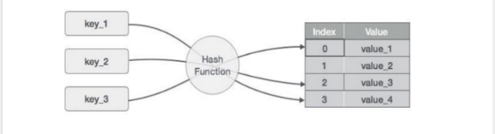
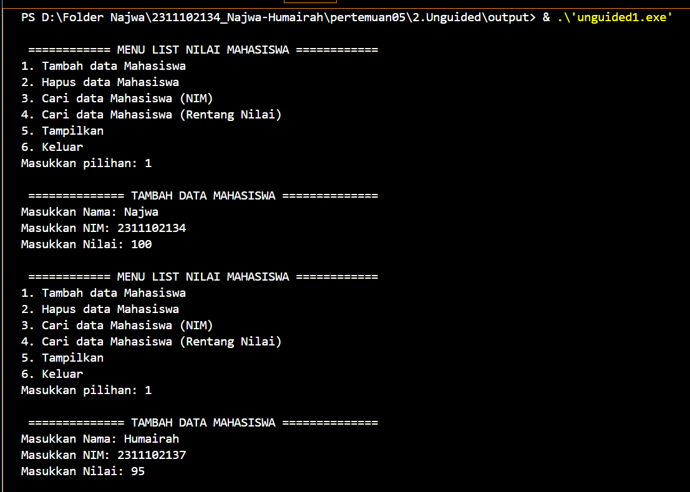
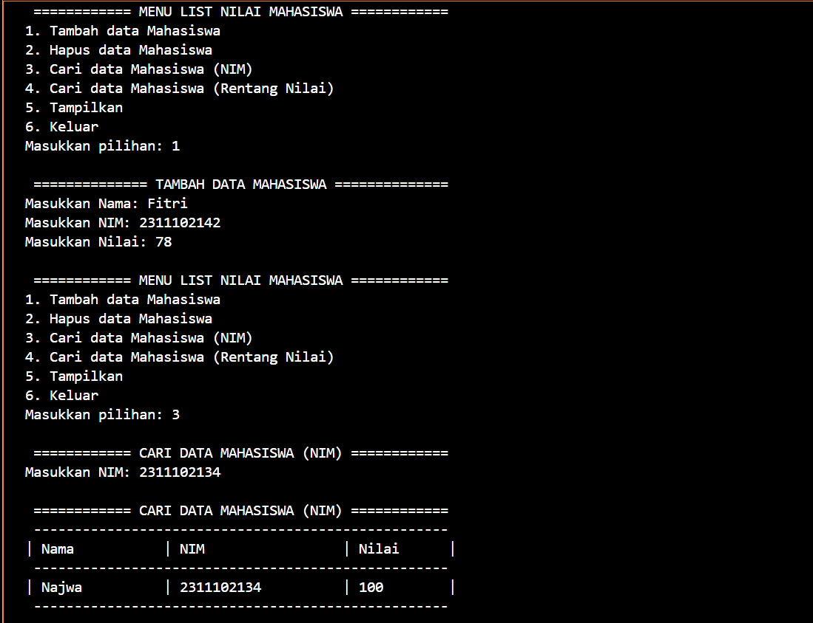
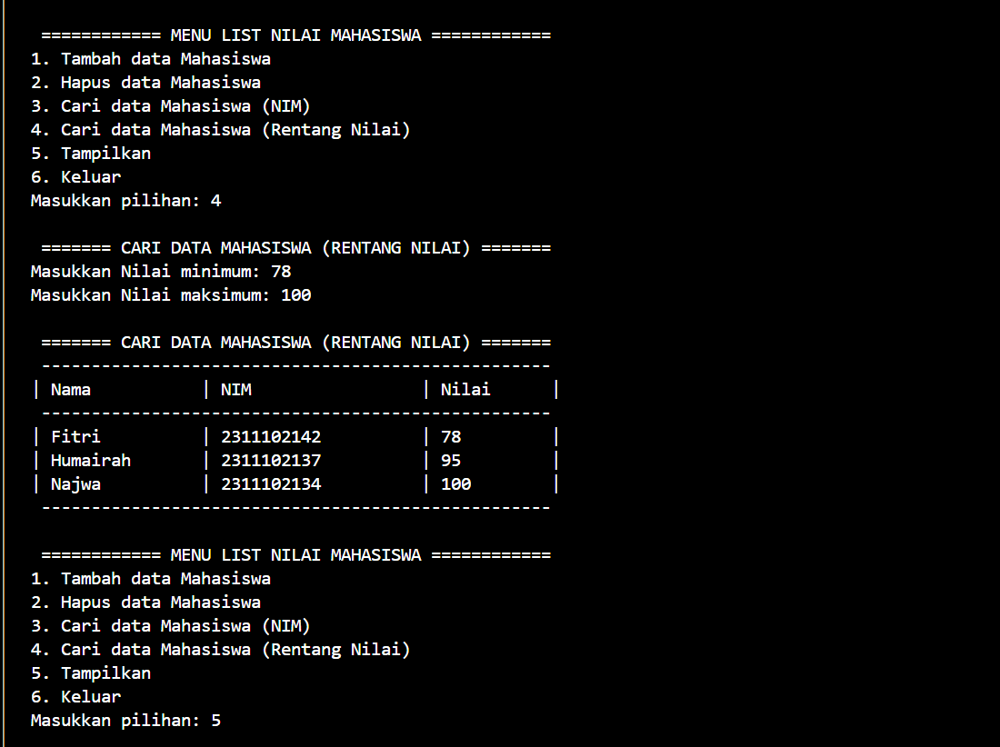
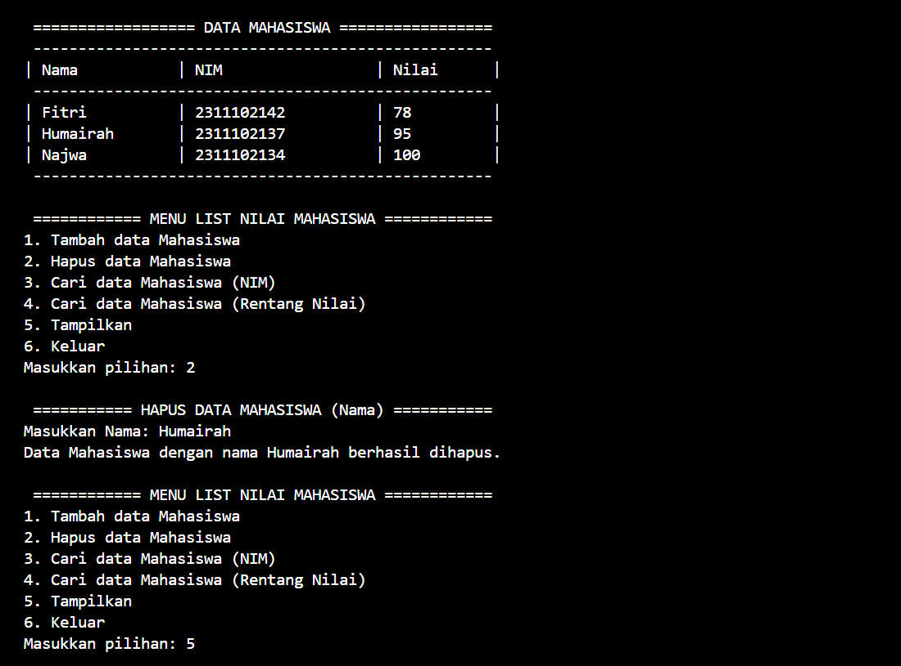
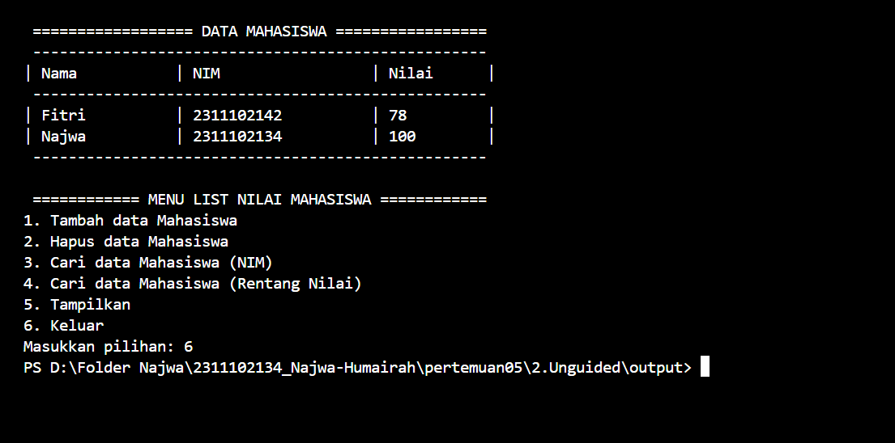

# <h1 align="center">Laporan Praktikum Modul HASH TABLE</h1>
<p align="center"> Najwa Humairah_2311102134 </p>

## Dasar Teori

### 1. [Pengertian Hash Table]
Hash Table adalah sebuah struktur data yang terdiri atas sebuah tabel dan fungsi yang bertujuan untuk memetakan nilai kunci yang unik untuk setiap record(baris) menjadi angka (hash) lokasi record tersebut terdapat dalam sebuah tabel. Keunggulan dari struktur hash table ini adalah waktu aksesnya yang cukup cepat, jia record yang dicari langsung berarda pada angka hash lokasi penyimpanannya. Akan tetapi pada kenyataannya sering kali ditemukan hash table yang recordnya mempunyai angka hash yang sama(bertabrakan). Karena pemetaan hash function yang digunakan bukanlah pemetaan satu-satu. (antara dua record yang tidak sama dapat dibangkitkan angka hash yang sama) maka dapat terjadi bentrokan (collision) dalam penempatan suatu data record. Untuk mengatasi hal tersebut, maka perlu diterapkan kebijakan resolusi bentrokan (collision resolution policy) untuk menentukan lokasi record dalam tabel. Umumnya kebijakan resolusi bentrokan adalah dengan mencari lokasi tabel yang masih kosong pada lokasi setelah lokasi yang berbentrokan. 

Metode hashing mengubah kumpulan nilai kunci menjadi kumpulan indeks array. Data disimpan dalam slot yang disebut bucket, setiap slot dapat menampung satu atau lebih item data. Nilai unik dari setiap item data dibuat dengan menggunakan fungsi hash, yang digunakan sebagai indeks array. Hash table memungkinkan pencarian data dalam waktu yang konstan (O(1)) dalam situasi terbaik. Sistem hash table menggunakan fungsi hash untuk mengambil input kunci dan memetakkannya ke nilai indeks array. Kemudian, fungsi hash menghasilkan posisi indeks array, dan ketika data perlu dicari, input kunci dijadikan parameter untuk fungsi hash, dan posisi indeks array yang dihasilkan digunakan untuk mencari data. Dalam situasi di mana dua atau lebih data memiliki nilai hash yang sama, hash table menyimpan data tersebut dalam slot yang sama. Teknik yang disebut chaining memungkinkan hash table menyimpan data tersebut dalam slot yang sama.


### 2. [Operasi Hash Table]
1. Insert: Menyisipkan pasangan key-value ke dalam hash table. Ini memerlukan penggunaan fungsi hash untuk menentukan indeks di mana nilai akan disimpan. Jika terjadi collision, teknik seperti chaining atau linear probing dapat digunakan untuk menanganinya.
2. Search: Mencari nilai (value) dari hash table berdasarkan key yang diberikan. Fungsi hash mengonversi key menjadi indeks, dan kemudian pencarian dilakukan di indeks tersebut. Jika terjadi collision, pencarian dilanjutkan sesuai dengan metode penanganan collision yang digunakan.
3. Delete: Menghapus pasangan nilai kunci dari tabel hash yang didasarkan pada kunci yang diberikan. Key diubah menjadi indeks dengan fungsi hash, dan kemudian data pada indeks dihapus. Teknik penanganan collision akan digunakan saat terjadi collision.
4. Resize: Jika faktor beban, atau load factor, tabel hash melebihi ambang tertentu, maka tabel hash baru yang lebih besar atau lebih kecil dibuat dan fungsi hash yang diperbarui digunakan untuk merehash semua data ke dalam tabel baru.
5. Iterasi: Ini memungkinkan untuk melakukan operasi pada setiap elemen hash table dengan melakukan iterasi (perulangan) melalui seluruh pasangan nilai kunci yang ada di dalam hash table. 
6. Load Factor Management: Mengawasi faktor beban hash table untuk memastikan performa yang optimal. Hash table harus diubah jika faktor load terlalu tinggi untuk menghindari benturan dan mengurangi kompleksitas waktu operasi.
7. Handling Collision: Untuk menangani kasus ketika dua kunci di-hash ke indeks yang sama, hash table harus memiliki teknik seperti chaining (menggunakan daftar yang terhubung atau array di setiap bucket) atau linear probing (mencari slot kosong berikutnya jika terjadi collision).

### 3. [Fungsi Hash Table]
Fungsi Hashtable: Fungsi Hashtable adalah struktur data yang digunakan untuk menyimpan dan mengakses data dengan cepat berdasarkan kunci (key) yang dihash. Fungsi Hashtable mengonversi kunci menjadi indeks dalam array atau tabel. Dalam hash table, setiap bucket atau slot adalah elemen, dan setiap bucket dapat menampung satu atau lebih pasangan nilai kunci. Hash table sangat bermanfaat karena dapat memberikan akses cepat ke data berdasarkan kunci. Dalam kondisi ideal, pencarian, penyisipan, dan penghapusan data dalam hash table dapat dilakukan dalam waktu konstan (O(1)) dengan menggunakan fungsi hash yang efektif. Hash table dapat digunakan untuk menjalankan struktur data seperti set, map, dictionary, cache, dan lainnya. Hash table sering digunakan dalam bahasa pemrograman seperti Python (dict), Java (HashMap), C++ (unordered_map), dan lainnya untuk memungkinkan pencarian yang cepat dan menyimpan data dengan baik. Namun, perlu diperhatikan bahwa konflik dapat terjadi dalam hash table. Dalam hal ini, metode penanganan konflik seperti chaining, open addressing, atau Robin Hood Hashing diperlukan untuk menangani situasi di mana dua atau lebih kunci dihash ke indeks yang sama. Hash table dapat menjadi struktur data yang sangat berguna dalam banyak aplikasi jika digunakan dengan benar.

### 4. [Collision Resolution]
Keterbatasan tabel hash menyebabkan ada dua angka yang jika dimasukkan ke dalam fungsi hash maka menghasilkan nilai yang sama. Hal ini disebut dengan collision.

contoh:

Kita ingin memasukkan angka 6 dan 29.<br/>
Hash(6) 6% 23 = 6<br/>
Hash(29) 29% 23 = 6<br/>

Pertama-tama anggap tabel masih kosong. Pada saat angka 6 masuk akan ditempatkan pada posisi indeks 6, angka kedua 29 seharusnya ditempatkan di indeks 6 juga, namun karena indeks ke-6 sudah ditempati maka 29 tidak bisa ditempatkan di situ, di sinilah terjadi collision. Cara penanganannya bermacam-macam :

a.Collision Resolution Open Addressing<br/>

1. Linear Probing
Pada saat terjadi collision, maka akan mencari posisi yang kosong di bawah tempat terjadinya collision, jika masih penuh terus ke bawah, hingga ketemu tempat terjadinya collision, jika masih penuh terus ke bawah, hingga ketemu tempat yang kosong. Jika tidak ada tempat yang kosong berarti HashTable sudah penuh.

Contoh deklarasi program:
```C++
struct {...} node;
node Table (M); int Free;
/* insert K */
addr Hash(K);
if (IsEmpty (addr)) Insert (K,addr);
else {
/* see if already stored */
test:
if (Table [addr].key == K) return;
else {
addr Table (addr).link; goto test;}
/* find free cell */
Free addr;
do { Free--; if (Free<0) Free=M-1; } 
while (!IsEmpty (Free) && Free!=addr)
if (!IsEmpty (Free)) abort;
else {
Insert (K, Free); Table (addr).link Free;} 
}
```
2. Quadratic Probing Penanganannya hampir sama dengan metode linear, hanya lompatannya tidak satu-satu, tetapi quadratic (12, 22, 32, 42, ...)

3. Double Hashing Pada saat terjadi collision, terdapat fungsi hash yang kedua untuk menentukan posisinya kembali.

a. Collision Resolution Chaining<br/>
    - Tambahkan key and entry di manapun dalam list (lebih mudah dari depan)<br/>
    - Keunggulan dibandingkan open addressing.<br/>
Proses insert dan remove lebih sederhana<br/>
Ukuran Array bukan batasan (tetapi harus tetap meminimalisir collision: buat ukuran tabel sesuai dengan jumlah key dan entry yang diharapkan)<br/>
    - Kerugian:<br/>
Overhead pada memory tinggi jika jumlah entry sedikit

## Guided

### 1. [Hash Table Sederhana]

```C++
#include <iostream>
using namespace std;

const int MAX_SIZE = 10;

// Fungsi hash sederhana
int hash_func(int key) {
    return key % MAX_SIZE;
}

// Struktur data untuk setiap node
struct Node {
    int key;
    int value;
    Node* next;
    Node(int key, int value) : key(key), value(value), next(nullptr) {}
};

// Class hash table
class HashTable {
private:
    Node** table;

public:
    HashTable() {
        table = new Node*[MAX_SIZE]();
    }

    ~HashTable() {
        for (int i = 0; i < MAX_SIZE; i++) {
            Node* current = table[i];
            while (current != nullptr) {
                Node* temp = current;
                current = current->next;
                delete temp;
            }
        }
        delete[] table;
    }

    // Insertion
    void insert(int key, int value) {
        int index = hash_func(key);
        Node* current = table[index];
        while (current != nullptr) {
            if (current->key == key) {
                current->value = value;
                return;
            }
            current = current->next;
        }
        Node* node = new Node(key, value);
        node->next = table[index];
        table[index] = node;
    }

    // Searching
    int get(int key) {
        int index = hash_func(key);
        Node* current = table[index];
        while (current != nullptr) {
            if (current->key == key) {
                return current->value;
            }
            current = current->next;
        }
        return -1;
    }

    // Deletion
    void remove(int key) {
        int index = hash_func(key);
        Node* current = table[index];
        Node* prev = nullptr;
        while (current != nullptr) {
            if (current->key == key) {
                if (prev == nullptr) {
                    table[index] = current->next;
                } else {
                    prev->next = current->next;
                }
                delete current;
                return;
            }
            prev = current;
            current = current->next;
        }
    }

    // Traversal
    void traverse() {
        for (int i = 0; i < MAX_SIZE; i++) {
            Node* current = table[i];
            while (current != nullptr) {
                cout << current->key << ": " << current->value << endl;
                current = current->next;
            }
        }
    }
};

int main() {
    HashTable ht;

    // Insertion
    ht.insert(1, 10);
    ht.insert(2, 20);
    ht.insert(3, 30);

    // Searching
    cout << "Get key 1: " << ht.get(1) << endl;
    cout << "Get key 4: " << ht.get(4) << endl;

    // Deletion
    ht.remove(4);

    // Traversal
    ht.traverse();

    return 0;
}
```
Kode di atas adalah pengimplementasian sederhana dari table hash dalam bahasa pemograman c++. Untuk menyimpan dan mengelola pasangan kunci-nilai, program ini menggunakan konsep struktur data tabel hash. Pertama, program mendefinisikan fungsi hash sederhana yang digunakan untuk menentukan indeks di mana elemen akan disimpan dalam tabel hash. Setiap elemen dalam tabel hash diwakili oleh struktur data node, yang memiliki dua variabel anggota untuk menyimpan nilai dan kunci, serta pointer untuk mengarah ke node berikutnya dalam kasus tabrakan. Selain itu, program mendefinisikan kelas HashTable, yang memiliki berbagai fungsi untuk memanipulasi tabel hash, seperti menyisipkan, mencari, dan menghapus pasangan kunci-nilai, dan melihat seluruh isi tabel hash. Kelas ini juga memiliki konstruktor dan destruktor untuk mengatur alokasi memori. Program menunjukkan penggunaan kelas HashTable dalam fungsi main. Metode insert digunakan untuk memasukkan tiga pasangan kunci-nilai ke dalam tabel hash. Dua pencarian dilakukan untuk menemukan nilai yang terkait dengan kunci yang ada dan tidak ada, dan penghapusan dilakukan untuk menghapus elemen dari tabel hash, meskipun kunci yang dihapus tidak ada. Terakhir, program meninjau seluruh isi tabel hash dan mencetak pasangan kunci-nilai yang disimpan di dalamnya.

## Guided 

### 2. [Hash Table dengan Node]

```C++
#include <iostream>
#include <string>
#include <vector>

using namespace std;

const int TABLE_SIZE = 11;

string name;
string phone_number;
class HashNode{
    public:
    string name;
    string phone_number;

    HashNode(string name, string phone_number){
        this->name = name;
        this->phone_number = phone_number;
    }
};

class HashMap{
    private:
    vector<HashNode*> table[TABLE_SIZE];
    public:
    int hashFunc(string key){
        int hash_val = 0;
        for(char c : key){
            hash_val += c;
        }
    return hash_val % TABLE_SIZE;
    }

    void insert(string name, string phone_number){
        int hash_val = hashFunc(name);

        for(auto node : table[hash_val]){
            if(node->name == name){
                node->phone_number = phone_number;
                return;
            }
        }
        table[hash_val].push_back(new HashNode(name, phone_number));
    }

    void remove(string name){
        int hash_val = hashFunc(name);

        for(auto it = table[hash_val].begin(); it != table[hash_val].end(); it++){
            if((*it)->name == name){
                table[hash_val].erase(it);
                return;
            }
        }
    }

    string searchByName(string name){
        int hash_val = hashFunc(name);
        for(auto node : table[hash_val]){
            if(node->name == name){
                return node->phone_number;
            }
        }
        return "";
    }

    void print(){
        for(int i = 0; i < TABLE_SIZE; i++){
            cout << i << ": ";
            for(auto pair : table[i]){
                if(pair != nullptr){
                    cout << "[" << pair->name << ", " << pair->phone_number << "]";
                }
            }
            cout << endl;
        }
    }
};

int main(){
    HashMap employee_map;

    employee_map.insert("Mistah", "1234");
    employee_map.insert("Pastah", "5678");
    employee_map.insert("Ghana", "91011");

    cout << "Nomor HP Mistah : " << employee_map.searchByName("Mistah") << endl;
    cout << "Nomor HP Pastah : " << employee_map.searchByName("Pastah") << endl;

    employee_map.remove("Mistah");

    cout << "Nomor HP Mistah setelah dihapus : " << employee_map.searchByName("Mistah") << endl << endl;

    employee_map.print();

    return 0;
}
```
Program diatas yaitu pengimplementasian struktur data hash table yang digunakan untuk menyimpan dan mengakses pasangan nama dan nomor telepon. Program ini terdiri dari dua kelas yaitu 'HashNode' dan 'HashMap'. Kelas HashNode menunjukkan setiap node dalam tabel hash. Setiap objek HashNode memiliki dua variabel anggota, name dan phone_number, yang digunakan untuk menyimpan nama dan nomor telepon. Untuk mengelola tabel hash, kelas HashMap menampilkan tabel hash sebagai array dinamis dari vektor atau vector yang berisi pointer ke objek HashNode. Kelas ini memiliki beberapa fungsi, termasuk fungsi hash untuk mengonversi nama dalam tabel hash menjadi indeks dan fungsi untuk menyisipkan, menghapus, dan mencari pasangan nama dan nomor telepon dalam tabel hash. Fungsi utama (utama) program ini adalah untuk menunjukkan penggunaan kelas HashMap. Tiga pasangan nama dan nomor telepon dimasukkan ke dalam tabel hash, kemudian dilakukan pencarian untuk mencari nomor telepon berdasarkan nama yang ada, dan kemudian satu pasangan nama dan nomor telepon dihapus dari tabel hash. Setelah operasi-operasi ini selesai, isi tabel hash secara keseluruhan dicetak untuk ditampilkan.

## Unguided 

### 1. Implementasikan hash table untuk menyimpan data mahasiswa. Setiap mahasiswa memiliki NIM dan nilai. Implementasikan fungsi untuk menambahkan data baru, menghapus data, mencari data berdasarkan NIM, dan mencari data berdasarkan nilai. 
Dengan ketentuan : <br/>
a. Setiap mahasiswa memiliki NIM dan nilai.<br/>
b. Program memiliki tampilan pilihan menu berisi poin C.<br/>
c. Implementasikan fungsi untuk menambahkan data baru, menghapus data, mencari data berdasarkan NIM, dan mencari data berdasarkan rentang nilai (80 – 90).

```C++
// Najwa Humairah
// 2311102134

#include <iostream>
#include <string>
#include <vector>
#include <iomanip>

using namespace std;

const int TABLE_SIZE = 100; // Ukuran tabel diubah menjadi bilangan prima untuk meningkatkan efisiensi hashing

// Struktur data mahasiswa
struct Mahasiswa {
    string nama_134;
    string nim_134;
    int nilai_134;
};

// Struktur data untuk setiap node
class HashNode {
public:
    string name_134;
    string nim_134;
    int nilai_134;

    HashNode(string name_134, string nim_134, int nilai_134) : name_134(name_134), nim_134(nim_134), nilai_134(nilai_134) {}
};

// Class HashMap
class HashMap {
private:
    vector<HashNode*> table[TABLE_SIZE];

public:
    int hashFunc(string key) {
        int hash_val = 0;
        for (char c : key) {
            hash_val += c;
        }
        return hash_val % TABLE_SIZE;
    }

    void insert(string name_134, string nim_134, int nilai_134) {
        int hash_val = hashFunc(name_134);
        for (auto node : table[hash_val]) {
            if (node->name_134 == name_134) {
                node->nim_134 = nim_134;
                node->nilai_134 = nilai_134;
                cout << "Data Mahasiswa dengan Nama " << name_134 << " berhasil ditambahkan." << endl;
                return;
            }
        }
        table[hash_val].push_back(new HashNode(name_134, nim_134, nilai_134));
    }

    void remove(string name_134) {
        int hash_val = hashFunc(name_134);
        for (auto it = table[hash_val].begin(); it != table[hash_val].end(); ++it) {
            if ((*it)->name_134 == name_134) {
                delete *it;
                table[hash_val].erase(it);
                cout << "Data Mahasiswa dengan nama " << name_134 << " berhasil dihapus." << endl;
                return;
            }
        }
    }

    void searchByNIM(string nim_134) {
        bool found = false;
        for (int i = 0; i < TABLE_SIZE; ++i) {
            for (auto node : table[i]) {
                if (node->nim_134 == nim_134) {
                    cout << "\n ============ CARI DATA MAHASISWA (NIM) ============" << endl;
                    cout << " ---------------------------------------------------" << endl;
                    cout << left << "| " << setw(15) << "Nama"
                         << "| " << setw(20) << "NIM"
                         << "| " << setw(10) << "Nilai"
                         << " |" << endl;
                    cout << " ---------------------------------------------------" << endl;
                    cout << "| " << left << setw(15) << node->name_134
                         << "| " << left << setw(20) << node->nim_134
                         << "| " << left << setw(10) << node->nilai_134 << " |" << endl;
                    cout << " ---------------------------------------------------" << endl;
                    found = true;
                    return;
                }
            }
        }
        if (!found) {
            cout << "Mahasiswa dengan NIM " << nim_134 << " tidak ditemukan." << endl;
        }
    }

    void CariRentangNilai(int NilaiMin, int NilaiMax) {
        bool found = false;
        cout << "\n ======= CARI DATA MAHASISWA (RENTANG NILAI) =======" << endl;
        cout << " ---------------------------------------------------" << endl;
        cout << left << "| " << setw(15) << "Nama"
             << "| " << setw(20) << "NIM"
             << "| " << setw(10) << "Nilai"
             << " |" << endl;
        cout << " ---------------------------------------------------" << endl;
        for (int i = 0; i < TABLE_SIZE; ++i) {
            for (auto node : table[i]) {
                if (node->nilai_134 >= NilaiMin && node->nilai_134 <= NilaiMax) {
                    cout << "| " << left << setw(15) << node->name_134
                         << "| " << left << setw(20) << node->nim_134
                         << "| " << left << setw(10) << node->nilai_134 << " |" << endl;
                    found = true;
                }
            }
        }
        if (!found) {
            cout << "Tidak ada data Mahasiswa dengan nilai antara " << NilaiMin << " dan " << NilaiMax << "." << endl;
        }
        cout << " ---------------------------------------------------" << endl;
    }

    void print() {
        cout << "\n ================== DATA MAHASISWA =================" << endl;
        cout << " ---------------------------------------------------" << endl;
        cout << left << "| " << setw(15) << "Nama"
             << "| " << setw(20) << "NIM"
             << "| " << setw(10) << "Nilai"
             << " |" << endl;
        cout << " ---------------------------------------------------" << endl;
        for (int i = 0; i < TABLE_SIZE; ++i) {
            for (auto pair : table[i]) {
                cout << "| " << left << setw(15) << pair->name_134
                     << "| " << left << setw(20) << pair->nim_134
                     << "| " << left << setw(10) << pair->nilai_134 << " |" << endl;
            }
        }
        cout << " ---------------------------------------------------" << endl;
    }

    ~HashMap() {
        for (int i = 0; i < TABLE_SIZE; ++i) {
            for (auto node : table[i]) {
                delete node;
            }
        }
    }
};

int main() {
    HashMap map;
    int choice;
    string name_134;
    string nim_134;
    int nilai_134;
    int search1, search2;
    do {
        cout << "\n ============ MENU LIST NILAI MAHASISWA ============" << endl;
        cout << "1. Tambah data Mahasiswa" << endl;
        cout << "2. Hapus data Mahasiswa" << endl;
        cout << "3. Cari data Mahasiswa (NIM)" << endl;
        cout << "4. Cari data Mahasiswa (Rentang Nilai)" << endl;
        cout << "5. Tampilkan" << endl;
        cout << "6. Keluar" << endl;
        cout << "Masukkan pilihan: ";
        cin >> choice;
        switch (choice) {
            case 1:
                cout << "\n ============== TAMBAH DATA MAHASISWA ==============" << endl;
                cout << "Masukkan Nama: ";
                cin >> name_134;
                cout << "Masukkan NIM: ";
                cin >> nim_134;
                cout << "Masukkan Nilai: ";
                cin >> nilai_134;
                map.insert(name_134, nim_134, nilai_134);
                break;
            case 2:
                cout << "\n =========== HAPUS DATA MAHASISWA (Nama) ===========" << endl;
                cout << "Masukkan Nama: ";
                cin >> name_134;
                map.remove(name_134);
                break;
            case 3:
                cout << "\n ============ CARI DATA MAHASISWA (NIM) ============" << endl;
                cout << "Masukkan NIM: ";
                cin >> nim_134;
                map.searchByNIM(nim_134);
                break;
            case 4:
                cout << "\n ======= CARI DATA MAHASISWA (RENTANG NILAI) =======" << endl;
                cout << "Masukkan Nilai minimum: ";
                cin >> search1;
                cout << "Masukkan Nilai maksimum: ";
                cin >> search2;
                map.CariRentangNilai(search1, search2);
                break;
            case 5:
                map.print();
                break;
            case 6:
                break;
            default:
                cout << "Pilihan tidak tersedia!" << endl;
        }
    } while (choice != 6);
    return 0;
}
```
#### Output:






Dalam program diatas, struktur data tabel hash digunakan untuk menyimpan data siswa menggunakan bahasa C++. Struktur data ini memungkinkan untuk menambah, menghapus, mencari, dan menampilkan data siswa berdasarkan nama atau NIM serta mencari data siswa berdasarkan rentang nilai. Untuk mengelola data siswa, program ini menggunakan kelas HashMap, yang memungkinkan beberapa operasi utama seperti memasukkan, menghapus, mencariByNIM, mencariRentangNilai, dan menulis. Setiap siswa diwakili oleh objek HashNode yang menyimpan informasi nama, NIM, dan nilai. Kelas HashMap memiliki tabel hashing yang digambarkan sebagai array vektor dinamis dengan ukuran tabel diubah menjadi bilangan prima untuk meningkatkan efisiensi hashing. Fungsi hashing digunakan untuk mengonversi nama siswa dalam tabel hashing menjadi indeks.

Sebuah menu interaktif di fungsi main memungkinkan pengguna melakukan hal-hal berikut:<br/>
1. Menambah data mahasiswa dengan memasukkan nama, NIM, dan nilai.
2. Menghapus data mahasiswa berdasarkan nama.
3. Mencari data mahasiswa berdasarkan NIM.
4. Mencari data mahasiswa berdasarkan rentang nilai.
5. Menampilkan seluruh data mahasiswa yang tersimpan.
6. Keluar dari program.

Setelah pengguna memilih opsi, program akan menjalankan operasi yang sesuai dan mengulangi menu hingga pengguna memilih untuk keluar.

## Kesimpulan
Hash table adalah struktur data yang efektif untuk menyimpan dan mengelola data dalam aplikasi komputer. Program yang dibuat untuk menggunakan hash table dalam bahasa C++ menunjukkan kemampuan hash table untuk melakukan operasi pencarian, penyisipan, dan penghapusan data dengan kompleksitas waktu rata-rata yang rendah, serta untuk menangani tabrakan dengan metode chaining. Program tersebut juga menjelaskan bagaimana hash table dapat digunakan dalam berbagai konteks pengembangan perangkat lunak dan interaksi dengan pengguna melalui antarmuka yang sederhana. Hasilnya menunjukkan bahwa hash table sangat penting untuk meningkatkan kinerja dan efisiensi aplikasi yang menggunakan penyimpanan dan pengelolaan data.

## Referensi
[1] Praktikum Algoritma Dan Struktur Data 2010 BAB XI HASHING. 2010.
[2] Mailund, T. (2019). Kegembiraan hashing: pemrograman tabel hash dengan C. Apress. 