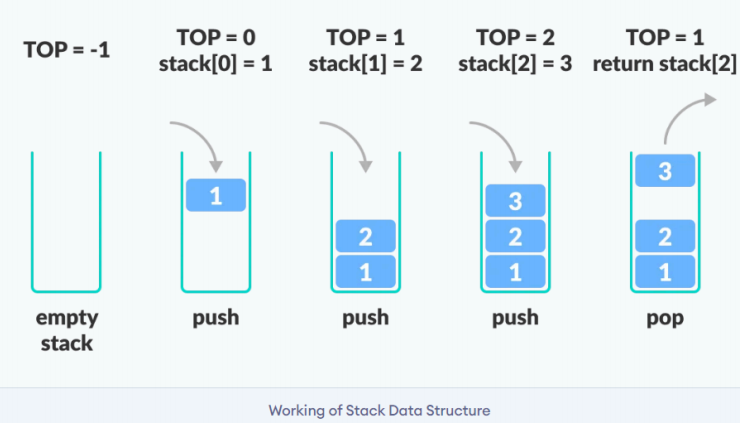

# <h1 align="center">Laporan Praktikum Modul STACK</h1>
<p align="center"> Najwa Humairah_2311102134 </p>

## Dasar Teori

### 1. [Pengertian Stack]
Stack adalah sebuah kumpulan data di mana data diletakkan di atas data lain. Oleh karena itu, stack adalah struktur data yang menggunakan konsep LIFO, dan elemen pertama yang diambil adalah elemen terakhir yang disimpan dalam stack. Kita melakukan push dalam proses komputasi untuk meletakkan sebuah elemen di bagian atas tumpukan, dan kita melakukan pop untuk memindahkan elemen tersebut dari tempat tersebut.

Ada beberapa cara untuk menyajikan sebuah tumpukan, tergantung pada masalah yang akan kita selesaikan. Dalam bab ini, kita akan menggunakan cara paling sederhana , yaitu tipe data yang sudah kita kenal, yaitu array. Kita dapat menggunakan array untuk menyajikan sebuah stack, dengan menganggap bahwa banyaknya elemen maksimum dalam stack tidak akan melebihi batas maksimum banyaknya elemen dalam array. Jika kita terus menambah data pada saat ukuran stack meningkat, akan terjadi overflow. Oleh karena itu, untuk mencatat posisi ujung tumpukan, kita perlu menggunakan tipe struktur data , atau struct, yang terdiri dari dua medan. Medan pertama bertipe array untuk menyimpan elemen stack, dan medan kedua bertipe integer untuk mencatat posisi ujung stack. 


### 2. [Operasi Dasar Pada Stack]
Operasi-operasi Dasar pada stack adalah sebagai berikut: 

1. Create : Merupakan operator yang berfungsi untuk membuat sebuah stack kosong.
```C++
struct STACK { //Membuat jenis data abstrak 'STACK'
    int top;
    float data[4];
}
float dta;
struct STACK stackbaru;
```

2. isEmpty : Merupakan operator yang berfungsi untuk menentukan apakah suatu stack merupakan stack kosong. Tanda bahwa sebuah stack kosong adalah Top bernilai kurang dari nol (-1).
```C++
bool isempty(){ //Menanyakan : kosongkan?
    if(stackbaru.top==1) return true;
    else return false;
}
```

3. isFull : Merupakan operator yang digunakan untuk memeriksa apakah stack yang ada sudah penuh. Stack akan penuh jika puncak stack terletak tepat dibawah jumlah maksimum yang dapat ditampung stack (Top = MAX_STACK-1).
```C++
bool isfull(){
    if(stackbaru.top==maxstack)return true;
    else return false;
}
```

4. Push : Merupakan operator yang berfungsi untuk menambahkan satu elemen ke dalam stack dan tidak dapat dilakukan jika stack dalam keadaan penuh.
```C++
void push(float dta) {
    if (isfull()==false) {
        puts("stack penuh");
    } else {
        stackbaru.top++;
        stackbaru.data[top]=dta;
    }
}
```

5. Pop : Merupakan operator yang berfungsi untuk mengeluarkan satu elemen teratas dari dalam stack dengan syarat stack tidak dalam kondisi kosong.
```C++
void pop() {
    if (isempty()==false) {
        cout << "data kosong";
    } else {
        cout << "data yang terambil :" << stackbaru.data[top] << endl;
        stackbaru.top--;
    }
}
```

5. Clear : Fungsi yang digunakan untuk mengosongkan stack dengan cara mengeset Top dengan -1. Jika Top bernilai kurang dari nol maka stack dianggap kosong.
```C++
void clear () {
top=-1
}
```

6. Retrieve : fungsi yang digunakan untuk melihat nilai yang berada pada posisi tumpukan teratas.
```C++
void print() {
    for (int i=0; i<=top; i++) {
        cout << stackbaru.data[i] << "  ";
    }
}
```

## Guided

### 1. [STACK]
```C++
#include<iostream>

using namespace std;

//Deklarasi array bernama arrayBuku dengan ukuran 5
string arrayBuku[5];
int maksimal = 5, top = 0;

//Fungsi isFull untuk memeriksa apakah stack full atau tidak
bool isFull(){
    return (top == maksimal);
}

//Fungsi isEmpty untuk memeriksa apakah stack kosong atau tidak
bool isEmpty(){
    return (top == 0);
}

//Prosedur push untuk menambahkan elemen pada stack posisi paling atas
void pushArrayBuku(string data){
    if(isFull()){
        cout << "Data telah penuh" << endl;
    } else {
        arrayBuku[top] = data;
        top++;
    }
}

//Prosedur pop untuk menghapus elemen pada stack posisi paling atas
void popArrayBuku(){
    if(isEmpty()){
        cout << "tidak ada data yang dihapus" << endl;
    } else {
        arrayBuku[top - 1] = "";
        top--;
    }
}

//Prosedur peek untuk melihat elemen pada stack posisi tertentu 
void peekArrayBuku(int posisi){
    if(isEmpty()){
        cout << "tidak ada data yang bisa dilihat" << endl;
    } else {
        int index = top;
        for(int i = 1; i <= posisi; i++){
            index--;
        }
        cout << "Posisi ke-" << posisi << " adalah " << arrayBuku[index] << endl;
    }
}

//Fungsi Count untuk menghitung jumlah elemen pada stack
int countStack(){
    return top;
}

//Prosedur change untuk mengubah elemen posisi tertentu pada stack
void changeArrayBuku(int posisi, string data){
    if(posisi > top){
        cout << "Posisi melebihi data yang ada" << endl;
    } else {
        int index = top;
        for(int i = 1; i <= posisi; i++){
            index--;
        }
        arrayBuku[index] = data;
    }
}

//Prosedur destroy atau clear untuk menghapus semua elemen pada stack
void destroyArrayBuku(){
    for(int i = top; i >= 0; i--){
        arrayBuku[i] = "";
    }
    top = 0;
}

//Prosedur cetak untuk menampilkan semua elemen pada stack
void cetakArrayBuku(){
    if(isEmpty()){
        cout << "tidak ada data yang bisa dicetak" << endl;
    } else {
        for (int i = top - 1; i >= 0; i--){
            cout << arrayBuku[i] << endl;
        }
    }
}

int main(){
    //Menambahkan elemen pada stack menggunakan prosedur push
    pushArrayBuku("Kalkulus");
    pushArrayBuku("Struktur Data");
    pushArrayBuku("Matematika Diskrit");
    pushArrayBuku("Dasar Multimedia");
    pushArrayBuku("Inggris");

    //mencetak semua elemen pada stack menggunakan prosedur cetak
    cetakArrayBuku();
    cout << "\n";

    //Memeriksa apakah stack penuh atau tidak menggunakan fungsi isFull
    cout << "Apakah data stack penuh? " << isFull() << endl;

    //Memeriksa apakah stack kosong atau tidak menggunakan fungsi isEmpty
    cout << "Apakah data stack kosong? " << isEmpty() << endl;
    cout << "\n";

    //Melihat elemen pada stack posisi ke 2 menggunakan prosedur peek
    peekArrayBuku(2);

    //Menghapus elemen stack posisi paling atas menggunakan prosedur pop
    popArrayBuku();
    cout << "\n";

    //Menghitung jumlah elemen pada stack menggunakan fungsi count
    cout << "Banyaknya data = " << countStack() << endl;

    //Mengubah elemen stack posisi ke 2 menjadi "Bahasa Jerman" menggunakan prosedur change
    changeArrayBuku(2, "Bahasa Jerman");

    //mencetak semua elemen pada stack menggunakan prosedur cetak
    cetakArrayBuku();
    cout << "\n";

    //Menghapus semua elemen pada stack menggunakan prosedur destroy atau clear
    destroyArrayBuku();

    //Menghitung jumlah elemen pada stack menggunakan fungsi count
    cout << "Jumlah data setelah dihapus = " << countStack() << endl;

    //mencetak semua elemen pada stack menggunakan prosedur cetak
    cetakArrayBuku();

    return 0;
}
```
Kode di atas adalah sebuah program sederhana dalam bahasa c++ yang menggunakan konsep stack untuk mengelola data buku. Program ini mendeklarasikan array buku dengan ukuran 5 dan dua variabel maksimal dan atas untuk mengatur kapasitas tumpukan dan penanda posisi paling atas. Ada fungsi-fungsi seperti isFull dan isEmpty yang menunjukkan apakah stack penuh atau kosong; Menambahkan elemen (pushArrayBuku), menghapus elemen (popArrayBuku), melihat elemen pada posisi tertentu (peekArrayBuku), menghitung jumlah elemen (countStack), mengubah elemen pada posisi tertentu (changeArrayBuku), menghapus semua elemen (destroyArrayBuku), dan mencetak semua elemen (cetakArrayBuku). Pada fungsi main, ada beberapa operasi dilakukan seperti menambahkan elemen ke tumpukan, mencetak elemen pada tumpukan, memeriksa apakah tumpukan penuh atau kosong, melihat elemen pada posisi tertentu, menghapus elemen pada posisi paling atas, menghitung jumlah elemen pada tumpukan, mengubah elemen pada posisi tertentu, Menghapus semua elemen pada stack, dan kembali mencetak elemen pada stack setelah dihapus.

## Unguided 

### 1. [Buatlah program untuk menentukan apakah kalimat tersebut yang diinputkan dalam program stack adalah palindrom/tidak. Palindrom kalimat yang dibaca dari depan dan belakang sama. Jelaskan bagaimana cara kerja programnya.]


```C++
// Najwa Humairah
// 2311102134


```
#### Output:


Dalam program diatas, 

### 2. [Buatlah program untuk melakukan pembalikan terhadap kalimat menggunakan stack dengan minimal 3 kata. Jelaskan output program dan source codenya beserta operasi/fungsi yang dibuat?]


```C++
// Najwa Humairah
// 2311102134


```
#### Output:


Dalam program diatas, 

## Kesimpulan
Stack adalah struktur 

## Referensi
[1] Modul Praktikum Algoritma Dan Struktur Data MODUL IV STACK