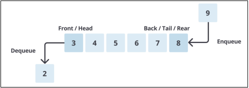
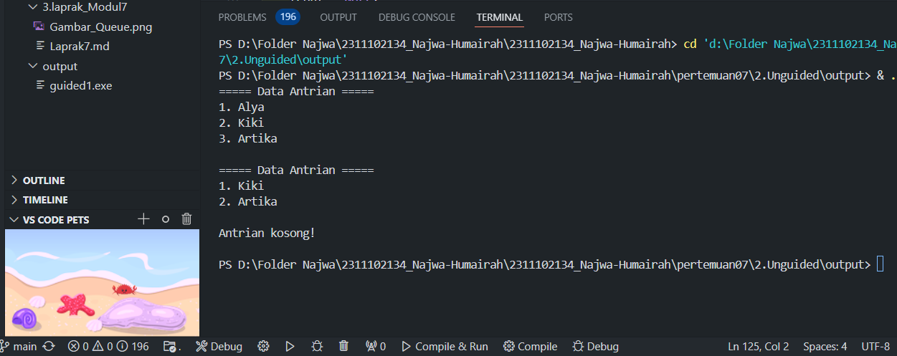
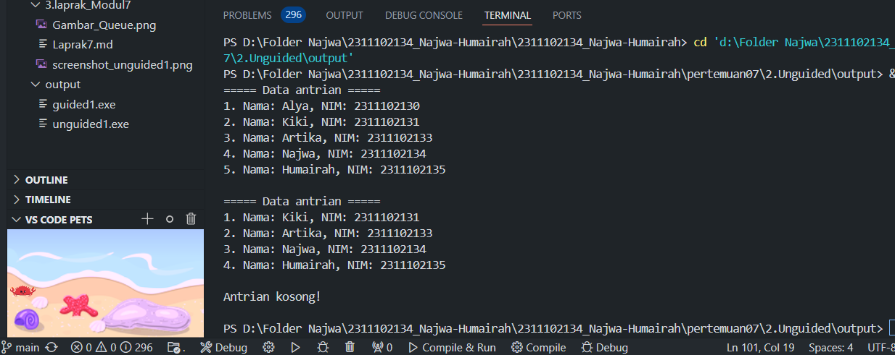

# <h1 align="center">Laporan Praktikum Modul QUEUE</h1>
<p align="center"> Najwa Humairah_2311102134 </p>

## Dasar Teori

### 1. [Pengertian QUEUE]
Queue atau antrian adalah struktur data linear. Konsepnya mirip dengan staack. Perbedaannya adalah penambahan dan penghapusan dilakukan di ujung yang berbeda. Bagian depan, atau kepala, dihapus, dan bagian belakang, atau kaki, ditambah. Dalam antrian, elemen dapat berupa integer, real, atau daftar sederhana atau terstruktur. Penambahan dan penghapusan elemen baru pada bagian depan dan penambahan elemen baru pada bagian belakang dikenal sebagai tumpukan. Sistem pengaksesan queue menggunakan sistem FIFO, yang berarti elemen yang pertama masuk akan pertama dikeluarkan dari queue. Queue adalah salah satu contoh aplikasi pembuatan daftar dua terkait yang sering kita temui dalam kehidupan sehari-hari. Ini terjadi saat Anda menunggu tiket di loket.

Implementasi queue dapat dilakukan dengan menggunakan array atau linked list. Struktur data queue terdiri dari dua pointer yaitu front dan rear. Front/head adalah pointer ke elemen pertama dalam queue dan rear/tail/back adalah pointer ke elemen terakhir dalam queue.



### 2. [Operasi Operasi Pada QUEUE]
1. Operasi Create<br/>
Operasi create adalah membuat antrian baru dengan jumlah elemen kosong. yang berfungsi untuk menciptakan dan menginisialisasi queue. Ini dibuat dengan membuat head dan tail = -1. Kode berikut digunakan untuk membuat operasi create.

```C++
void create(){
    antrian.head=antrian.tail=-1;
}
```

2. Operasi Empty<br/>
Operasi empty digunakan untuk mengetahui apakah antrian kosong atau tidak. Pemeriksaan dilakukan dengan memeriksa nilai tail. Antrian tidak ada jika tail = 1. Kita tidak memeriksa head karena head adalah tanda elemen pertama dalam antrian, yang tidak akan berubah kecuali nilainya berubah menjadi 0. Penambahan elemen antrian ke belakang, atau nilai tail, memungkinkan pergerakan dalam antrian.

```C++
int IsEmpty(){
    if(antrian.tail==-1)
        return 1;
    else
        return 0;
}
```

3. Operasi full<br/>
Operasi full digunakan untuk mengecek apakah antrian sudah penuh atau belum. Pengecekan dilakukan dengan cara mengecek nilai tail, Jika tail >= MAX-1 (karena MAX-1 adalah batas elemen array pada C++) berarti sudah penuh.

```C++
int IsFull(){
    if(antrian.tail>-max-1)
        return 1;
    else
        return 0;
}
```

4. Operasi Engueue<br/>
Operasi enqueue digunakan untuk menambahkan elemen ke dalam antrian, penambahan elemen selalu ditambahkan di elemen paling belakang. Penambahan elemen selalu menggerakkan variabel tail dengan cara increment counter tail terlebih dahulu.

```C++
void Enqueue(int data){
    if(IsEmpty()==1){
        antrian.head=antrian.tail=0;
        antrian.data[antrian.tail]=data;
        cout<<"Data "<<antrian.data[antrian.tail]<<"Masuk !!!";
    }
    else if(IsFull()==0)
    {
        antrian.tail++;
        antrian.data[antrian.tail]=data;
        cout<<"Data "<<antrian.data[antrian.tail]<<"Masuk !!!";
    }
    else if(IsFull()==1)
    {
        cout<<"Ruangan Penuh !!"<<endl;
        cout<<data<<"Ga Bisa Masuk !!!";
    }
}
```

5. Operasi Dequeue<br/>
Operasi dequeue digunakan untuk menghapus elemen terdepan/pertama (head) dari antrian. Penghapusan dilakukan dengan cara menggeser semua elemen antrian ke depan dan mengurangi tail dengan 1. Penggeseran dilakukan dengan menggunakan looping.

## Guided

### 1. [QUEUE]

```C++
#include<iostream>

using namespace std;

const int MaksimalAntrian = 5;
int front = 0;
int back = 0;
string QueueTeller[5];

// Mengecek apakah antrian sudah penuh atau belum
bool isFull(){
    if(back == MaksimalAntrian){
        return true;
    } else {
        return false;
    }
}

// Mengecek apakah antrian masih kosong atau tidak
bool isEmpty(){
    if(back == 0){
        return true;
    } else {
        return false;
    }
}

// Menambah antrian
void TambahData(string nama){
    if(isFull()){
        cout << "Antrian sudah penuh" << endl;
    } else if(!isFull()){
        if(isEmpty()){
            QueueTeller[0] = nama;
            front++;
            back++;
        } else if(!isEmpty()){
            QueueTeller[back] = nama;
            back++;
        }
    }
}

// Mengurangi antrian
void KurangAntrian(){
    if(isEmpty()){
        cout << "Antrian masih kosong" << endl;
    } else if(!isEmpty()){
        for(int i = 0; i < back; i++){
            QueueTeller[i] =  QueueTeller[i+1];
        }
        back--;
    }
}

// Menghitung banyak antrian
int Count(){
    return back;
}

// Menghapus seluruh antrian
void ClearQueue(){
    if(isEmpty()){
        cout << "Antrian masih kosong" << endl;
    } else if(!isEmpty()){
        for(int i = 0; i < back; i++){
            QueueTeller[i] = "";
        }
        back = 0;
        front = 0;
    }
}

// Melihat Antrian
void ViewQueue(){
    cout << "Data antrian = " << endl;
    for(int i = 0; i < MaksimalAntrian; i++){
        if(QueueTeller[i] != ""){
            cout << i+1 << ". " << QueueTeller[i] << endl;
        } else {
            cout << i+1 << ". " << "(kosong)" << endl;
        }
    }
}

// main fungsi
int main(){
    
    //Menambah 3 data nama kedalam antrian
    TambahData("Alya");
    TambahData("Kiki");
    TambahData("Artika");

    //menampilkan data yang sudah ditambahkan
    ViewQueue();

    //mengurangi data
    KurangAntrian();

    //menampilkan data setelah dikurangi
    ViewQueue();

    //menghapus seluruh antrian
    ClearQueue();

    //menampilkan data setelah dihapus
    ViewQueue();
}
```
Program di atas menggunakan array C++ untuk menjalankan antrian (queue). Antrian ini dapat memiliki hingga lima elemen dan memiliki berbagai fungsi untuk mengelola data dalam antrian. Fungsi isFull menunjukkan apakah antrian sudah penuh, sementara isEmpty menunjukkan apakah antrian kosong. Fungsi TambahData menambahkan data ke antrian jika antrian belum penuh, dan Fungsi KurangAntrian menghapus elemen pertama dari antrian dan menggeser elemen yang tersisa. Fungsi Count mengembalikan jumlah elemen dalam antrian, sedangkan Fungsi ViewQueue mengosongkan antrian dengan mengatur ulang semua elemennya. Fungsi ViewQueue juga menampilkan semua elemen dalam an Program menambahkan tiga nama ("Alya", "Kiki", "Artika") ke antrian, menampilkannya, menghapus satu elemen, menampilkannya lagi, dan kemudian mengosongkannya dan menampilkannya kembali. Pada program tersebut mendemonstrasikan operasi dasar antrian, seperti menambah, menghapus, dan menampilkan elemen, ditunjukkan secara interaktif.

## Unguided 

### 1. [Ubahlah penerapan konsep queue pada bagian guided dari array menjadi linked list]

```C++
// Najwa Humairah
// 2311102134

#include<iostream>

using namespace std;

//Deklarasi struct node
struct node{ 
    string data_134;
    node *next;
};
    node *front; 
    node *back; 

//Prosedur inisialisasi node front dan back sebagai NULL
void Inisialisasi_134(){ 
    front = NULL;
    back = NULL;
}

//Fungsi untuk mengecek apakah queue kosong atau tidak
bool isEmpty_134(){
    if (front == 0){
        return true; 
    } else {
        return false; 
    }
}

//Prosedur untuk menambahkan data pada antrian
void TambahData_134(string data_134){
    node *baru = new node; 
    baru->data_134 = data_134; 
    baru->next = NULL; 
    if(isEmpty_134() == true){ 
        front = back = baru; 
        back->next = NULL; 
    } else if(isEmpty_134() == false){ 
        back->next = baru; 
        back = baru; 
    }
}

//Prosedur untuk mengurangi antrian (lanjut ke antrian selanjutnya)
void KurangiAntrian_134(){
    node *hapus; 
    if(isEmpty_134() == true){ 
        cout << "Antrian masih kosong!" << endl;
    } else if(isEmpty_134() == false){ 
        if(front->next != NULL){ 
            hapus = front; 
            front = front->next; 
            delete hapus; 
        } else { 
            front = back = NULL; 
        }
    }
}

//Fungsi untuk menghitung jumlah antrian
int HitungAntrian_134(){
    node * hitung; 
    hitung = front; 
    int jumlah_134 = 0; 
    while(hitung != NULL){ 
        hitung = hitung->next; 
        jumlah_134++; 
    }
    return jumlah_134; 
}

//Prosedur untuk menghapus seluruh antrian
void HapusAntrian_134(){
    node * hapus, * bantu; 
    bantu = front; 
    while(bantu != NULL){ 
        hapus = bantu; 
        bantu = bantu->next; 
        delete hapus; 
    }
    front = back = NULL; 
}

//Prosedur untuk menampilkan antrian
void LihatAntrian_134(){
    node * bantu; 
    bantu = front; 
    if(isEmpty_134() == true){ 
        cout << "Antrian kosong!" << endl; 
    } else if(isEmpty_134() == false){ 
        cout << "===== Data Antrian =====" << endl;  
        int NomorAntrian_134 = 1; 
        while(bantu != NULL){ 
            cout << NomorAntrian_134 << ". " << bantu->data_134 << endl; 
            bantu = bantu->next; 
            NomorAntrian_134++; 
        }
    }
    cout << endl;
}

int main(){
    //Menambah 3 data nama kedalam antrian
    TambahData_134("Alya");
    TambahData_134("Kiki");
    TambahData_134("Artika");

    //Menampilkan data yang sudah ditambahkan
    LihatAntrian_134();

    //Mengurangi data
    KurangiAntrian_134();

    //menampilkan data setelah dikurangi
    LihatAntrian_134();

    //Menghapus seluruh antrian
    HapusAntrian_134();

    //menampilkan data setelah dihapus
    LihatAntrian_134();
    
    return 0;
}
```

#### Output:


Dalam program diatas, yaitu mengimplementasikan antrian queue menggunakan linked list dalam bahasa pemograman c++. Struktur node ditentukan oleh elemen data string dan pointer next, yang menunjuk ke node berikutnya. Untuk melacak awal dan akhir antrian, dua pointer global, front dan back digunakan. Program ini juga memiliki beberapa fungsi untuk mengelola antrian, termasuk inisialisasi node front dan back ke NULL. Fungsi isEmpty_134 memeriksa apakah antrian kosong dengan mengembalikan true jika front adalah NULL. Fungsi TambahData_134 membuat node baru dan menambahkannya di bagian belakang untuk menambahkan data baru ke antrian. Fungsi KurangiAntrian_134 menghapus data dari antrian dengan memindahkan pointer front ke node berikutnya dan menghapus node sebelumnya; jika tidak, node baru ditambahkan setelah node back yang ada. Fungsi HitungAntrian_134 menghitung jumlah elemen dalam antrian dengan mengiterasi semua node mulai dari front hingga NULL. Fungsi HapusAntrian_134 menghapus semua elemen dalam antrian dengan mengiterasi setiap node hingga antrian kosong. Fungsi LihatAntrian_134 menampilkan semua data dalam antrian dengan mengiterasi setiap node dan mencetak datanya. Pada fungsi main, tiga data dimasukkan ke dalam antrian, kemudian ditampilkan lagi, satu data dihapus, dan kemudian antrian ditampilkan lagi untuk menunjukkan bahwa antrian telah kosong.

### 2. [Dari nomor 1 buatlah konsep antri dengan atribut Nama mahasiswa dan NIM Mahasiswa]

```C++
// Najwa Humairah
// 2311102134

#include <iostream>

using namespace std;

// Deklarasi struct node
struct node {
    string nama_134;
    string nim_134;
    node *next;
};

node *front; // node depan
node *back;  // node belakang

// Prosedur Inisialisasi node front dan back sebagai NULL
void Inisialisasi_134() {
    front = NULL;
    back = NULL;
}

// Fungsi untuk mengecek apakah queue kosong atau tidak
bool isEmpty_134() {
    return front == NULL;
}

// Prosedur tuntuk menambahkan data pada antrian
void TambahData_134(string name_134, string nim_134) {
    node *baru = new node;
    baru->nama_134 = name_134;
    baru->nim_134 = nim_134;
    baru->next = NULL;
    if (isEmpty_134()) {
        front = back = baru;
    } else {
        back->next = baru;
        back = baru;
    }
}

// Prosedur untuk mngurangi data dari antrian (lanjut ke antrian selanjutnya)
void KurangiAntrian_134() {
    if (isEmpty_134()) {
        cout << "Antrian masih kosong!" << endl;
    } else {
        node *hapus = front;
        front = front->next;
        delete hapus;
        if (front == NULL) {
            back = NULL;
        }
    }
}

// Fungsi untuk menghitung jumlah antrian
int HitungAntrian_134() {
    int jumlah_134 = 0;
    node *hitung = front;
    while (hitung != NULL) {
        hitung = hitung->next;
        jumlah_134++;
    }
    return jumlah_134;
}

// Prosedur untu menghapus semua antrian
void HapusAntrian_134() {
    node *hapus, *bantu = front;
    while (bantu != NULL) {
        hapus = bantu;
        bantu = bantu->next;
        delete hapus;
    }
    front = back = NULL;
}

// Prosedur untuk mampilkan antrian
void LihatAntrian_134() {
    if (isEmpty_134()) {
        cout << "Antrian kosong!" << endl;
    } else {
        cout << "===== Data antrian =====" << endl;
        node *bantu = front;
        int NomorAntrian_134 = 1;
        while (bantu != NULL) {
            cout << NomorAntrian_134 << ". Nama: " << bantu->nama_134 << ", NIM: " << bantu->nim_134 << endl;
            bantu = bantu->next;
            NomorAntrian_134++;
        }
    }
    cout << endl;
}

int main() {
    Inisialisasi_134();
    
    // Tambah 3 data mahasiswa ke antrian
    TambahData_134("Alya", "2311102130");
    TambahData_134("Kiki", "2311102131");
    TambahData_134("Artika", "2311102133");
    TambahData_134("Najwa","2311102134");
    TambahData_134("Humairah","2311102135");

    // Menampilkan data yang sudah ditambah
    LihatAntrian_134();

    // Mengurangi data
    KurangiAntrian_134();

    // Menampilkan data setelah dikurangi
    LihatAntrian_134();

    // Menghapus semua antrian
    HapusAntrian_134();

    // Menampilkan data setelah dihapus
    LihatAntrian_134();

    return 0;
}
```

#### Output:


Dalam program diatas yaitu mengimplementasikan antrian(queue) menggunakan linked list untuk menyimpan data mahasiswa dengan atribut Nama dan NIM. Program dimulai dengan mendeklarasikan struktur node, yang terdiri dari dua string (nama_134 dan nim_134), serta pointer next yang menunjuk ke node berikutnya. Ada juga dua pointer global, front dan back, yang menunjuk ke awal dan akhir antrian. Fungsi inisialisasi_134 menginisialisasi front dan back sebagai NULL, menunjukkan bahwa antrian tidak ada. Jika antrian kosong, fungsi isEmpty_134 mengembalikan benar, dan jika tidak, mengembalikan salah. Metode TambahData_134 menambahkan node baru ke antrian yang mengandung data nama dan NIM siswa. Jika antrian tidak kosong, node baru ditambahkan ke depan dan ke belakang, dan back diperbarui jika tidak. Node depan antrian dihapus dan front diperbarui oleh Prosedur KurangiAntrian_134. Jika setelah penghapusan node depan menjadi kosong, back juga diatur ke NULL. Fungsi HitungAntrian_134 menghitung dan mengembalikan jumlah node dalam antrian dengan iterasi dari front hingga NULL. Prosedur HapusAntrian_134 menghapus semua node dalam antrian dengan mengiterasi front dan menghapus setiap node hingga NULL. Kemudian, prosedur LihatAntrian_134 menampilkan semua data dalam antrian dan mencetak pesan "Antrian kosong!" jika ada antrian kosong.

Pada fungsi main(), antrian diinisialisasi terlebih dahulu. Selanjutnya, lima data siswa dimasukkan ke dalam antrian. Program kemudian menampilkan antrian, mengurangi satu data, menampilkan antrian setelah pengurangan, menghapus semua data, dan menampilkan antrian setelah dihapus.

## Kesimpulan
QUEUE adalah struktur data linear yang mengikuti prinsip First In First Out (FIFO), di mana elemen yang pertama kali dimasukkan akan menjadi elemen yang pertama kali dikeluarkan. Ini sering digunakan dalam situasi di mana urutan elemen harus dipertahankan, seperti dalam penjadwalan tugas, antrian layanan pelanggan, dan pengelolaan proses sistem operasi. Queue dapat diimplementasikan menggunakan berbagai struktur data dasar seperti array atau linked list. Terdapat beberapa operasi umum yang dapat dilakukan pada queue, seperti enqueue untuk menambahkan elemen, dequeue untuk mengeluarkan elemen, display untuk menampilkan isi queue, isEmpty untuk memeriksa apakah antrian kosong, isFull untuk memeriksa apakah antrian penuh, destroy/clear untuk menghapus semua elemen, dan peek untuk melihat nilai elemen pertama tanpa menghapusnya.

## Referensi
[1] S.Kom, I. Komang Setia Buana, et al. STRUKTUR DATA. Google Books, Penerbit Andi.<br/>
[2] Sindar, Anita. (2019). "STRUKTUR DATA DAN ALGORITMA DENGAN C++". Serang: CV. AA. RIZKY.<br/>
[3] Johnson Sihombing. 2019 . PENERAPAN STACK DAN QUEUE PADA ARRAY DAN LINKED LIST DALAM JAVA. Bandung.<br/>
