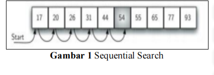
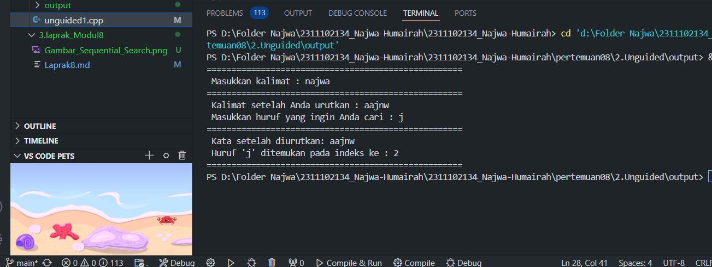
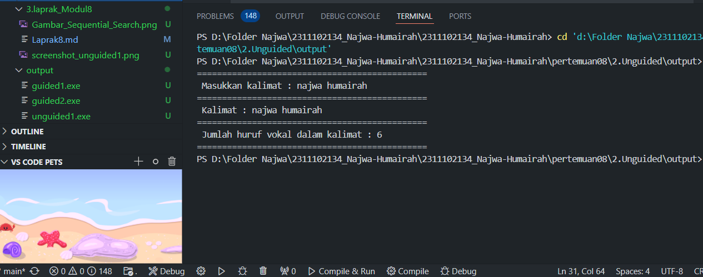
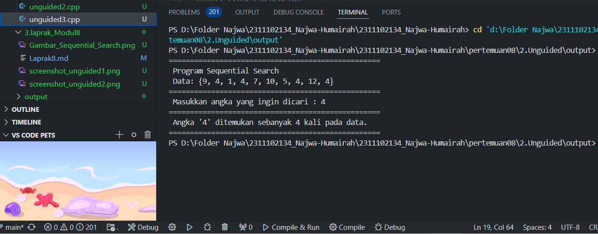

# <h1 align="center">Laporan Praktikum Modul ALGORITMA SEARCHING</h1>
<p align="center"> Najwa Humairah_2311102134 </p>

## Dasar Teori

### 1. [Pengertian Algoritma Searching]
Pencarian (Searching) adalah  suatu  proses  yang  dilakukan  untuk  menemukan sesuatu nilai yang diinginkan atau yang dicari pada kumpulan data. Proses pencarian biasanya dapat dilakukan baik secara manual oleh manusia tersebut dengan menelusuri data satu persatu atau secara otomatis dengan program yang telah dibuat. Setelah Proses pencarian dilakukan, akan diperoleh salah satu dari dua kemungkinan, yaitu data yang dicari ditemukan (successful) atau tidak ditemukan (unsuccessful).

### 2. [Macam-macam Algoritma Searching]
Dalam kebanyakan kasus, algoritma searching terdiri dari dua jenis: sequential search, yang melakukan pencarian satu per satu setiap elemen dalam data. Binary search melakukan pencarian dengan mempersempit wilayah pencarian, yaitu membagi data menjadi dua bagian secara berurutan. 

1. Algoritma Sequential Search
    - Sequential Search<br/>
    - Sequential Search dengan Sentinel<br/>
2. Algoritma Binary Search
    - Binary Search<br/>
    - Interpolation (pengembangan dari binary search)<br/>

### 3. [Pengertian Sequential Search]
Metode Sequential Search atau disebut pencarian beruntun dapat digunakan untuk melakukan pencarian data baik pada array yang sudah berurutan maupun yang belum berututan. Proses pencarian data dengan metode ini cukup sederhana dan mudah. Kemungkinan terbaik (best case) ketika menggunakan algoritma ini adalah jika data yang dicari terletak di indeks awal array sehingga hanya membutuhkan sedikit waktu pencarian. Sedangkan kemungkinan terburuknya (worst case) adalah jika data yang dicari ternyata terletak dibagian akhir dari array sehingga pencarian data akan memakan waktu yang lama. Proses pencarian data dilakukan dengan mencocokan data yang dilakukan secara berurut satu demi satu dimulai dari data ke-1 hingga pada data urutan terakhir[8] seperti terlihat pada gambar 1.



- Sequential Search dengan Sentinen<br/>
Dengan algoritma sentinel pencarian squential ini, pencarian melibatkan penambahan elemen fiktif pada elemen data array. Biasanya, elemen fiktif ini ditempatkan pada posisi terakhir dalam array, di mana nilai elemen fiktif tersebut sama dengan nilai elemen yang dicari. 

Pada dasarnya algoritma pencarian ini sama dengan sequential search biasa yaitu mencari elemen dengan mengeceknya satu per satu mulai dari elemen pertama hingga terakhir. Namun, algoritma ini menambah elemen sentinel pada array, yang digunakan sebagai acuan atau batas dari pencarian.

### 4. [Pengertian Binary Search]
Algoritma Binary Search adalah salah satu algoritma pencarian data yang biasa digunakan untuk array yang berpola terurut. Teknik pencarian yang digunakan pada algoritma ini adalah dengan cara berulang kali membagi jumlah data menjadi dua bagian sehingga memperkecil lokasi pencarian suatu data hingga pada akhirnya dapat ditemukan. Algoritma ini biasanya banya diguankan untuk mencari suatu key pada array dengan jumlah elemen yang banyak, dimana kompleksitas dari algoritma ini adalah O(log n). Dalam penerapannya algoritma ini sering digabungkan dengan algoritma sorting karena data yang akan digunakan harus sudah terurut terlebih dahulu.

Prinsip dalam Binary Seacrh secara langkahnya yaitu :
1. Pertama diambil posisi awal 0 dan posisi akhir = N-1,
2. Selanjutnya dicari posisi tengah dengan rumus (posisi awal + posisi akhir) / 2.
3. Dan data yang dicari dibandingkan dengan data tengah tadi. Jika lebih kecil, proses diulangi kembali namun posisi akhir dianggap sama dengan posisi tengah –1.
4. Jika hasil lebih besar, maka dilakukan lagi tetapi posisi awal dianggap sama dengan posisi tengah + 1.
5. Demikian seterusnya sampai data tengah sama dengan yang dicari. 

- Interpolation Seacrh<br/>
Proses pencarian interpolasi adalah evolusi dari pencarian biner. Keduanya memiliki persamaan untuk mencari nilai pada data yang telah terurut, tetapi cara kerjanya berbeda. Pencarian biner interpolasi mencari data dengan membagi array secara terus menerus, sementara pencarian interpolasi menggunakan formula, seperti yang ditunjukkan di bawah ini:

![Gambar_Interpolation_Search][Gambar_Interpolation_Search.png]

Keterangan Variabel:<br/>
    - pos : variabel yang digunakan untuk menampung indeks atau posisi dimana program akan mencari data.<br/>
    - key : variabel yang berisi data atau nilai yang dicari.<br/>
    - data : array yang menyimpan banyak nilai dengan tipe yang sama sekaligus.<br/>
    - low : variabel yang menampung indeks paling awal pada array (indeks 0).<br/>
    - high : variabel yang menampung indeks terakhir dari array (indeks n-1).<br/>
    - data[low] : nilai pada indeks low.
    - data[high] : nilai pada indeks high 

## Guided

### 1. [Buatlah sebuah project dengan menggunakan sequential search sederhana untuk melakukan pencarian data.]

```C++
#include <iostream>

using namespace std;

int main() {
    int n = 10;
    int data[n] = {9,4,1,7,5,12,4,13,4,10};
    int cari = 10;
    bool ketemu = false;
    int i;

    for (i = 0; i < n; i++) {
        if (data[i] == cari) {
            ketemu = true;
            break;
        }
    }

    cout <<"Program Sequential Search" <<endl;
    cout <<"data : {9,4,1,7,5,12,4,13,4,10} " <<endl;

    if (ketemu) {
        cout <<"\nAngka " << cari <<" ditemukan pada indeks ke-" << i << endl;
    } else {
        cout << "data tidak ditemukan"<< endl;
    }

    return 0;
}
```

Program di atas merupakan program C++ sederhana yang melakukan pencarian linear (Sequential Seacrh) untuk mengidentifikasi angka khusus dalam sebuah array. Program dimulai dengan mengimpor pustaka input-output C++ biasa. Selanjutnya, sebuah array data berukuran 10 diinisialisasi dengan nilai tertentu dalam fungsi main(). Angka 10 adalah angka yang dicari, dan variabel boolean yang ditemukan diatur ke false untuk menunjukkan apakah angka tersebut ditemukan atau tidak. Program menggunakan loop for untuk memeriksa setiap elemen dalam array. Jika elemen yang dicari ditemukan, variabel ketemu diatur ke true dan loop dihentikan dengan perintah break. Setelah loop selesai, program mencetak pesan ke layar yang menginformasikan data array yang digunakan. Jika angka yang dicari ditemukan, program akan mencetak indeks dari angka-angka tersebut dalam array, dan jika tidak ditemukan, program akan mencetak pesan bahwa data tidak ditemukan. Program ini berakhir dengan pernyataan return 0.

### 2.[Buatlah sebuah project untuk melakukan pencarian data dengan menggunakan Binary Search.]

```C++
#include<iostream>
#include<conio.h>
#include<iomanip>

using namespace std;

int dataArray[7] = {1, 8, 2, 5, 4, 9, 7};
int cari;

void Selection_Sort(){
    int temp, min, i, j;
    for(i = 0; i < 7; i++){
        min = i;
        for(j = i + 1; j < 7; j++){
            if(dataArray[j] < dataArray[min]){
                min = j;
            }
        }
        temp = dataArray[i];
        dataArray[i] = dataArray[min];
        dataArray[min] = temp;
    }
}

void BinarySearch(){
    int awal, akhir, tengah;
    bool b_flag = false;
    awal = 0;
    akhir = 6;
    while(!b_flag && awal <= akhir){
        tengah = (awal + akhir)/2;
        if(dataArray[tengah] == cari){
            b_flag = true;
        } else if(dataArray[tengah] < cari){
            awal = tengah + 1;
        } else {
            akhir = tengah - 1;
        }
    }
    if(b_flag){
        cout << "\nData ditemukan pada index ke-" << tengah << endl;
    } else {
        cout << "\nData tidak ditemukan" << endl;
    }
}

int main(){
    cout << "BINARY SEARCH" << endl;
    cout << "\nData : ";
    for(int x = 0; x < 7; x++){
        cout << setw(3) << dataArray[x];
    }
    cout << endl;

    cout << "Masukkan data yang ingin dicari : ";
    cin >> cari;
    
    cout << "\nData diurutkan : ";
    Selection_Sort();

    for(int x = 0; x < 7; x++){
        cout << setw(3) << dataArray[x];
    }
    cout << endl;
    BinarySearch();
    _getche();
    return 0;
}
```

Kode diatas mengimplementasikan algoritma pencarian biner (Binary Search) program dimulai dengan mengimpor pustaka input-output konvensional, conio.h untuk fungsi _getche(), dan iomanip untuk manipulasi keluaran format setelah mengurutkan data menggunakan algoritma Selection Sort. Dalam fungsi main(), sebuah array dataArray berukuran 7 dimulai dengan nilai tertentu, dan variabel cari digunakan untuk menyimpan nilai yang akan dicari oleh pengguna. Array dataArray diurutkan dalam urutan menaik oleh fungsi Selection_Sort(). Fungsi ini menggunakan dua loop bersarang untuk menemukan elemen terkecil dan kemudian menukarnya dengan elemen saat ini. Fungsi BinarySearch() digunakan untuk menemukan nilai yang dimasukkan oleh pengguna setelah array diurutkan. Variabel awal, akhir, dan tengah algoritma pencarian biner ini digunakan untuk melakukan pencarian yang efektif pada array yang sudah diurutkan. Program mencetak indeks jika nilai yang dicari ditemukan; jika tidak, program mencetak pesan bahwa data tidak ditemukan. Dalam main(), program meminta pengguna untuk memasukkan nilai yang ingin dicari dan kemudian mencetak array asli setelah memanggil Selection_Sort(). Setelah itu, program memanggil BinarySearch() untuk melakukan pencarian pada array yang telah diurutkan. Setelah pengguna menekan sembarang tombol dengan _getche(), program diakhiri.

## Unguided 

### 1. [Buatlah sebuah program untuk mencari sebuah huruf pada sebuah kalimat yang sudah di input dengan menggunakan Binary Search!]

```C++
//Najwa Humairah
//2311102134

#include <iostream>
#include <string>

using namespace std;
// Fungsi untuk mengurutkan karakter atau huruf kedalam string menggunakan Bubble Sort
void bubbleSort_134(string & Kalimat_134)
{
    int n = Kalimat_134.size();
    // Perulangan untuk semua elemen dalam string
    for (int i = 0; i < n - 1; ++i)
    {
        for (int j = 0; j < n - i - 1; ++j)
        {
            if (Kalimat_134[j] > Kalimat_134[j + 1])
            {
                swap(Kalimat_134[j], Kalimat_134[j + 1]);
            }
        }
    }
}

// Fungsi untuk mencari karakter atau huruf dalam string yang sudah diurutkan menggunakan Binary Search
void binarySearch_134(const string & Kalimat_134, char cari_134)
{
    bool ditemukan = false;
    cout << "====================================================\n";
    cout << " Kata setelah diurutkan: " << Kalimat_134 << endl;
    cout << " Huruf '" << cari_134 << "' ditemukan pada indeks ke : ";
    // Perulangan untuk mencari huruf dalam string
    for (size_t i = 0; i < Kalimat_134.size(); ++i)
    {
        if (Kalimat_134[i] == cari_134)
        {
            ditemukan = true;
            cout << i << " ";
        }
    }
    cout << endl;
    // percabangan apabila huruf tidak ditemukan dalam kata atau huruf
    if (!ditemukan)
    {
        cout << " Huruf '" << cari_134 << "' tidak ditemukan dalam kalimat." << endl;
    }
    cout << "====================================================\n";
}

int main()
{
    // variable kalimat dan cari
    string Kalimat_134;
    char cari_134;
    
    cout << "====================================================\n";
    cout << " Masukkan kalimat : ";
    getline(cin, Kalimat_134);
    cout << "====================================================\n";

    // Urutkan kalimat menggunakan bubble sort
    bubbleSort_134(Kalimat_134);
    cout << " Kalimat setelah Anda urutkan : " << Kalimat_134 << endl;

    cout << " Masukkan huruf yang ingin Anda cari : ";
    cin >> cari_134;

    // Cari huruf dalam kalimat menggunakan binary search
    binarySearch_134(Kalimat_134, cari_134);

    return 0;
}
```

#### Output:


Dalam kode diatas, yaitu aplikasi c++ yang mengurutkan karakter dalam sebuah kalimat yang diinputkan oleh pengguna menggunakan algoritma bubble sort dan memncari huruf atau kalimat yang sudah diurutkan menggunakan metode pencarian linier. 

Dengan menggunakan algoritma Sort Bubble, fungsi bubbleSort_134 mengurutkan semua karakter dalam string dengan mengiterasi seluruh elemennya, membandingkan elemen yang berdekatan, dan mengubahnya jika urutannya salah, hingga seluruh string terurut dengan benar. Meskipun namanya mengandung kata "Search Binary", fungsi binarySearch_134 sebenarnya menggunakan metode pencarian linier untuk mencari karakter tertentu dalam string yang sudah diurutkan. Fungsi ini mencetak string yang sudah diurutkan dan kemudian mengiterasi setiap elemen dalam string, mencetak indeks untuk setiap karakter yang dicari yang muncul. Fungsi mencetak pesan yang tepat jika karakter tidak ditemukan. Dalam fungsi main, program meminta pengguna untuk memasukkan kalimat dan kemudian menyimpannya dalam variabel Kalimat_134. Kemudian, fungsi bubbleSort_134 mengurutkan kalimat dan menampilkan hasilnya. Selanjutnya, program meminta pengguna untuk memasukkan karakter yang ingin dicari, dan fungsi binarySearch_134 digunakan untuk mencari karakter tersebut dalam kalimat yang sudah diurutkan.

### 2. [ Buatlah sebuah program yang dapat menghitung banyaknya huruf vocal dalam sebuah kalimat!]

```C++
//Najwa Humairah
//2311102134

#include <iostream>
#include <string>

using namespace std;

int main()
{
    // variable menampung kalimat dan total huruf vokal
    string kalimat_134;
    int jumlahVokal_134 = 0;

    cout << "==============================================\n";
    cout << " Masukkan kalimat : ";
    getline(cin, kalimat_134);
    cout << "==============================================\n";

    // perulangan apakah huruf dan kalimat sama atau tidak
    for (char huruf_134 : kalimat_134)
    {
        if (huruf_134 == 'a' || huruf_134 == 'e' || huruf_134 == 'i' || huruf_134 == 'o' || huruf_134 == 'u' || huruf_134 == 'A' || huruf_134 == 'E' || huruf_134 == 'I' || huruf_134 == 'O' || huruf_134 == 'U')
        {
            jumlahVokal_134++;
        }
    }
    
    // Menampilkan jumlah total huruf vokal
    cout << " Kalimat : " << kalimat_134 << endl;
    cout << "==============================================\n";
    cout << " Jumlah huruf vokal dalam kalimat : " << jumlahVokal_134 << endl;
    cout << "==============================================\n";

    return 0;
}

```

#### Output:


Dalam program diatas yaitu menghitung jumlah huruf vokal dalam sebuah kalimat yang dimasukkan oleh pengguna. Program dimulai dengan variabel kalimat_134 dideklarasikan untuk menyimpan kalimat yang dimasukkan oleh pengguna dan variabel jumlah vokal_134 dideklarasikan untuk menyimpan jumlah vokal yang ada dalam kalimat.

Kemudian, program meminta pengguna untuk memasukkan sebuah kalimat dengan menggunakan getline(cin, kalimat_134). Setelah kalimat dimasukkan, program menggunakan loop for untuk mengiterasi setiap karakter dalam kalimat. Semua karakter diuji untuk memastikan bahwa mereka adalah huruf vokal, baik vokal besar maupun vokal kecil. Jika hasilnya positif, variabel jumlahVokal_134 akan ditambahkan satu. Program mencetak kalimat yang dimasukkan oleh pengguna setelah mengiterasi semua karakter dalam kalimat. Kemudian, program mencetak jumlah huruf vokal yang ditemukan dalam kalimat.

### 3. [Diketahui data = 9, 4, 1, 4, 7, 10, 5, 4, 12, 4. Hitunglah berapa banyak angka 4 dengan menggunakan algoritma Sequential Search!]

```C++
//Najwa Humairah
//2311102134

#include <iostream>

using namespace std;

int main(){
    // Jumlah elemen dalam array
    const int n = 10;
    // Array berisi data yang akan dicari
    int data_134[n] = {9, 4, 1, 4, 7, 10, 5, 4, 12, 4};
    // Variabel untuk menghitung jumlah kemunculan angka yang dicari
    int jumlah_134 = 0;
    // Variabel untuk menyimpan angka yang akan dicari
    int cari_134;

    // Proses pencarian
    cout << "==================================================\n";
    cout << " Program Sequential Search" << endl;
    cout << " Data: {9, 4, 1, 4, 7, 10, 5, 4, 12, 4}" << endl;
    cout << "==================================================\n";

    // Meminta input angka yang akan dicari
    cout << " Masukkan angka yang ingin dicari : ";
    cin >> cari_134;

    // Perulangan untuk mencari nilai pada data dengan mencocokkan data dengan angka yang dicari
    for (int i = 0; i < n; i++){
        if (data_134[i] == cari_134)
        {
            jumlah_134++;
        }
    }

    // Output hasil pencarian
    cout << "==================================================\n";
    if (jumlah_134 > 0){
        cout << " Angka '" << cari_134 << "' ditemukan sebanyak " << jumlah_134 << " kali pada data." << endl;
    }
    else{
        cout << " Angka '" << cari_134 << "' tidak ditemukan pada data tersebut." << endl;
    }
    cout << "==================================================\n";

    return 0;
}
```

#### Output:


Dalam program diatas memnggunakan algoritma sequential Seacrh untuk memncari berapa kali suatu angka tertentu muncul dalam sebuah array yang telah ditentukan. Program dimulai dengan mendeklarasikan sebuah array data_134 yang berisi data yang akan dicari. Setelah itu, meminta pengguna untuk memasukkan angka yang diinginkan, program menggunakan loop for untuk iterasi melalui setiap elemen dalam array data_134. Setiap komponen dibandingkan dengan angka yang dicari, dan jika ada kecocokan, variabel jumlah_134 yang digunakan untuk menghitung jumlah kemunculan angka tersebut akan ditambah satu. Program mencetak hasil pencarian, yaitu jumlah kali angka yang dicari muncul dalam data atau pesan bahwa angka tersebut tidak ditemukan, setelah proses pencarian selesai.

## Kesimpulan
Sequential search atau pencarian linier adalah metode pencarian yang sederhana di mana setiap elemen dalam data diperiksa satu per satu dari awal hingga akhir hingga elemen yang dicari ditemukan atau seluruh data telah diperiksa. Metode ini mudah digunakan dan tidak memerlukan data yang diurutkan, tetapi memiliki kelemahan utama, yaitu kompleksitas waktu O(n). Kelemahan ini membuatnya tidak efisien untuk data yang sangat besar. Sebaliknya, binary search adalah algoritma yang lebih efisien tetapi membutuhkan data yang sudah diurutkan. Binary Search sangat efektif untuk pencarian dalam data yang besar karena kemampuannya untuk mengurangi jumlah perbandingan yang signifikan. Ini dilakukan dengan membagi data menjadi dua bagian berulang, mengurangi setengah elemen yang perlu diperiksa setiap kali, sehingga kompleksitas waktunya menjadi O(log n).

## Referensi
[1] Satya Informatika. Penerapan Algoritma Pencarian Sequential Pada Aplikasi Kamus Tiga Bahasa Indonesia-Jawa-Banten. 2019.<br/>
[2] Maulana, Ridwan . ALGORITMA PENCARIAN (SEQUENTIAL DAN BINARY SEARCH). 2022.<br/>
[3] Burhanudin, Faisal. “SEARCHING ALGORITHM.” Www.academia.edu.<br/>
[4] Elektronika, Jurnal, and Dan Komputer. Implementasi Algoritma Sequential Searching Pada Sistem Penyedia Informasi Magang Berbayar. Vol. 16, no. 1, 2023, pp. 148–155.<br/>
