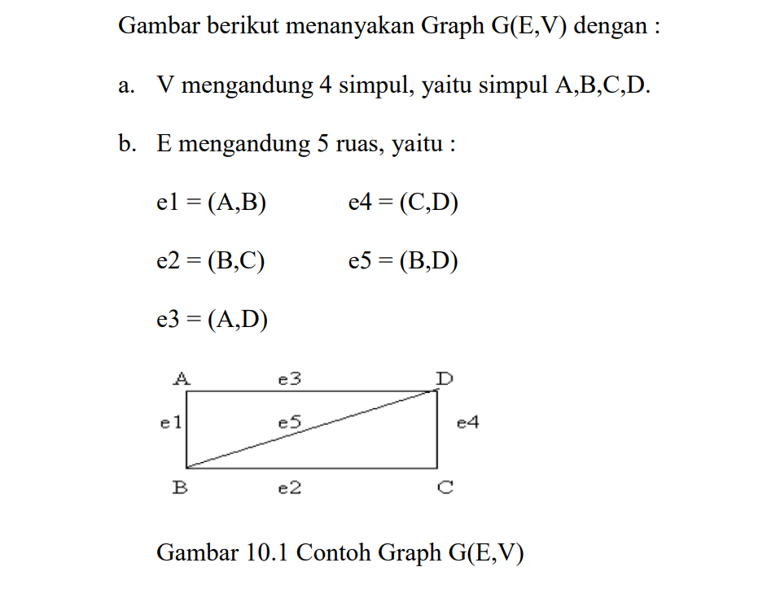
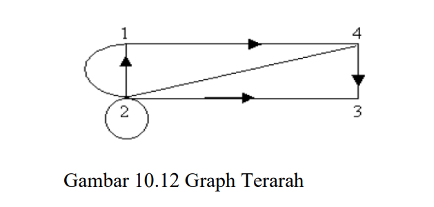
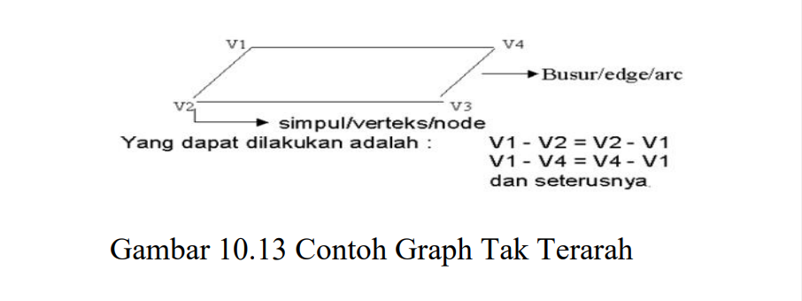
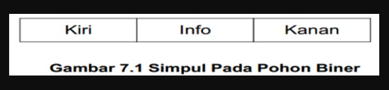
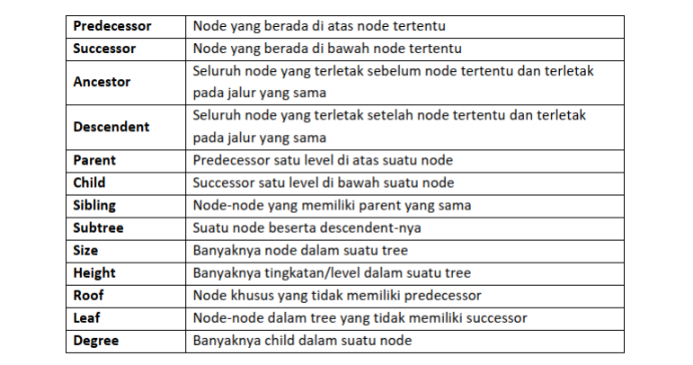
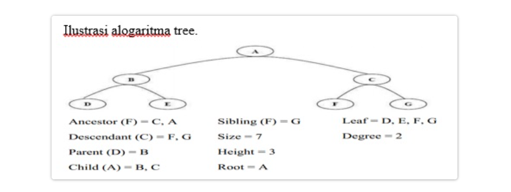
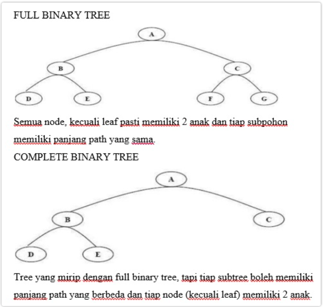
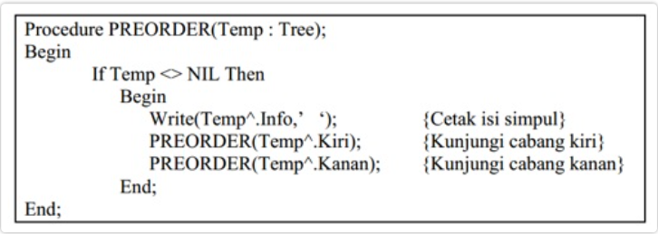
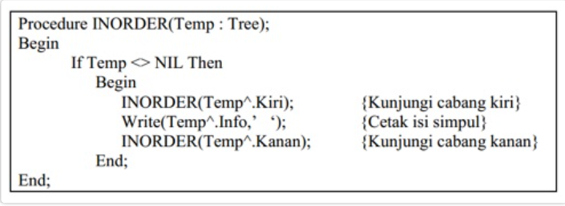
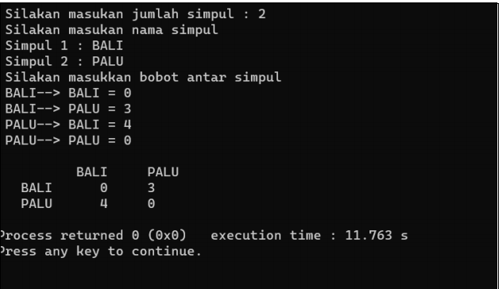

# <h1 align="center">Laporan Praktikum Modul GRAPH DAN TREE</h1>
<p align="center"> Najwa Humairah_2311102134 </p>

## Dasar Teori

### 1. [Pengertian GRAPH]
Graf  merupakan salah satu dari beberapa struktur data yang paling sering diaplikasikan dalam pemrogrman. Graph adalah  sekumpulan noktah (simpul/vertex) di dalam bidang dua dimensi yang dihubungkan dengan sekumpulan garis (sisi/edge).  Graph dapat digunakan untuk merepresentasikan objek-objek diskrit dan hubungan antara objek-objek tersebut. Sedangkan  Pohon (tree) adalah graph yang khusus. Pohon dapat didefinisikan sebagai graph-tak-berarah terhubung yang tidak mengandung sirkuit (cycle).

Perbedaan antara graph dengan tree yaitu pada graph, mampu terjadi cycle, artinya dari suatu titik yang terhubung oleh edge dapat kembali lagi ke vertex tersebut. Sedangkan tree, merupakan suatu graf yang alur edge nya tidak dapat kembali lagi ke vertex awalnya.

Suatu Graf mengandung 2 himpunan, yaitu:<br/>
    1. Himpunan V yang elemennya disebut simpul(Vertex atau point atau node atau titik)<br/>
    2. Himpunan E yang merupakan pasangan tak urut dari simpul. Anggotanya disebut ruas(Edge atau rusuk atau sisi)<br/>
Graf seperti diatas ditulis sebagai G(E,V). Banyaknya simpul (vertex) disebut order, sedangkan banyaknya ruas (edge) disebut size dari graf.

Contoh:


##### JENIS-JENIS GRAF
1. Graf Berarah(Directed Graph/Digraph)<br/>
Graf berarah adalah graf yang dapat menghubungkan V1 dan V2 saja. Maksimum jumlah busur dari n simpul adalah : n(n-1)

Suatu graf berarah (directed graf) D terdiri atas 2 himpunan :<br/>
    1. Himpunan V, anggotanya disebut simpul.<br/>
    2. Himpunan A, merupakan himpunan pasangan terurut, yang disebut ruas berarah atau arkus.

Contoh,Gambar dibawah ini adalah sebuah graf berarah D(V,A) dengan:
    1. V mengandung 4 simpul, yaitu 1,2,3, dan 4.<br/>
    2. A mengandung 7 arkus, yaitu (1,4),(2,1),(2,1),(4,2),(2,3),(4,3), dan (2). Arkus (2,2) disebut gelung(self-loop) sedangkan arkus (2,1) muncul lebih dari satu kali disebut arkus sejajar atau arkus berganda.


2. Graf Tidak Berarah(Undirect Graph)<br/>
Graf Tak Berarah adalah graf yang menghubungkan 2 verteks V1 ke V2 dan V2 ke V1 (2 arah). Bila verteks = n, maka graf tak berarah komplit akan mempunyai busur atau edge sama dengan : n(n-1)/2.


3. Weight Graph<br/>
Graf yang mempunyai nilai pada tiap edgenya.

### 2. [PENGERTIAN TREE(Pohon)]
Kumpulan node yang saling terhubung satu sama lain dalam suatu  kesatuan yang membentuk layakya struktur sebuah pohon. Struktur pohon adalah suatu  cara merepresentasikan suatu struktur hirarki (one-to-many) secara grafis yang mirip sebuah pohon, walaupun pohon tersebut  hanya tampak sebagai kumpulan node-node  dari atas ke bawah. Suatu struktur data yang tidak linier yang menggambarkan  hubungan yang hirarkis (one-to-many) dan tidak linier antara elemen-elemennya.

Deklarasi pohon:<br/>


Sesuai dengan gambar 7.1, maka deklarasi list yang sesuai adalah :
```C++
typedef char TypeInfo;
typedef struct Simpul *Tree;
struct Simpul {
    TypeInfo Info;
    tree Kiri, /* cabang kiri */
    Kanan; /* cabang kanan */
};
```

##### ISTILAH DALAM TREE


##### ILUSTRASI ALGORITMA TREE


##### JENIS JENIS TREE
1. Binary Tree<br/>
Tree dengan syarat bahwa tiap node hanya boleh memiliki maksimal dua sub. pohon dan kedua subpohon harus terpisah.

Kelebihan struktur binary tree:<br/>
    1. Mudah dalam penyusunan algoritma sorting
    2. Searching data relatif cepat
    3. Fleksibel dalam penambahan dan penghapusan data



Kunjungan Pada Pohon Biner<br/>
Sebuah pohon biner memiliki operasi  traversal  yaitu suatu kunjungan pada suatu simpul tepat satu kali. Dengan melakukan kunjungan lengkap kita akan memperoleh urutan informasi secara linier yang tersinpan di dalam pohon biner.

Terdapat tiga jenis kunjungan pada pohon biner, yaitu:
1. PreOrder<br/>
Penelusuran secara pre-order memiliki alur:<br/>
a. Cetak data pada simpul root<br/>
b. Secara rekursif mencetak seluruh data pada subpohon kiri<br/>
c. Secara rekursif mencetak seluruh data pada subpohon kanan



2. inOrder
Penelusuran secara in-order memiliki alur:<br/>
a. Secara rekursif mencetak seluruh data pada subpohon kiri<br/>
b. Cetak data pada root<br/>
c. Secara rekursif mencetak seluruh data pada subpohon kanan



3. postOrder
Penelusuran secara in-order memiliki alur:<br/>
a. Secara rekursif mencetak seluruh data pada subpohon kiri<br/>
b. Secara rekursif mencetak seluruh data pada subpohon kanan<br/>
c. Cetak data pada root

## Guided

### 1. [Program Graph]

```C++
#include<iostream>
#include<iomanip>

using namespace std;
string simpul[7] ={
    "Ciamis", "Bandung", "Bekasi", "Tasikmalaya", "Cianjur", "Purwokerto", "Yokyakarta"
};

int busur[7][7] ={
    {0, 7, 8, 0, 0, 0, 0},
    {0, 0, 5, 0, 0, 15, 0},
    {0, 6, 0, 0, 5, 0, 0},
    {0, 5, 0, 0, 2, 4, 0},
    {23, 0, 0, 10, 0, 0, 8},
    {0, 0, 0, 0, 7, 0, 3},
    {0, 0, 0, 0, 9, 4, 0}
};

void tampilGraph(){
    for(int baris=0; baris<7; baris++){
        cout << " " << setiosflags(ios::left) << setw(15) << simpul [baris] << " : ";
        for(int kolom = 0; kolom<7; kolom++){
            if(busur[baris][kolom] !=0){
                cout << " " << simpul[kolom] << "(" << busur[baris][kolom] << ")";
            }
        }cout << endl;
    }
}

int main(){
    tampilGraph();
    return 0;
}
```
Program di atas merupakan implementasi graph menggunakan matriks ketetanggaan yang menggambarkan hubungan antar kotaa di jawa barat dan sekitarnya beserta bobotnya. Kode tersebut membuat kumpulan titik dengan nama-nama kota seperti Ciamis, Bandung, Bekasi, Tasikmalaya, Cianjur, Purwokerto, dan Yogyakarta. Matriks ketetanggaan berfungsi sebagai array busur dua dimensi yang menyimpan bobot atau jarak antara kota-kota tersebut. Tidak ada koneksi langsung antara dua kota ini, seperti yang ditunjukkan oleh nilai nol pada matriks. Untuk menampilkan graph yang mudah dibaca, fungsi tampilGraph melakukan iterasi pada setiap baris matriks untuk mencetak nama kota dan semua kota yang terhubung dengannya, serta bobotnya. Saat program dijalankan, fungsi tampilGraph digunakan untuk menampilkan graph. Hasilnya, program ini akan mencetak daftar setiap kota beserta kota-kota yang terhubung langsung dan jarak atau bobot yang terkait dengan setiap koneksi.

### 2. [Program Tree]

```C++
#include <iostream>
#include <iomanip>

using namespace std;

struct Pohon {
    char data;
    Pohon *left, *right, *parent;
};

Pohon *root, *baru;

void init() {
    root = NULL;
}

bool isEmpty() {
    return root == NULL;
}

void buatNode(char data) {
    if (isEmpty()) {
        root = new Pohon();
        root->data = data;
        root->left = NULL;
        root->right = NULL;
        root->parent = NULL;
        cout << "\nNode " << data << " berhasil dibuat sebagai root." << endl;
    } else {
        cout << "\nTree sudah ada!" << endl;
    }
}

Pohon* insertLeft(char data, Pohon *node) {
    if (isEmpty()) {
        cout << "\nBuat tree terlebih dahulu!" << endl;
        return NULL;
    } else {
        if (node->left != NULL) {
            cout << "\nNode " << node->data << " sudah ada child kiri!" << endl;
            return NULL;
        } else {
            Pohon *baru = new Pohon();
            baru->data = data;
            baru->left = NULL;
            baru->right = NULL;
            baru->parent = node;
            node->left = baru;
            cout << "\nNode " << data << " berhasil ditambahkan ke child kiri " << baru->parent->data << endl;
            return baru;
        }
    }
}

Pohon* insertRight(char data, Pohon *node) {
    if (isEmpty()) {
        cout << "\nBuat tree terlebih dahulu!" << endl;
        return NULL;
    } else {
        if (node->right != NULL) {
            cout << "\nNode " << node->data << " sudah ada child kanan!" << endl;
            return NULL;
        } else {
            Pohon *baru = new Pohon();
            baru->data = data;
            baru->left = NULL;
            baru->right = NULL;
            baru->parent = node;
            node->right = baru;
            cout << "\nNode " << data << " berhasil ditambahkan ke child kanan " << baru->parent->data << endl;
            return baru;
        }
    }
}

void update(char data, Pohon *node) {
    if (isEmpty()) {
        cout << "\nBuat tree terlebih dahulu!" << endl;
    } else {
        if (!node) {
            cout << "\nNode yang ingin diganti tidak ada!!" << endl;
        } else {
            char temp = node->data;
            node->data = data;
            cout << "\nNode " << temp << " berhasil diubah menjadi " << data << endl;
        }
    }
}

void retrieve(Pohon *node) {
    if (isEmpty()) {
        cout << "\nBuat tree terlebih dahulu!" << endl;
    } else {
        if (!node) {
            cout << "\nNode yang ditunjuk tidak ada!" << endl;
        } else {
            cout << "\nData node : " << node->data << endl;
        }
    }
}

void find(Pohon *node) {
    if (isEmpty()) {
        cout << "\nBuat tree terlebih dahulu!" << endl;
    } else {
        if (!node) {
            cout << "\nNode yang ditunjuk tidak ada!" << endl;
        } else {
            cout << "\nData Node : " << node->data << endl;
            cout << "Root : " << root->data << endl;
            if (!node->parent) {
                cout << "Parent : (tidak punya parent)" << endl;
            } else {
                cout << "Parent : " << node->parent->data << endl;
            }
            if (node->parent != NULL && node->parent->left != node && node->parent->right == node) {
                cout << "Sibling : " << node->parent->left->data << endl;
            } else if (node->parent != NULL && node->parent->right != node && node->parent->left == node) {
                cout << "Sibling : " << node->parent->right->data << endl;
            } else {
                cout << "Sibling : (tidak punya sibling)" << endl;
            }
            if (!node->left) {
                cout << "Child Kiri : (tidak punya Child kiri)" << endl;
            } else {
                cout << "Child Kiri : " << node->left->data << endl;
            }
            if (!node->right) {
                cout << "Child Kanan : (tidak punya Child kanan)" << endl;
            } else {
                cout << "Child Kanan : " << node->right->data << endl;
            }
        }
    }
}

// Penelusuran (Traversal)
// preOrder
void preOrder(Pohon *node = root) {
    if (isEmpty()) {
        cout << "\nBuat tree terlebih dahulu!" << endl;
    } else {
        if (node != NULL) {
            cout << " " << node->data << ", ";
            preOrder(node->left);
            preOrder(node->right);
        }
    }
}

// inOrder
void inOrder(Pohon *node = root) {
    if (isEmpty()) {
        cout << "\nBuat tree terlebih dahulu!" << endl;
    } else {
        if (node != NULL) {
            inOrder(node->left);
            cout << " " << node->data << ", ";
            inOrder(node->right);
        }
    }
}

// postOrder
void postOrder(Pohon *node = root) {
    if (isEmpty()) {
        cout << "\nBuat tree terlebih dahulu!" << endl;
    } else {
        if (node != NULL) {
            postOrder(node->left);
            postOrder(node->right);
            cout << " " << node->data << ", ";
        }
    }
}

// Hapus Node Tree
void deleteTree(Pohon *node) {
    if (isEmpty()) {
        cout << "\nBuat tree terlebih dahulu!" << endl;
    } else {
        if (node != NULL) {
            if (node != root) {
                node->parent->left = NULL;
                node->parent->right = NULL;
            }
            deleteTree(node->left);
            deleteTree(node->right);
            if (node == root) {
                delete root;
                root = NULL;
            } else {
                delete node;
            }
        }
    }
}

// Hapus SubTree
void deleteSub(Pohon *node) {
    if (isEmpty()) {
        cout << "\nBuat tree terlebih dahulu!" << endl;
    } else {
        deleteTree(node->left);
        deleteTree(node->right);
        cout << "\nNode subtree " << node->data << " berhasil dihapus." << endl;
    }
}

// Hapus Tree
void clear() {
    if (isEmpty()) {
        cout << "\nBuat tree terlebih dahulu!!" << endl;
    } else {
        deleteTree(root);
        cout << "\nPohon berhasil dihapus." << endl;
    }
}

// Cek Size Tree
int size(Pohon *node = root) {
    if (isEmpty()) {
        cout << "\nBuat tree terlebih dahulu!!" << endl;
        return 0;
    } else {
        if (!node) {
            return 0;
        } else {
            return 1 + size(node->left) + size(node->right);
        }
    }
}

// Cek Height Level Tree
int height(Pohon *node = root) {
    if (isEmpty()) {
        cout << "\nBuat tree terlebih dahulu!" << endl;
        return 0;
    } else {
        if (!node) {
            return 0;
        } else {
            int heightKiri = height(node->left);
            int heightKanan = height(node->right);
            if (heightKiri >= heightKanan) {
                return heightKiri + 1;
            } else {
                return heightKanan + 1;
            }
        }
    }
}

// Karakteristik Tree
void characteristic() {
    cout << "\nSize Tree : " << size() << endl;
    cout << "Height Tree : " << height() << endl;
    cout << "Average Node of Tree : " << size() / height() << endl;
}

int main() {
    buatNode('A');
    Pohon *nodeB, *nodeC, *nodeD, *nodeE, *nodeF, *nodeG, *nodeH, *nodeI, *nodeJ;

    nodeB = insertLeft('B', root);
    nodeC = insertRight('C', root);
    nodeD = insertLeft('D', nodeB);
    nodeE = insertRight('E', nodeB);
    nodeF = insertLeft('F', nodeC);
    nodeG = insertLeft('G', nodeE);
    nodeH = insertRight('H', nodeE);
    nodeI = insertLeft('I', nodeG);
    nodeJ = insertRight('J', nodeG);

    update('Z', nodeC);
    update('C', nodeC);

    retrieve(nodeC);

    find(nodeC);

    cout << "\nSize Tree: " << size() << endl;
    cout << "Height Tree: " << height() << endl;
    cout << "Average Node of Tree: " << size() / height() << endl;

    cout << "\nPreOrder: ";
    preOrder();
    cout << "\nInOrder: ";
    inOrder();
    cout << "\nPostOrder: ";
    postOrder();
    cout << endl;

    return 0;
}
```
Program di atas merupakan implementasi dari pohon biner bahasa pemograman c++. Selain mendefinisikan struktur data pohon biner, program ini memungkinkan berbagai tugas untuk memanipulasi pohon, termasuk pembuatan, penyisipan, pembaruan data node, pencarian node, dan penelusuran pohon secara berurutan. Pertama, struktur Pohon didefinisikan dengan char anggota data dan tiga pointer—kiri, kanan, dan induk—untuk menunjuk ke anak kiri, kanan, dan induk node. Sementara variabel akar global digunakan sebagai akar pohon, variabel baru digunakan untuk membuat node baru. Fungsi init menginisialisasi pohon dengan mengatur akar menjadi NULL, dan fungsi isEmpty memeriksa apakah pohon kosong. Fungsi buatNode membuat node baru sebagai akar pohon jika pohon masih kosong, dan fungsi insertLeft dan insertRight menyisipkan node baru sebagai anak kiri atau kanan dari node yang diberikan. Data dari node tertentu diubah oleh fungsi update, sedangkan data dari node tertentu ditampilkan oleh fungsi retrieve. Detail dari node tertentu, seperti orang tua, saudara, dan anak-anak, ditampilkan oleh fungsi find.

PreOrder, inOrder, dan postOrder adalah fungsi penelusuran pohon yang tersedia dalam program ini. Fungsi deleteTree menghapus seluruh pohon, sementara deleteSub menghapus subtree dari node tertentu. Fungsi clear juga menghapus seluruh pohon dengan memanggil deleteTree pada akar. Jumlah node dalam pohon dihitung oleh fungsi ukuran, dan tinggi dihitung oleh fungsi tinggi. Fungsi karakteristik menampilkan ukuran, tinggi, dan node rata-rata dari pohon. Di bagian main, program membuat pohon dengan root berdata "A" dan menambahkan beberapa node lainnya. Selain itu, program mengubah data node, menampilkan informasi node, dan menampilkan karakteristik pohon. Terakhir, aplikasi mencari pohon berdasarkan pre-order, in-order, dan post-order.

## Unguided 

### 1. [Buatlah program graph dengan menggunakan inputan user untuk menghitung jarak dari sebuah kota ke kota lainnya.]



```C++
// Najwa Humairah
// 2311102134

#include <iostream> 
#include <iomanip> 
#include <string> 

using namespace std;

const int Max_simpul_134 = 2;

// Deklarasi array string yang berisi nama kota
string simpul_134[Max_simpul_134];

// Deklarasi matriks busur yang berisi bobot dari setiap busur antar simpul
int busur[Max_simpul_134][Max_simpul_134];

// Fungsi untuk menampilkan graf
void tampilGraph_134(){
    cout << setw(12) << " ";
    for (int i = 0; i < Max_simpul_134; i++)
    {
        cout << setw(12) << simpul_134[i];
    }
    cout << endl; 

    for (int i = 0; i < Max_simpul_134; i++)
    {
        cout << setw(12) << simpul_134[i] << " "; 
        for (int j = 0; j < Max_simpul_134; j++)
        {
            cout << setw(12) << busur[i][j];
        }
        cout << endl;
    }
}

int main(){
    cout << " Silakan masukkan jumlah simpul : "; 
    int numVertices;
    cin >> numVertices; 

    if (numVertices != Max_simpul_134)
    {
        cout << " Jumlah simpul tidak sesuai dengan konstanta max vertices!." << endl; 
        return 1; 
    }

    cout << " Silakan masukkan nama simpul \n";
    for (int i = 0; i < numVertices; ++i)
    {
        cout << " Simpul " << i + 1 << ": "; 
        cin >> simpul_134[i]; 
    }

    cout << " Silakan masukkan bobot antar simpul \n"; 
    for (int i = 0; i < numVertices; ++i)
    {
        for (int j = 0; j < numVertices; ++j)
        {
            cout << simpul_134[i] << " --> " << simpul_134[j] << " = "; 
            cin >> busur[i][j]; 
        }
    }
    cout << endl; 

    tampilGraph_134(); 

    return 0; 
}
```

#### Output:


Dalam program diatas, yaitu mengimplementasikan graf menggunakan matriks ketetanggaan dalam bahasa pemograman c++. Program dimulai dengan mendeklarasikan dua konstanta, Max_simpul_134 yang menunjukkan jumlah simpul (node) maksimum yang ada dalam graf, dan dua array global: simpul_134 untuk menyimpan nama simpul dan busur untuk menyimpan bobot busur (edge) yang menghubungkan simpul-simpul tersebut. Selanjutnya, fungsi tampilGraph_134 digunakan untuk menampilkan graf dalam bentuk matriks ketetanggaan, di mana setiap simpul dan bobot busur diatur dalam format tabel. Dalam fungsi main, pengguna diminta untuk memasukkan jumlah simpul yang harus sesuai dengan Max_simpul_134; jika tidak, program akan mengeluarkan pesan kesalahan. Selanjutnya, pengguna diminta untuk memasukkan nama simpul dan bobot busur antar simpul. Program ini menunjukkan cara dasar untuk menampilkan dan menampilkan graf dengan matriks ketetanggaan. Fungsi tampilGraph_134 menampilkan matriks ketetanggaan dari graf yang telah dibuat berdasarkan input pengguna.

### 2. [Modifikasi guided tree diatas dengan program menu menggunakan input data tree dari user dan berikan fungsi tambahan untuk menampilkan node child dan descendant dari node yang diinput kan!]

```C++
// Najwa Humairah
// 2311102134

#include <iostream> 
#include <iomanip> 

using namespace std;

// Struktur data Pohon untuk merepresentasikan node dalam tree
struct Pohon{
    char data_134; 
    Pohon *left;               
    Pohon *right;              
    Pohon *parent;             
};

// Deklarasi pointer root dan baru untuk tree
Pohon *root, *baru;

// Fungsi untuk menginisialisasi tree
void init(){
    root = NULL; 
}

// Fungsi untuk memeriksa apakah tree kosong
bool isEmpty(){
    return root == NULL; 
}

// Fungsi untuk membuat node baru sebagai root
void buatNode(char data){
    if (isEmpty()){
        root = new Pohon();                 
        root->data_134 = data; 
        root->left = NULL;                  
        root->right = NULL;                 
        root->parent = NULL;                
        cout << "\n Node " << data << " berhasil dibuat sebagai root." << endl;
    } else{
        cout << "\n Tree sudah ada!" << endl; // Pesan jika tree sudah ada
    }
}

// Fungsi untuk menambahkan node di anak kiri
Pohon *insertLeft(char data, Pohon *node){
    if (isEmpty()){
        cout << "\n Buat tree terlebih dahulu!" << endl;
        return NULL; 
    } else{
        if (node->left != NULL){
            cout << "\n Node " << node->data_134 << " sudah ada child kiri !" << endl;
            return NULL; 
        } else{
            Pohon *baru = new Pohon();          
            baru->data_134 = data; 
            baru->left = NULL;                  
            baru->right = NULL;                 
            baru->parent = node;                
            node->left = baru;                 
            cout << "\n Node " << data << " berhasil ditambahkan ke child kiri " << baru->parent->data_134<< endl;
            return baru; 
        }
    }
}

// Fungsi untuk menambahkan node di anak kanan
Pohon *insertRight(char data, Pohon *node){
    if (isEmpty()){
        cout << "\n Buat tree terlebih dahulu!" << endl;
        return NULL; 
        } else{
        if (node->right != NULL){
            cout << "\n Node " << node->data_134 << " sudah ada child kanan !" << endl;
            return NULL; 
        } else{
            Pohon *baru = new Pohon();          
            baru->data_134= data; 
            baru->left = NULL;                  
            baru->right = NULL;               
            baru->parent = node;                
            node->right = baru;                
            cout << "\n Node " << data << " berhasil ditambahkan ke child kanan " << baru->parent->data_134 << endl;
            return baru; 
        }
    }
}

// Fungsi untuk mengupdate data di node
void update(char data, Pohon *node){
    if (isEmpty()){
        cout << "\n Buat tree terlebih dahulu!" << endl; 
    } else{
        if (!node){
            cout << "\n Node yang ingin diganti tidak ada!!" << endl; 
        } else {
            char temp = node->data_134;                                   
            node->data_134= data;                                        
            cout << "\n Node " << temp << " berhasil diubah menjadi " << data << endl; 
        }
    }
}

// Fungsi untuk menampilkan data di node
void retrieve(Pohon *node){
    if (isEmpty()){
        cout << "\n Buat tree terlebih dahulu!" << endl; 
    } else{
        if (!node){
            cout << "\n Node yang ditunjuk tidak ada!" << endl; 
        } else{
            cout << "\n Data node : " << node->data_134<< endl;
        }
    }
}

// Fungsi untuk menemukan dan menampilkan informasi tentang node dalam pohon
void find(Pohon *node){
    if (isEmpty()){
        cout << "\n Buat tree terlebih dahulu!" << endl;
    } else{
        if (!node){
            cout << "\n Node yang ditunjuk tidak ada!" << endl; 
        } else{
            cout << "\n Data Node : " << node->data_134 << endl; 
            cout << " Root : " << root->data_134 << endl;        

            // Tampilkan informasi tentang sibling node
            if (node->parent != NULL && node->parent->left != node && node->parent->right == node)
                cout << " Sibling : " << node->parent->left->data_134 << endl;
            else if (node->parent != NULL && node->parent->right != node && node->parent->left == node)
                cout << " Sibling : " << node->parent->right->data_134 << endl;
            else
                cout << " Sibling : (tidak punya sibling)" << endl;

            // Tampilkan informasi tentang child node kiri
            if (!node->left)
                cout << " Child Kiri : (tidak punya Child kiri)" << endl;
            else
                cout << " Child Kiri : " << node->left->data_134 << endl;

            // Tampilkan informasi tentang child node kanan
            if (!node->right)
                cout << " Child Kanan : (tidak punya Child kanan)" << endl;
            else
                cout << " Child Kanan : " << node->right->data_134 << endl;
        }
    }
}

// Fungsi untuk melakukan traversal PreOrder pada pohon
void preOrder(Pohon *node = root){
    if (isEmpty()){
        cout << "\n Buat tree terlebih dahulu!" << endl; 
    } else{
        if (node != NULL){
            cout << node->data_134 << ", ";
            preOrder(node->left);                       
            preOrder(node->right);                       
        }
    }
}

// Fungsi untuk melakukan traversal InOrder pada pohon
void inOrder(Pohon *node = root) {
    if (isEmpty()){
        cout << "\n Buat tree terlebih dahulu!" << endl; 
    } else{
        if (node != NULL){
            inOrder(node->left);                         
            cout << node->data_134 << ", "; 
            inOrder(node->right);                        
        }
    }
}

// Fungsi untuk melakukan traversal PostOrder pada pohon
void postOrder(Pohon *node = root){
    if (isEmpty()){
        cout << "\n Buat tree terlebih dahulu!" << endl; 
    } else{
        if (node != NULL){
            postOrder(node->left);                       
            postOrder(node->right);                      
            cout << node->data_134 << ", "; 
        }
    }
}

// Fungsi untuk menghapus subtree yang dimulai dari node yang diberikan
void deleteSubtree(Pohon *node){
    if (node == NULL) 
        return;

    // Hapus subtree secara rekursif
    deleteSubtree(node->left);
    deleteSubtree(node->right);

    // Hapus hubungan parent dengan node
    if (node->parent != NULL && node->parent->left == node){
        node->parent->left = NULL;
    }else if (node->parent != NULL && node->parent->right == node){
        node->parent->right = NULL;
    }

    // Tampilkan pesan bahwa node berhasil dihapus
    cout << "\n Node " << node->data_134 << " berhasil dihapus." << endl;

    // Hapus node dari memory
    delete node;
}

// Fungsi untuk menampilkan informasi tentang child dan descendant
void showChildAndDescendant(Pohon *node) {
    if (isEmpty()){
        cout << "\n Buat tree terlebih dahulu!" << endl; 
    } else{
        if (!node){
            cout << "\n Node yang ditunjuk tidak ada!" << endl; 
        } else{
            cout << "\n Data Node : " << node->data_134 << endl; 
            if (!node->left){
                cout << " Child Kiri : (tidak punya Child kiri)" << endl; 
            } else{
                cout << " Child Kiri : " << node->left->data_134 << endl; 
                cout << " Descendant dari Child Kiri : ";
                inOrder(node->left); 
                cout << endl;
            }

            if (!node->right){
                cout << " Child Kanan : (tidak punya Child kanan)" << endl; 
            } else{
                cout << " Child Kanan : " << node->right->data_134 << endl; 
                cout << " Descendant dari Child Kanan : ";
                inOrder(node->right); 
                cout << endl;
            }
        }
    }
}

// Deklarasi fungsi findParent
void findParent(Pohon *node, char parentData, Pohon *&parentNode){
    if (node == NULL) 
        return;

    if (node->data_134 == parentData){
        parentNode = node; 
        return;
    }

    // Telusuri subtree secara rekursif
    findParent(node->left, parentData, parentNode);
    findParent(node->right, parentData, parentNode);
}

// Fungsi untuk menghitung ukuran tree
int size(Pohon *node = root){
    if (isEmpty()) {
        cout << "\n Buat tree terlebih dahulu!!" << endl; 
        return 0;
    } else{
        if (!node){
            return 0; 
        } else{
            return 1 + size(node->left) + size(node->right); 
        }
    }
}


// Fungsi untuk menghitung tinggi tree
int height(Pohon *node = root){
    if (isEmpty()){
        cout << "\n Buat tree terlebih dahulu!" << endl; 
        return 0;
    } else{
        if (!node){
            return 0; 
        } else{
            int heightKiri = height(node->left); 
            int heightKanan = height(node->right); 
            if (heightKiri >= heightKanan){
                return heightKiri + 1; 
            } else{
                return heightKanan + 1; 
            }
        }
    }
}
// Fungsi untuk menampilkan karakteristik tree
void characteristic() {
    cout << "\n Size Tree : " << size() << endl; 
    cout << " Height Tree : " << height() << endl; 
    cout << " Average Node of Tree : " << size() / height() << endl; 
}

int main(){
    int pil;   
    char data; 

    // Loop utama program
    do{
        cout << "\n||=====================================||";
        cout << "\n||      ==  Pemograman Tree C++ ==     ||";
        cout << "\n||=====================================||";
        cout << "\n||                MENU                 ||";
        cout << "\n||=====================================||";
        cout << "\n|| 1. Tambah Node Root                 ||"; 
        cout << "\n|| 2. Tambah Kiri                      ||";
        cout << "\n|| 3. Tambah Kanan                     ||";
        cout << "\n|| 4. Update Data                      ||";
        cout << "\n|| 5. Lihat/Retrive Data               ||";
        cout << "\n|| 6. Cari Data                        ||";
        cout << "\n|| 7. Traversal PreOrder               ||";
        cout << "\n|| 8. Traversal InOrder                ||";
        cout << "\n|| 9. Traversal PostOrder              ||";
        cout << "\n|| 10. Hapus Subtree                   ||";
        cout << "\n|| 11. Hapus Seluruh Tree              ||";
        cout << "\n|| 12. Karakteristik Tree              ||";
        cout << "\n|| 13. Tampilkan Child dan Descendant  ||";
        cout << "\n|| 0. Exit                             ||";
        cout << "\n||=====================================||";
        cout << "\n   Pilih menu :";

        cin >> pil; 

        switch (pil){
        case 1: 
            cout << "\n Input data : ";
            cin >> data;
            buatNode(data);
            break;

        case 2: 
        {
            cout << "\n Input data : ";
            cin >> data;
            char parentData;
            cout << " Input parent data: ";
            cin >> parentData;
            Pohon *parentNode = NULL;

            // Cari parent node berdasarkan parentData
            findParent(root, parentData, parentNode);

            if (parentNode){
                insertLeft(data, parentNode);
            } else{
                cout << "\n Parent node tidak ditemukan!" << endl;
            }
            break;
        }

        case 3: 
        {
            cout << "\n Input data : ";
            cin >> data;
            char parentData;
            cout << " Input parent data: ";
            cin >> parentData;
            Pohon *parentNode = NULL;

            // Cari parent node berdasarkan parentData
            findParent(root, parentData, parentNode);

            if (parentNode){
                insertRight(data, parentNode);
            } else{
                cout << "\n Parent node tidak ditemukan!" << endl;
            }
            break;
        }

        case 4: 
        {
            cout << "\n Input data baru : ";                 
            cin >> data;                                     
            char nodeData;                                   
            cout << " Input data node yang ingin diupdate: "; 
            cin >> nodeData;                                 
            Pohon *node = root;

            // Loop untuk mencari node yang ingin diupdate berdasarkan datanya
            while (node && node->data_134 != nodeData){
                if (node->left && node->left->data_134 == nodeData){
                    node = node->left; 
                } else if (node->right && node->right->data_134 == nodeData){
                    node = node->right; 
                } else if (node->left){
                    node = node->left; 
                } else if (node->right){
                    node = node->right;
                } else{
                    node = NULL; 
                }
            } if (node){
                update(data, node); 
            } else{
                cout << "\n Node tidak ditemukan!" << endl; 
            }
            break; 
        }

        case 5:
        {
            char nodeData;                                  
            cout << "Input data node yang ingin dilihat: "; 
            cin >> nodeData;                                

            Pohon *node = root; 

            // Loop untuk mencari node yang ingin dilihat berdasarkan datanya
            while (node && node->data_134 != nodeData){
                if (nodeData < node->data_134){
                    node = node->left; 
                } else{
                    node = node->right; 
                }
            }

            if (node){
                cout << "Data node: " << node->data_134 << endl;
            } else{
                // Jika node tidak ditemukan, tidak melakukan apa-apa
            }
            break;
        }

        case 6: 
        {
            char nodeData;                                 
            cout << " Input data node yang ingin dicari: ";
            cin >> nodeData;                                
            Pohon *node = root;     

            // Loop untuk mencari node yang ingin dicari berdasarkan datanya
            while (node && node->data_134 != nodeData){
                if (node->left && node->left->data_134== nodeData){
                    node = node->left; 
                }else if (node->right && node->right->data_134 == nodeData){
                    node = node->right; 
                } else if (node->left){
                    node = node->left; 
                }else if (node->right){
                    node = node->right; 
                } else{
                    node = NULL; 
                }
            }
            if (node){
                find(node);
            } else{
                cout << "\n Node tidak ditemukan!" << endl;
            }
            break; 
        }

        case 7: 
            cout << "\n Traversal PreOrder : ";
            preOrder(root); 
            break;

        case 8: 
            cout << "\n Traversal InOrder : ";
            inOrder(root); 
            break;

        case 9: // Menu untuk traversal PostOrder
            cout << "\n Traversal PostOrder : ";
            postOrder(root); 
            break;

        case 10: 
        {
            char nodeData;                                               
            cout << " Input data node yang ingin dihapus subtree-nya: "; 
            cin >> nodeData;                                            
            Pohon *node = root;   

            // Loop untuk mencari node yang ingin dihapus subtree-nya berdasarkan datanya
            while (node && node->data_134 != nodeData){
                if (node->left && node->left->data_134 == nodeData){
                    node = node->left; 
                } else if (node->right && node->right->data_134 == nodeData){
                    node = node->right; 
                } else if (node->left){
                    node = node->left; 
                } else if (node->right){
                    node = node->right; 
                } else{
                    node = NULL; 
                }
            }
            if (node){
                deleteSubtree(node);
            } else{
                cout << "\n Node tidak ditemukan!" << endl; 
            }
            break; 
        }

        case 11: 
            cout << "\n Hapus Seluruh Tree : ";
            init();                                      
            cout << "\n Tree berhasil dihapus!" << endl; 
            break;                                      

        case 12: 
            characteristic(); 
            break; 

        case 13: 
        {
            char nodeData;                                                           
            cout << " Input data node yang ingin dilihat child dan descendant-nya: "; 
            cin >> nodeData;                                                         
            Pohon *node = root;         

            // Loop untuk mencari node yang ingin dilihat child dan descendant-nya berdasarkan datanya
            while (node && node->data_134 != nodeData){
                if (node->left && node->left->data_134 == nodeData){
                    node = node->left; 
                } else if (node->right && node->right->data_134 == nodeData){
                    node = node->right;
                } else if (node->left){
                    node = node->left; 
                } else if (node->right){
                    node = node->right; 
                } else{
                    node = NULL; 
                }
            }
            if (node){
                showChildAndDescendant(node);
            } else{
                cout << "\n Node tidak ditemukan!" << endl; 
            }
            break; 
        }

        case 0:                                                               
            cout << "\n Terima kasih telah menggunakan program ini!" << endl; 
            break;                                                           

        default:                                            
            cout << "\n Pilihan menu tidak valid!" << endl; 
        }
    } while (pil != 0); 

    return 0;
}

```

#### Output:


Dalam program diatas yaitu mengimplementasikan dari struktur data ttree dalam bahasa c++. Pengguna dapat membuat, mengubah, dan mengawasi pohon dengan program ini. Tree ini menggunakan representasi node dengan struktur data Pohon, yang memiliki data karakter (char) dan pointer ke node anak kiri, node anak kanan, dan node parent. Program dimulai dengan mendeklarasikan struktur data dan pointer untuk pohon, dan kemudian melakukan beberapa fungsi utilitas, seperti inisialisasi, mengecek apakah pohon kosong, dan membuat node baru.

Setelah program dimulai, sebuah menu muncul yang memungkinkan Anda melakukan berbagai operasi pada pohon. Pilihan ini termasuk menambah node root, menambah node anak kiri atau anak kanan, mengubah data node, melihat atau mengambil data node, mencari data node, melintasi pohon (PreOrder, InOrder, dan PostOrder), menghapus cabang, menghapus seluruh pohon, menampilkan karakteristik pohon (ukuran dan tinggi), dan menampilkan anak dan keturunan node. Setiap pilihan menu digunakan dalam bentuk fungsi yang berkaitan dengan operasi yang sedang dilakukan. Misalnya, ketika Anda ingin menambahkan node anak kiri atau anak kanan, program akan mencari node induk dan kemudian menambahkan node baru sebagai anak kiri atau anak kanan dari node induk. Dengan cara yang sama, tindakan tambahan seperti penghapusan subtree, traversal, dan update data dilakukan dengan menggunakan pendekatan rekursif atau iteratif sesuai dengan kebutuhan. Pengguna dapat memilih operasi yang diinginkan dari menu dan program akan mengeksekusi operasi tersebut sesuai dengan input pengguna. 
## Kesimpulan


## Referensi
[1] Ratih.  TREE DAN GRAPH. 2019.<br/>
[2] M.Kom, Nur Hidayati. MODUL STRUKTUR DATA.<br/>

