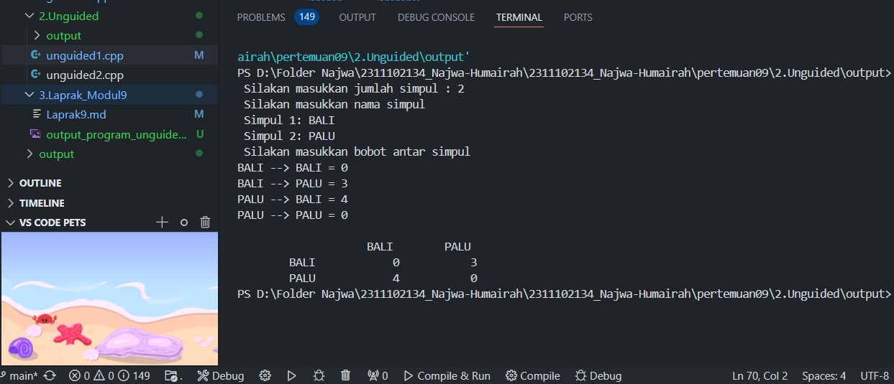

# <h1 align="center">Laporan Praktikum Modul GRAPH DAN TREE</h1>
<p align="center"> Najwa Humairah_2311102134 </p>

## Dasar Teori

### 1. [Pengertian GRAPH DAN TREE]

### 2. [Operasi ]

## Guided

### 1. []

```C++
#include<iostream>

```
Program di atas 

### 2. []

```C++
#include<iostream>

```
Program di atas 

## Unguided 

### 1. []

```C++
// Najwa Humairah
// 2311102134

```

#### Output:


Dalam program diatas, yaitu

### 2. []

```C++
// Najwa Humairah
// 2311102134

```

#### Output:


Dalam program diatas yaitu 

## Kesimpulan


## Referensi
[1] <br/>
[2] <br/>

